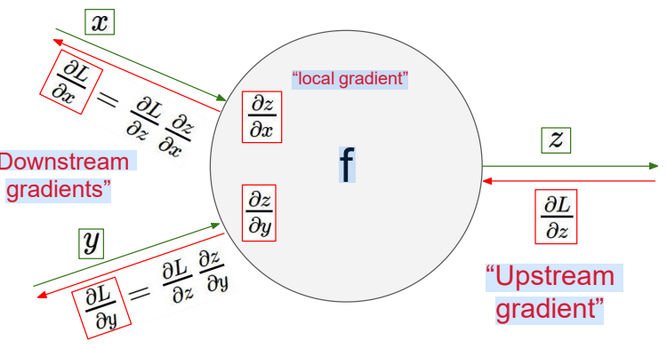
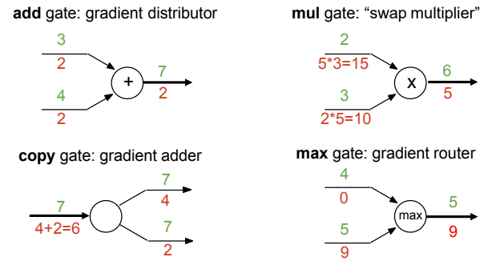

# Gradient and backprop

Also see [[DLAI VI - Multi Layer Perceptron]]

### Recall questions on computational graphs

1. 

 What is the meaning of this image?

    \
    
	

10. 

 Express the computational graph in terms of gates. List the most common ones. What does each of them do?

    \
    Most common:
    - ==add== gate
    - ==mult== gate
    - ==copy== gate
    - ==max== gate

	

