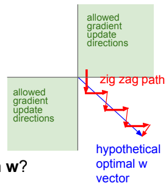
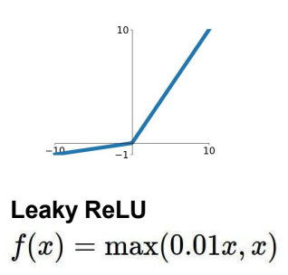
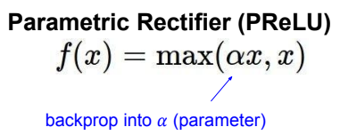
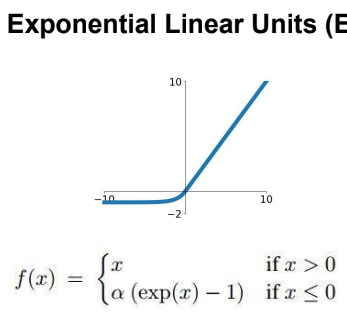
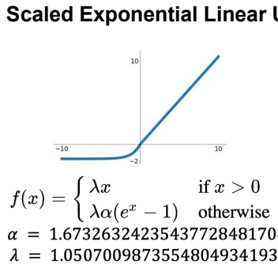
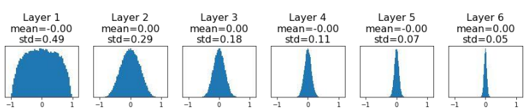
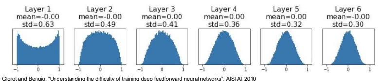

# Training neural networks

Also see:
- aa

### Recall questions 

1. 

 What are the 3 main "problems" of the sigmoid as activation function? Does the ReLU fix all of them? 

    
    \
    3 main problems:
    - ==saturated neurons kill the gradient==
    - ==not zero centred==
    - ==exp() is a computationally expensive== operation

	Furthermore, the fact that ==the gradients w.r.t. to the weights all either all positives or all negatives induces a zig-zag path== that might not be optimal for grad descent.

	

	Luckily the ==relu fixes most of those issues (pt.1 and 3)==, although it still suffers from:
	- ==killing the grad in the <0 region==
	- ==not being 0 centred==

2. 

 List some common variants of the ReLU. What is the difference with the standard relu? 

    
    \
	Some common variants:
	- ==leaky relu==: ==does not kill grad when <0== 
	- ==parametric rectifier==: ==tunable leaky relu==  
	- ==exponential linear units==: has some ==robustness in the <0 region== but is more computationally expensive 
	- ==scaled exponential linear units==: is ==self normalising==, no need for batchnorm 

3. 

 What is a common step of preprocessing? Why? 

    
    \
    ==Normalising is a standard step in most pipelines==. It is useful because it ensures that there are no outliers in the data that could compromise learning.

	More about this in [[DLAI VIII - Regularization]]

4. 

What are we looking for when choosing a weight initialisation technique and why? What is the best way to initialise weight then? What fix is necessary to make it work with relu? 

    
    \
    We are mainly looking for an ==even activation of the neurons in each layer==. This ==ensures that we have actual learning, contrary to what would happen if we, say, initialised weights with random small values==. In the following image, we can see what happens to the gradients of the weights:

	

	A good way to set weights is ==Xavier initialisation==: in fact, this initialisation ==ensures that activations are spread evenly.== This works well since it actually ==preserve the original variance among layers==.

	

	In order to make it work with relu, the dividing factor must be $\frac{2}{D_{in}}$ instead of $\frac{1}{D_{in}}$
	

5. 

 ? 

    
    \

