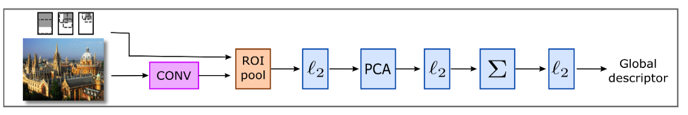
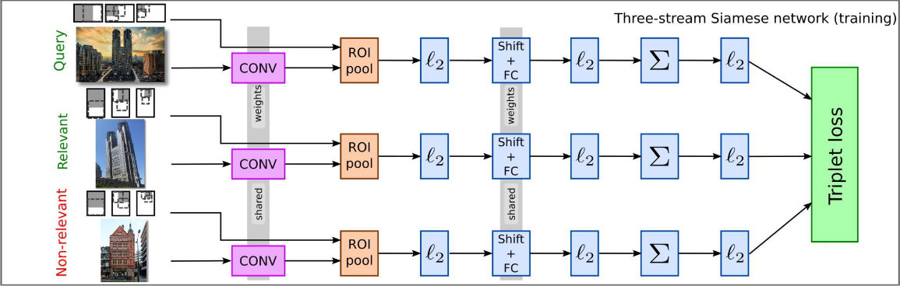
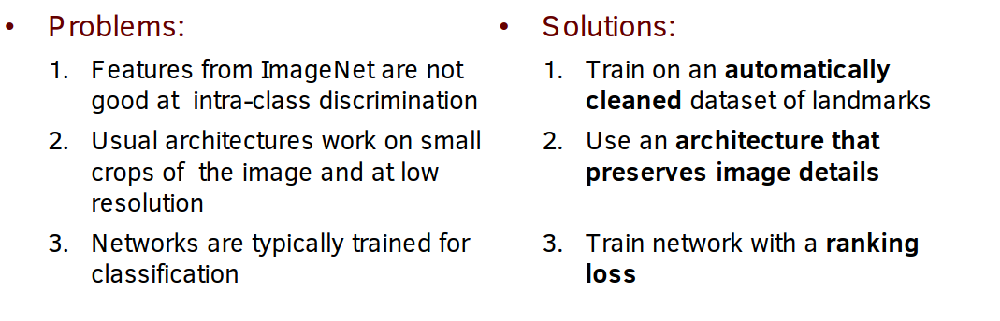
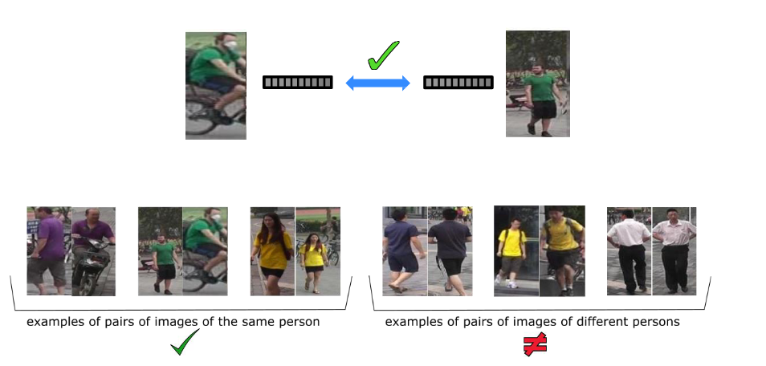
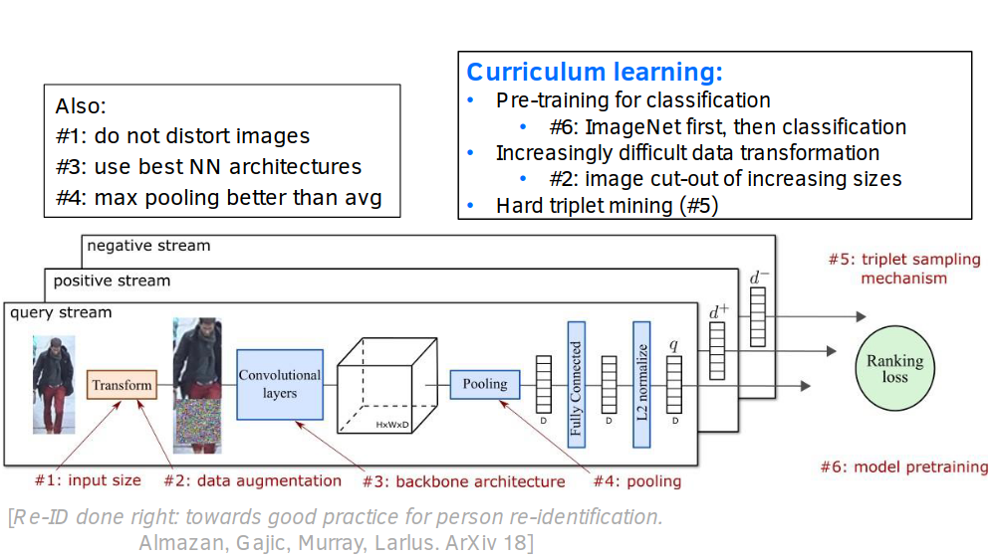
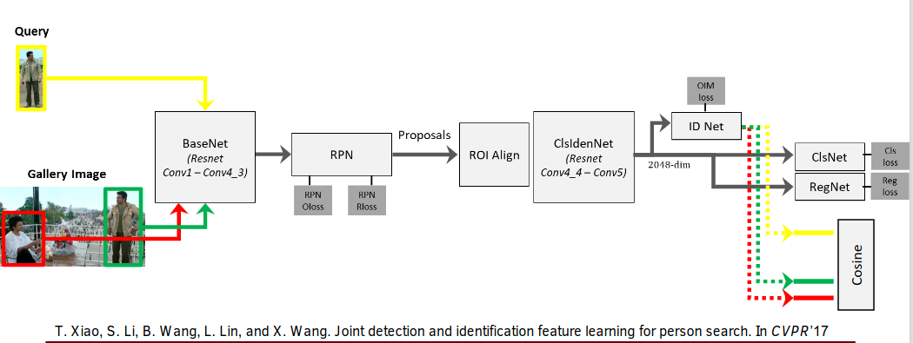
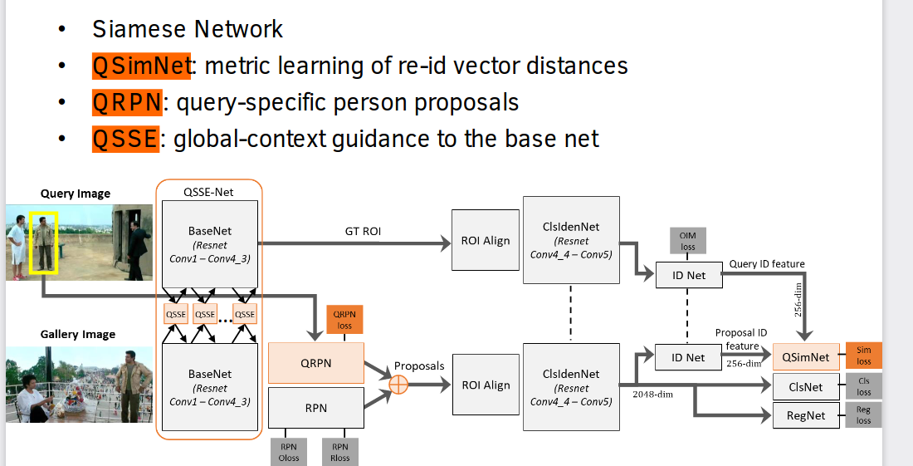
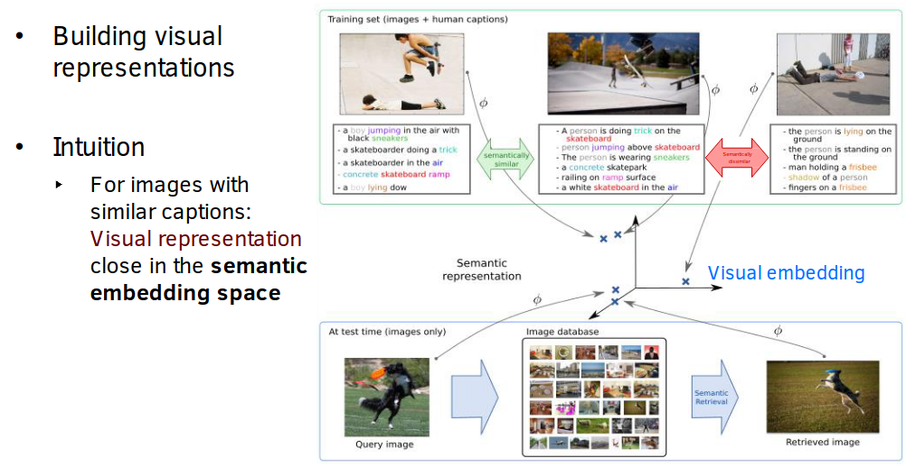

# Visual search

### Recall questions on object search

1. 

 Describe the most popular standard techniques (in the past) for object search.  What is the main issue with them? 

    
    \
	Popular techniques ==in the past==:
	- ==histograms/shape descriptors==
	- ==local representations/interest points detectors==: SIFT/Harris PD
	- ==global representation==: visual codebook starting from bag of local descriptors

	==Local features descriptors== have been shown to work the best, however they ==require lots of computational power==.

2. 

  What was the first deep approach for object search? Why doesn't it work well? 

    
    \
	The first deep approach was ==using a pre-trained CNN to output the feature vectors==. The main issue here is that a ==CNN is trained to recognise many generic instances of a class, while we are interested in one specific object!==

3. 

 Describe the R-MAC feature descriptor and the network used for object search presented by Gordo et al.  

    
    \
	R-MAC feature descriptor:

	

	The network used for solving object search is the following and is ==trained with a triplet loss.== (more on this in the following question)

	

4. 

 Describe the loss used for training the network of qst. 3 

    
    \
    The loss used is a ==triplet loss==:
	

5. 

 Describe three main issues of object search and discuss their solutions. 

    
    \
	Main issues:
	

## Recall questions on person search

6. 

 What is person re-identification? Why is it a good base for person search? 

    
    \
	In person re-id, we focus on ==retrieving the same person from different cameras. This works well for search as we assume image crops are produced by the person detector==.

	

7. 

 What is a really simple approach for person re-id? What are a few things we need to pay attention to? 

    
    \
	Idea: use ==same structure used for object search with a few tweaks==:
	

	==Hard triplets are triplets where the positive/negative are really close==.

8. 

 Briefly describe the OIM model for person search .

    
    \
    Online Instance Matching:

	

9. 

 Describe the structure proposed in QEEPS. What is its main benenifit? 

    
    \
	==Query guided end to end person search==:

	

	Main benefit: ==can train end to end using query image extensively==.

## Recall questions on semantic search

9. 

 What is a good way to create descriptors for semantic search? 

    
    \
	
	

