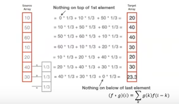
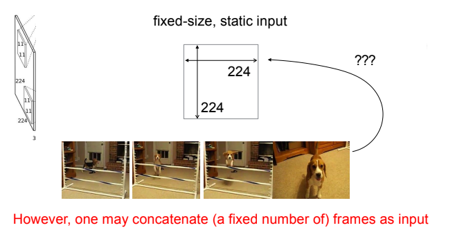
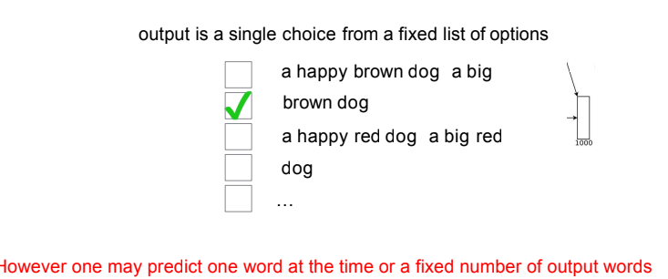
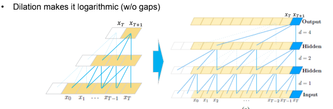
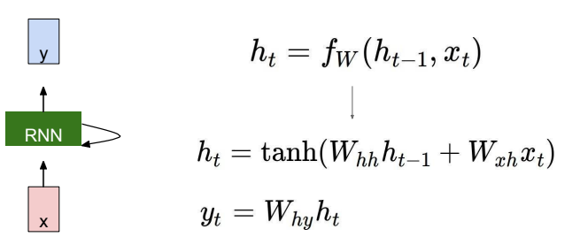
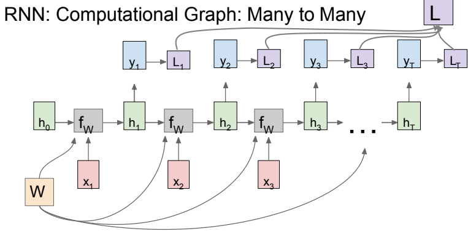
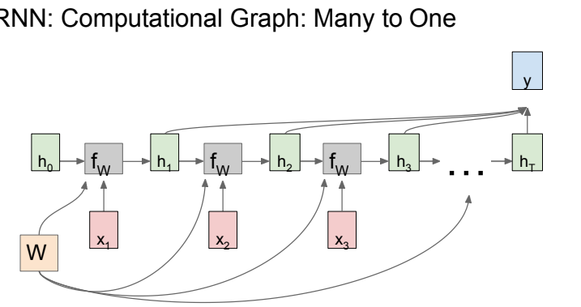
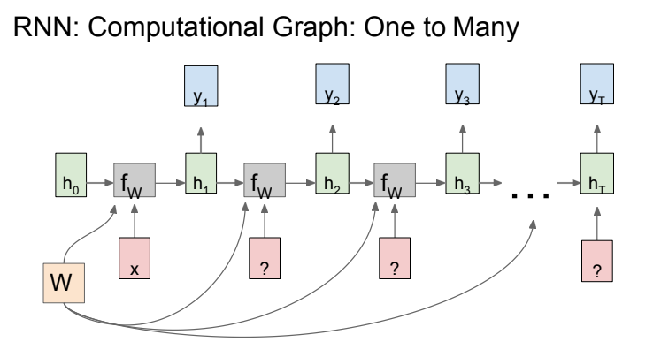
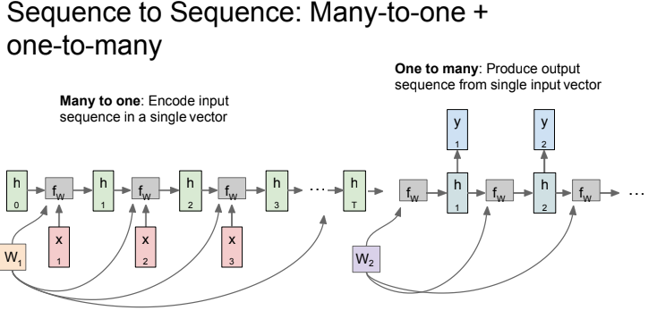

# Sequential

Also see:
- [[DLAI X - Transformers]]
- [[ML XI - RNN]]

### Recall questions

1. 

 What is the idea behind temporal CNNs? In which case do they work well? 

    
    \
    The idea is to use ==CNNs to model sequences==.
    

	Temporal CNNs have been shown to ==work great with small datasets==.

2. 

 What are the main issues when using CNNs to deal withs sequential data?

    
    \
    Main issues:
    - ==fixed kernel size==, e.g. number of input frames used 
    - can ==only choose one output from a single list of options==  

3. 

 What is dilation? How does it help in decreasing the depth of a temporal CNN?

    
    \
    The idea behind dilation is somewhat ==similar to the use of stride==. To make the receptive field of the network bigger, a number of output at each subsequent layer is skipped, ==assuming neighbouring outputs already contain the needed information==.
    This makes the ==depth of the network logarithmic==.
    

4. 

 What is the idea behind a "vanilla" RNN? 

    
    \
    The "basic" RNN can be represented by the following formula:

	

5. 

 Explain the meaning of the following computational graphs. 

    
    \
    What happens to the loss here?
	

	And here?
	

	What are two possible choices for output we do not have yet?
	

	Either 0 or next prediction in an ==autoregressive model==.

	What if we want to ==understand the context== before making a prediction?
	

