# Transformer networks

### Recall questions

1. 

 What is attention and how is it used? Use the RNN translation example, leveraging context at each step.  Are we limited to text only? 

    
    \
    In the following image, we can see a common pipeline for ==text translation== leveraging RNNs.
    
    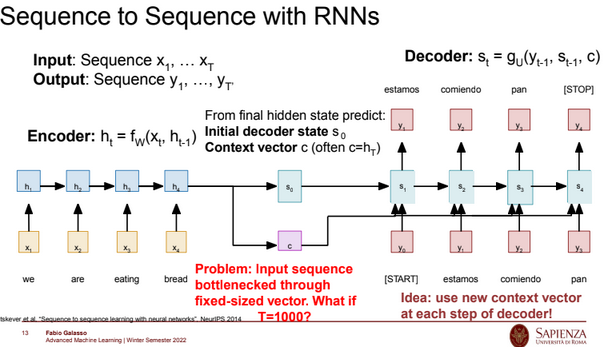

	The main issue here is given by the fact that not only we have a bottleneck on the ==size of the context==, but also ==that is harder to propagate information in the later stages of the pipeline==. Ideally, ==we'd want to use a new context vector at each step in order to "refresh" the relevant information==. \
	That is exactly what we do through ==attention==, as shown in the following image.

	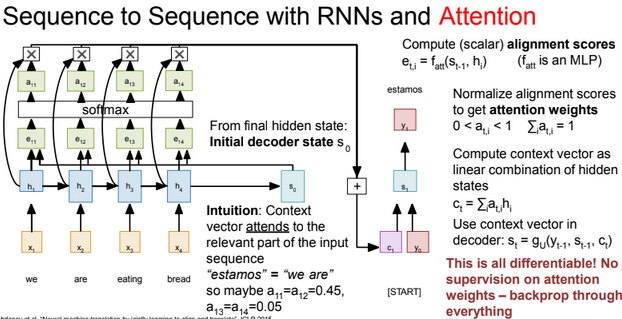

	In the net step, we are going to use $s_2$ to compute alignments and the new attentions, which will be multiplied together to compute the new context. \
	We can visualise ==how the context "changes" accordingly to the examined part in the following example==.

	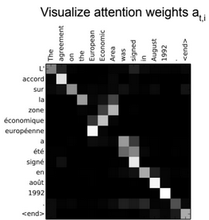

	We can use this approach for a multitude of tasks, as shown in ==image captioning with attention here==:

	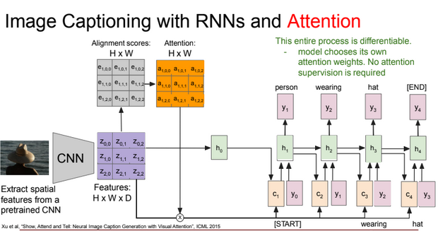

	Even if it's not shown here, the context is recomputed at each step.

2. 

 What is the shape of a general attention layer? Describe the key operations. What important property does attention have? Is it a good thing? 

    
    \
	Here we see the =="unrolled" version of a general attention layer (only one head)==:
	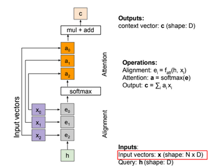

	Note that ==attention operation is permutation invariant==: this means that it does not "care" about the ordering of the vector. ==It generally isn't a good thing==, for instance when solving tasks like translation of sequences in which the position of a word does matter.

3. 

  What is the most recent choice for alignment? What tweak is necessary to make it work (hint: softmax peaks) ? 

    
    \
    We have possible choices for ==alignment==:
	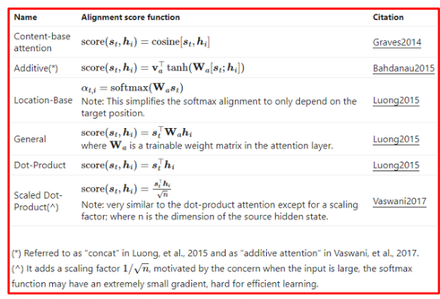

	The main trick we use is diving by a factor of $\sqrt D$, otherwise the ==dot product== explodes creating ==peaks in the softmax==.

4. 

So what are keys, queries and values and why do we transform them?  What is the difference between attention and self-attention?

    
    \
    We transform the input and hidden states because ==we want more expressiveness  - otherwise the scaled dot product wouldn't work (being just "linear").

	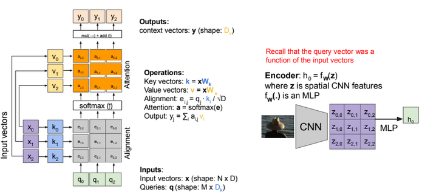

	In many cases we might want to compute queries starting from the inputs too. This is the case of ==self attention==.

	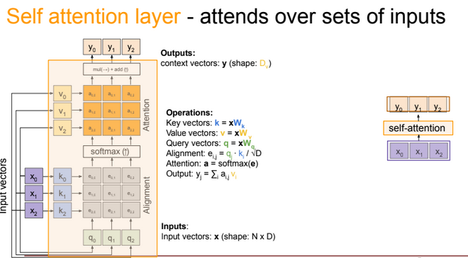

5. 

 What is positional encoding and what is its purpose? What are the desired characteristics for it? What are some possible choices?

    
    \
	==Positional encoding "fixes" (probably?) the positional invariance of attention.==
	A good way of putting it would be: *"when you read positional encoding, you know exactly where you are in the sentence and how far you are from the other words"* \
	We want it to:

	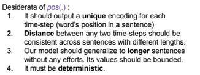

6. 

 What is masked self attention and why is it necessary?

    
    \
	We mainly use ==masked attention/self attention to avoid looking at future inputs== in the vector. One easy example would be next word prediction, in which knowing the next word would be considered cheating!

	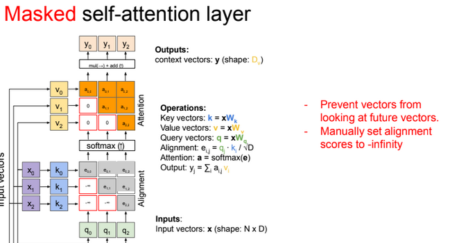

7. 

 Briefly describe the architecture of the transformer network presented by Vaswani et al. 

    
    \
	Overview of whole model:

	

	Zoomed in encoder:

	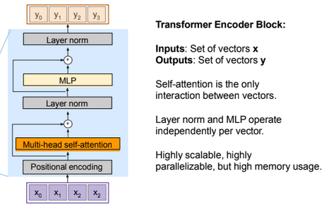

	Zoomed in decoder (==note that input for attn is encoder output==)
	
	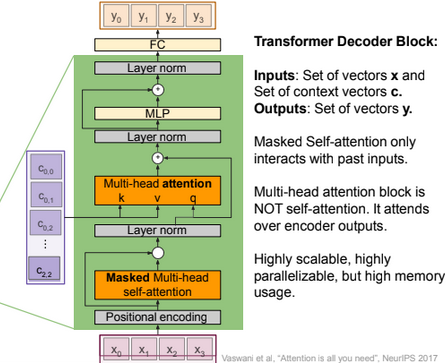

#### Transformer network applications

8. 

 

    
    \
	

