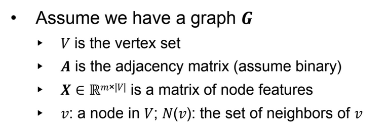

# GNNs

Also see:
- [[DLAI IX - Geometric]]

Setup:

### Recall questions

1. 

 What additional information is included in GNNs? How can we aggregate it?  

    
    \
    Note that a neighbor also holds information about its own neighbors... 
    It's also going to receive extra info about farther nodes after the other layers

2. 

 What happens as we increase the layers of a GNN? 

    
    \
    

3. 

What is the most basic approach to aggregating features? 

    
    \
    

4. 

 What is the compact matrix form the basic approach? Why do we use it? 

    
    \
    

5. 

 What are two possible ways to train GNNs?

    
    \
    

6. 

 What is the idea behind attention applied to graphs? What is the object of the attention of each node? 

    
    \
    

7. 

 Describe the 2 steps of applying attention to graphs.  

    
    \
    Computation of e_uv
    Computation of alpha_ab
    

8. 

 What is a simple way of applying attention to nodes? Is it possible to extend it to multi-head attention? 

    
    \
    

9. 

 What is the standard way of constructing GNNs and stacking their layers?  

    
    \
    

10. 

 What is the over-smoothing  problem?

    
    \
    

11. 

  How do we determine the receptive field of a GNN? How can it help in explaining over-smoothing? 

    
    \
    

12. 

 What is a good way of choosing the right number of layers then? 

    
    \
    

13. 

 What are 2 techniques we can use to increase the expressive power of shallow GNNs?

    
    \
    

14. 

 What is the idea behind using skip connections to solve over-smoothing? What is a possible explanation on why it works?

    
    \
     

