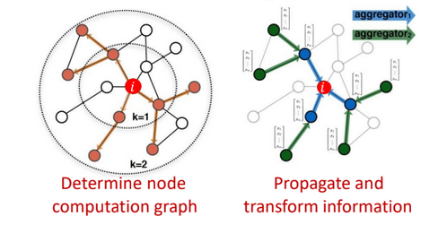
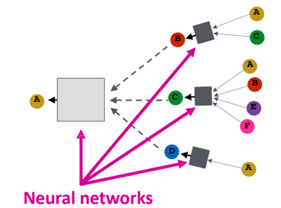
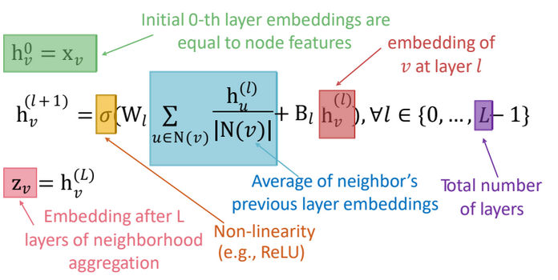
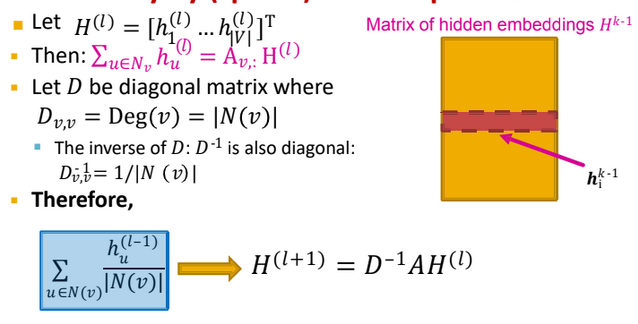
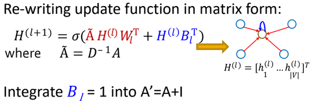
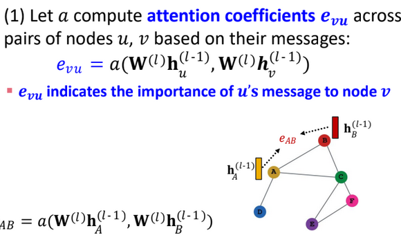
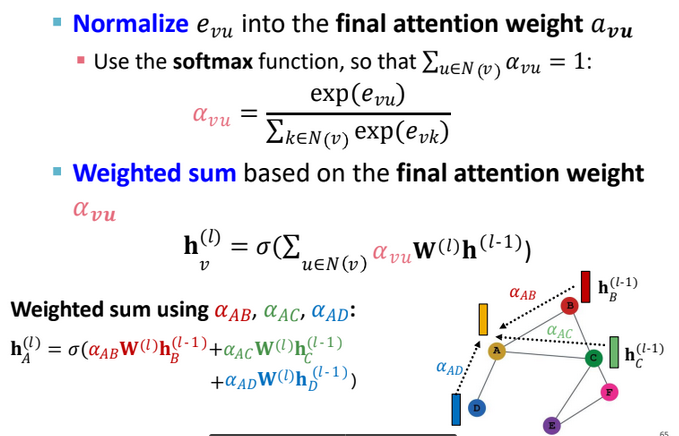
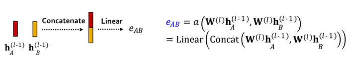

# GNNs

Also see:
- [[DLAI IX - Geometric]]

Setup:

### Recall questions

1. 

 What additional information is included in GNNs? How can we aggregate it?  

    
    \
    In GNNs, we leverage ==the neighbourhood== of each nod: ==the computational graph is determined by each node's neighbours. Each neighbour will send a message containing their features==.

	

	To ==generate the embeddings==, each node ==aggregates the received message==. One common choice, for example, is a ff neural network.

	

2. 

 What happens as we increase the layers of a GNN? 

    
    \
    After ==k-layers==, each node receives ==information about nodes at k-hops from itself!==.

3. 

What is the most basic approach to aggregating features? 

    
    \
    The most basic approach consists of ==averaging neighbours' messages, and then applying the nn==.

	

4. 

 What is the compact matrix form the basic approach? Why do we use it? 

    
    \
    We use this matrix in order to ==perform aggregations efficiently==. Note that ==this representation does not work with all the aggregations functions!==.

	

	We end up with:

	
	

5. 

 What are two possible ways to train GNNs?

    
    \
    Two settings:
    - supervised, ==with labels==
    - ==unsupervised, with no labels and the graph structure as supervision==.
    

6. 

 What is the idea behind attention applied to graphs? What is the object of the attention of each node? 

    
    \
    The idea is that we specify ==arbitrary importance for the messages of different neighbouring nodes==, following ==an attention strategy==.

7. 

 Describe the 2 steps of applying attention to graphs.  

    
    \
    ==Computation of $e_{uv}$, aka the attention coefficients==:
    
    ==Computation of ^$\alpha_{ab}$, aka the normalised attention weights to use in the final weighted sum==:
    
    

8. 

 What is a simple way of applying attention to nodes? Is it possible to extend it to multi-head attention? 

    
    \
    The ==original approach proposed for nodes was applying a linear layer to the concatenation of the 2 messages from each node==.

	

	For multihead, the same process is repeated multiple times with different coefficients and then the outputs are aggregated.

9. 

 What is the standard way of constructing GNNs and stacking their layers?  

    
    \
    The easiest way is to ==stack multiple GNNs layers==:

	

10. 

 What is the over-smoothing  problem?

    
    \
    

11. 

  How do we determine the receptive field of a GNN? How can it help in explaining over-smoothing? 

    
    \
    

12. 

 What is a good way of choosing the right number of layers then? 

    
    \
    

13. 

 What are 2 techniques we can use to increase the expressive power of shallow GNNs?

    
    \
    

14. 

 What is the idea behind using skip connections to solve over-smoothing? What is a possible explanation on why it works?

    
    \
     

