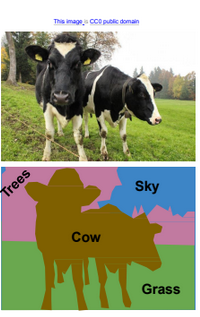
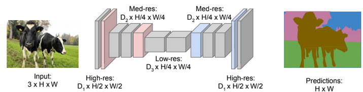
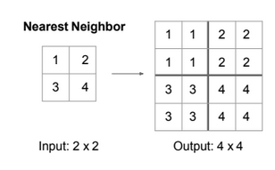
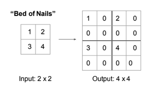
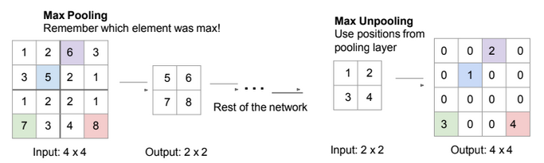
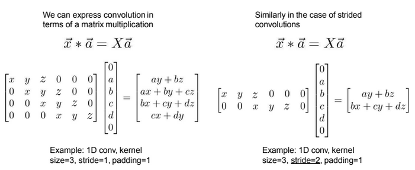

# Detection and segmentation

### Recall questions on segmentation

1. 

 How is the segmentation task defined? 

    
    \
	We want to ==label each pixel in the image with a category label==. We ==do not 
	request the differentiation of instances.==

	

2. 

 What is the difference between "things" and "stuff" and why does it matter?  

    
    \
    Things are ==individual instances with separate identities, recognised by "looking" at the entirety of the object==. Stuff, instead, ==can be identified at a pixel level, for instance looking at the texture==.

3. 

  How can we use convolutions for segmentation? Why is it computationally expensive and what can we do about it? 

    
    \
    We can ==extract each patch and try to classify it a CNN==, but it is very expensive! We can also try to ==apply convolutions to the whole image==, but if the original resolution is too high we'd still have the same issue. \
    The solution in this case is called a ==U-shaped network, in which we leverage sampling and up-sampling==.

	

4. 

 What are 3 possible up-sampling techniques? (hint: pooling)  

    
    \
    Unpooling techniques:
    - ==Nearest Neighbour==: 
    - ==Bed of Nails==: 
    - ==Max Unpooling==: ==remember which element was the max, the others are 0== 

5. 

 What is learnable upsampling? How does it work? Why do we call it transpose convolution?  

    
    \
    The idea is that ==our upsampling function is now approximated by a convolution itself==. To be more precise, we have what is called a ==transpose convolution, as we can reconstruct the original matrix by multiplying the convoluted patch for a learned filter that has the dimensions of the transposed original one==. It's easy to see it in an example:

	

	In this example, the kernel matrix is $4 \times 6$, the image $6 \times 1$. To regain the original patch, we multiply the convoluted patch ($4 \times 1$) for a $6 \times 4$ kernel, which has transposed dimensions w.r.t. to the original.
	==For overlapping patches, values are added==. Note that the image has to be flattened in 1D in order for this to work.

6. 

  What is a common challenge of semantic segmentation? 

    
    \
    ==It is hard to annotate each pixel==: few labels are used, ==the rest is labeled as other==. A few solutions for ==label propagation and semi automatic labelling== were also developed.

### Recall questions on object detection

1. 

  

    
    \

