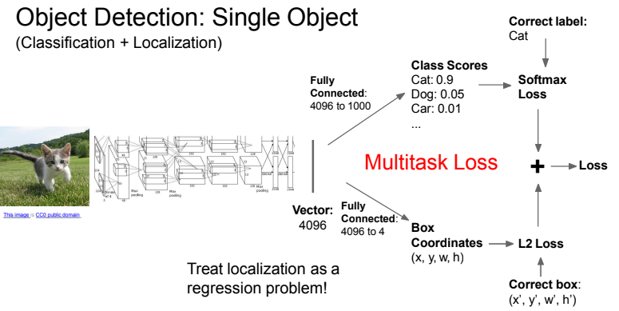
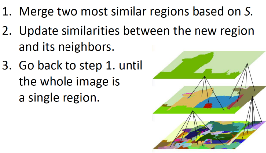
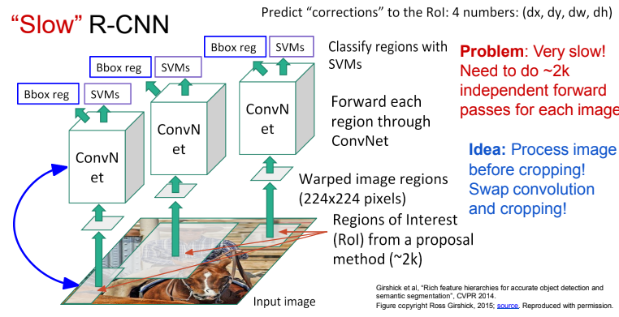
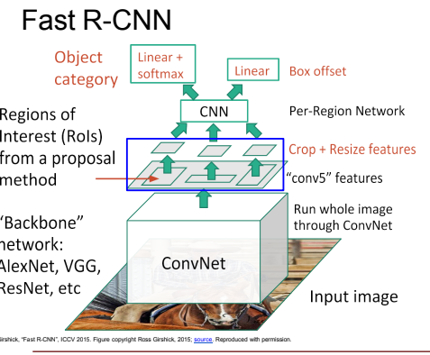
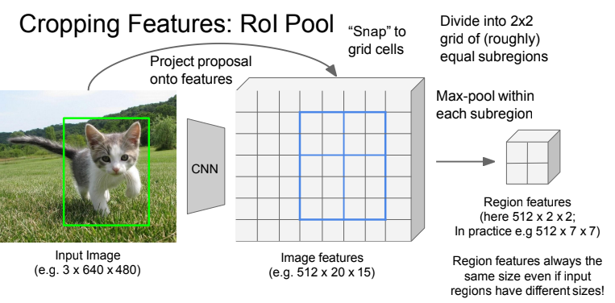
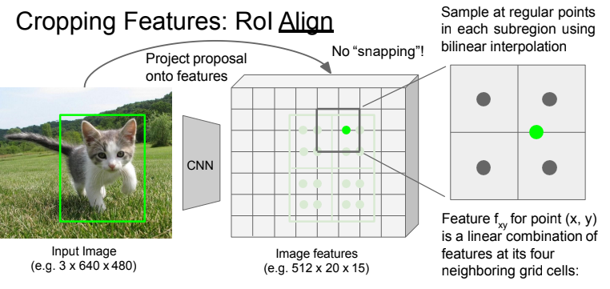
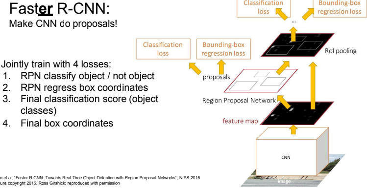
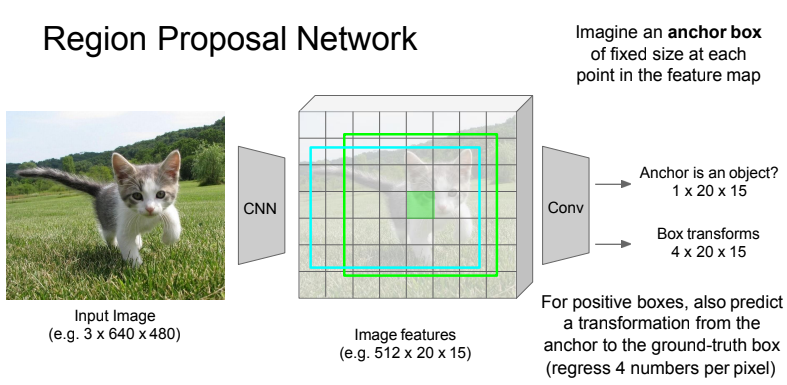
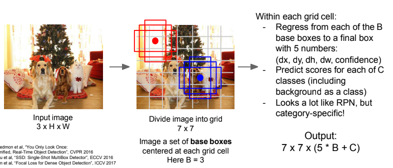
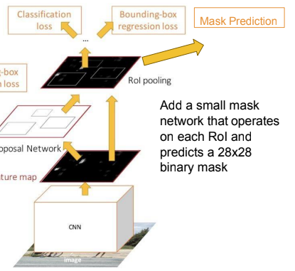

# Detection and segmentation

### Recall questions on segmentation

1. 

 How is the segmentation task defined? 

    
    \
	We want to ==label each pixel in the image with a category label==. We ==do not 
	request the differentiation of instances.==

	

2. 

 What is the difference between "things" and "stuff" and why does it matter?  

    
    \
    Things are ==individual instances with separate identities, recognised by "looking" at the entirety of the object==. Stuff, instead, ==can be identified at a pixel level, for instance looking at the texture==.

3. 

  How can we use convolutions for segmentation? Why is it computationally expensive and what can we do about it? 

    
    \
    We can ==extract each patch and try to classify it a CNN==, but it is very expensive! We can also try to ==apply convolutions to the whole image==, but if the original resolution is too high we'd still have the same issue. \
    The solution in this case is called a ==U-shaped network, in which we leverage sampling and up-sampling==.

	

4. 

 What are 3 possible up-sampling techniques? (hint: pooling)  

    
    \
    Unpooling techniques:
    - ==Nearest Neighbour==: 
    - ==Bed of Nails==: 
    - ==Max Unpooling==: ==remember which element was the max, the others are 0== 

5. 

 What is learnable upsampling? How does it work? Why do we call it transpose convolution?  

    
    \
    The idea is that ==our upsampling function is now approximated by a convolution itself==. To be more precise, we have what is called a ==transpose convolution, as we can reconstruct the original matrix by multiplying the convoluted patch for a learned filter that has the dimensions of the transposed original one==. It's easy to see it in an example:

	

	In this example, the kernel matrix is $4 \times 6$, the image $6 \times 1$. To regain the original patch, we multiply the convoluted patch ($4 \times 1$) for a $6 \times 4$ kernel, which has transposed dimensions w.r.t. to the original.
	==For overlapping patches, values are added==. Note that the image has to be flattened in 1D in order for this to work.

6. 

  What is a common challenge of semantic segmentation? 

    
    \
    ==It is hard to annotate each pixel==: few labels are used, ==the rest is labeled as other==. A few solutions for ==label propagation and semi automatic labelling== were also developed.

### Recall questions on object detection

1. 

 What is a basic implementation of single objection detection?  What are we assuming here (that is often untrue)? 

    
    \
    A simple implementation simply uses a ==classifier to identify the object== and a ==regressor to identify the bounding box==.

	

	We are however assuming that the ==subject is only one==, and in reality this is not often the case!

2. 

 Why do we need a region proposal algorithm for multiple objects detection?  What are the ideal criteria we want to satisfy with this algorithm? 

    
    \
    The fact is that we don't really ==need a region proposal algorithm because it works better, but because exhaustively searching each pixel of the image for possible objects is computationally expensive!==. \
    Ideally, this algorithm should be:
    - ==fast==
    - ==have high recall==: remember that accuracy is not a good metric in obj. detection 

3. 

 Briefly describe the idea behind selective search. 

    
    \
    The proposed method is based on ==aggregating similar pixels into regions called super pixels==. These regions will then act as ==proposals for the detection==.
    

4. 

 What is the R-CNN model? What is its main drawback? 

    
    \
	The idea is to ==use the the region proposal algorithm combined with multiple convnets that will output the feature maps used for classification and object boundaries==. 

	

	The main issue is that ==this approach is very slow, as it applies many times the convolution to the image== (i.e. we could only pre-process it once!)

5. 

 What is fast R-CNN? Is it equivalent to applying the convolution over each crop? 

    
    \
    The main idea behind Fast R-CNN is that ==now we "pre-process" the image only once, by passing it to a ConvNet==. Then, ==we apply the proposed original regions (how? see next question) to the resulting feature map==, and then ==apply a convnet to each of these regions== (that will be ==smaller than the original ones==!)

	

6. 

 What are 2 ways of projecting the original regions of interest  onto the feature map? 

    
    \
    Two methods:
    - RoI ==pool==: we "snap" a region to the closest cells and then pool; this doesn't take into account that ==different sub-regions might have different dimensions!== 
    - RoI ==align==: instead of snapping, we use ==bi-linear sampling at regular points of each sub region== 
    

7. 

 What is fastER R-CNN? Why do we need another layer after the proposals? 

    
    \
	Faster CNN makes the fast cnn faster ==by removing the "overhead" of doing the proposals==, which was shown to make the model a bit slower. Now, instead of using the default algorithm, a ==region proposal network (RPN)== is used.

	

	The (possible) explanation for having an extra layer is to ==balance classes==, i.e. after region proposal ==we would have a huge amount of "background" and few instances to compare==, instead afterwards we'd have only ==object classes against each other==.

	For overlapping proposals, use ==non maximum suppression==

8. 

 Describe more in detail the structure of a RPN. How many anchor boxes are used?  

    
    \
    

	In practice, ==$k$ anchor boxes are used== each one with an =="objectness" score==.

9. 

 What are single stage object detectors? Give a general description. 

    
    \
    

10. 

 What is Mask R-CNN? Why is it "impressive but easy to implement"? Why can it also do pose estimation? 

    
    \
    It's an ==extension of R-CNN that predicts masks for objects==. Despite being impressively powerful it's really "easy" to implement, as it ==only requires adding a small mask operator on the last layer that operates on each RoI and predicts a 28x28 binary mask==.

	

	Even cooler, it ==can also predict poses==.

#### To finish, it is suggested to review the final slides for updates on SOTA