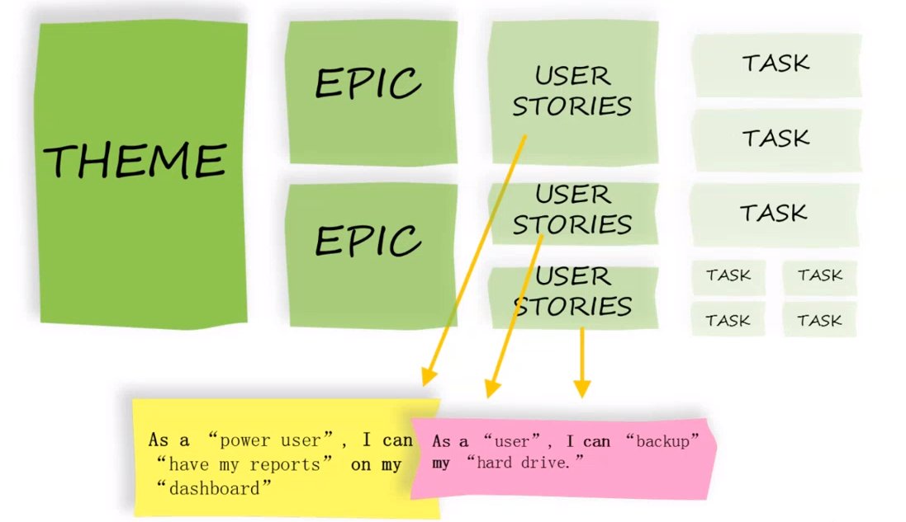

# Agile Artifacts

## Recall questions
    - Cosa sono tema, epiche e user stories?
    - Come è fatta una user story? Come viene decomposta? Cosa rappresenta?
    - Cosa è il product backlog?
    - Cosa sono le burnup e burndown charts?

## Artifatti nei metodi agili

### Tema, epiche e user stories

==Tema==: una particolare area di interesse del progetto

==Epica==: "racconti", spesso forniti da un product owner, che possono essere suddivisi poi in user stories.

==User story==: viene divisa in ==tasks==, rappresenta ==un requisiti funzionale dell'applicativo== da realizzare.

### User story

Ogni user story rappresenta un requisito funzionale da implementare nell'applicazione da realizzare.
Durante ==l'iteration planning==, il team decide quali storie saranno affrontate durante quello sprint.
Le decisioni su quale storia implementare sono facilitate tramite l'uso di metodologie come ==il planning poker==, che permettono di ordinare 

La scelta di usare le storie ==facilita il continuo sviluppo del team== proponendo obiettivi incrementali sempre diversi, ma soprattutto ==pone l'enfasi sul cliente== e su ciò che esso desidera.

Una volta scelte le storie da completare:
- si definiscono i ==criteri di completamento==
- si fa una suddivisione delle ==task per ogni storia==
- definire le stories in termini di persona, i.e. con formule come *Io [ruolo] voglio fare [azione] etc..*

È inoltre opportuno verificare, in questa fase, che nessuna storia sia "troppo lunga", ovvero fare ==una stima temporale==. Ognuna di esse dovrebbe infatti ==essere portata a termine in uno sprint==. In caso contrario, è probabile che questa possa essere suddivisa in ulteriori sotto user stories.

Un ==template== possibile è il seguente:
>"As a *[persona]*, I *[want to]*, *[so that]*."

Ad esempio:
>Come visitatore del sito, desidero leggere le notizie sulla homepage per rimanere sempre aggiornato.

Ogni user storie dovrebbe essere (==criterio *INVEST*==):
- ==indipendente==: minimizzare dipendenze da altre stories
- ==negoziabile==: cattura il requisito senza imporre troppi vincoli agli implementatori
- ==di valore==: per chi le implementa e (quindi) per il progetto
- ==temporalmente estimabile==
- ==di dimensioni appropriate==
- ==testabile==: deve essere possibile creare dei test per verificare se la funzionalità descritta dalla storia è soddisfatta o meno

Un modo classico di implementare fisicamente le user stories è tramite ==story cards==, fisiche o digitali.

### Product Backlog

Il product backlog ==contiene la lsita delle user stories== dell'intero progetto.
Per lo sprint invece si inseriscono le storie da implementare nell'==iteration backlog==.

Ogni volta che si riguarda il backlog (es. nelle fasi dello sprint), le storie ==possono essere raffinate==.

Il backlog di iterazione permette inoltre di evitare sprechi, assegnando le task a sviluppatori appena questi si liberano.

### Tracking completamento

Tramite ==burndown charts== o ==burnup charts== si verifica rispettivamente ==quante task mancano== e quante ==task sono state portate a termine==.
Si tratta di due metodi validi per monitorare il progresso del progetto.

