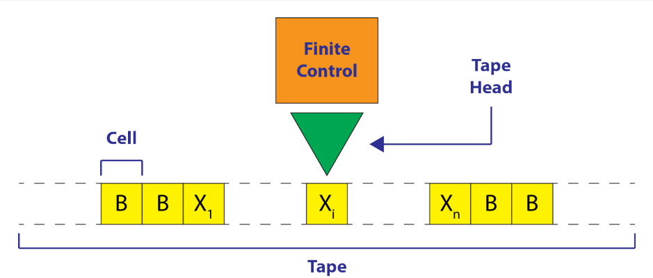

# Macchine di Turing 

## Recall questions
    - Che vuol dire che esistono problemi insolvibili dalle macchine? Puoi fare un esempio? Hint: problema dell'halting o anche pr. hello world
    - Come sono collegati il teorema di Godel e quello di Church Turing? 
    - Cosa è una macchina di Turing? Come è definito formalmente il suo modello matematico? Hint: settupla M = (Q,Sigma,Gamma, delta, q_0,B,F)
    - Come viene effettuata una mossa delta da parte della macchina?

## Macchine di Turing

### Problemi insolvibili

Prendiamo un problema ipotetico e mostriamo che è insolvibile.
Useremo il ==problema dell'hello world== come esempio.

Supponiamo esista un programma $H$ in grado di dirci se, dato un programma $P$ e il suo input $I$, questo stampa o meno per prima la stringa "Hello World". In caso positivo il programma risponde "Yes", altrimenti "No".

Ora modifichiamo $H$ in $H_1$ in caso di risposta negativa non stamperà più "No" ma "Hello World".

Modifichiamo ulteriormente $H_1$ in $H_2$: ora ha solo bisogno di $P$, che viene trattato come programma e come input.

Decidiamo infine di dare $H_2$ in input a se stesso...cosa succede?
Il programma da la risposta "sbagliata": questo perchè:
- se $H_2(H_2)$ stampasse Hello World, allora esso risponderebbe con "Yes", ma una volta ripassato in input a $H_2$ questo risponderebbe "Hello World" essendosi visto arrivare la stringa "Yes" come input!
- viceversa, accadrebbe il contario qualora il programma non stampasse "Hello World", in quanto risponderebbe proprio con "Hello World" e ritornando un risultato finale di "Yes"! 

$H_2(H_2) = Yes \to H_2(H_2(H_2)) = Hello World$

$H_2(H_2) = Hello World \to H_2(H_2(H_2)) = Yes$

### Teorema di Godel e la tesi di Church-Turing Thesis

Un altro esempio strettamente legato a questo contesto è dato dall'affermazione di ==Kurt Godel (1906–1978)==:
>Qualsiasi sistema formale consistente $F$ dentro cui un certo numero di operazioni aritmetiche elementari può essere eseguito è incompleto, ovvero ci sono affermazioni del linguaggio $F$ che non possono nè essere provate nè essere confutate in $F$.

Il problema fu affrontato nuovamente dal matematico ==Alan Turing (1912-1954)==, che propose un modello ==per qualsiasi computazione possibile== e in seguito stipulò:
>Tutte le proposte (accettabili) per un modello di computazione hanno la stessa potenza: computano tutte le stesse funzioni o riconoscono gli stessi linguaggi. 

La tesi di ==Church-Turing== è un'==assunzione non dimostrabile== che ogni modo generale di "computare" ci permetterà solamente di computare funzioni parziali ricorsive o equivalentemente ciò che le macchine di Turing o ogni computer moderno possono computare.

### Macchina di Turing

Una macchina di Turing (TM) consiste di:
- un ==modulo di controllo finito==, simile a un processore, che si può trovare in un ==numero finito di stati==
- un ==nastro infinito== diviso in ==celle contenenti simboli==
- un ==puntatore== che è sempre posizionato su una cella del nastro  

Formalmente, è definita come una ==settupla== $M = (Q,\Sigma,\Gamma, \delta, q_0,B,F)$ dove:
- $Q$ è il set finito di stati del modulo di controllo
- $\Sigma$ è il set finito di simboli di input
- $\Gamma$ è il set completo di simboli del nastro, ovvero $\Sigma \subset \Gamma$ 
- $\delta$ è la funzione di transizione $\delta(q,X) = (p,Y,D)$ dove
  - $q$ è lo stato corrente
  - $X$ è il simbolo in input
  - $p$ è lo stato successivo
  - $Y$ è il simbolo scritto nella cella appena letta ($Y \in \Gamma$)
  - $D$ è la direzione in cui la testa si muove, $D \in {L,R}$
- $q_0$ è lo stato iniziale $(q_0 \in Q)$
- $B$ è il simbolo vuoto ($B \in \Gamma$ e $B \notin \Sigma$)
- $F$ è il set di stati finali o di accettazione $(F \in Q)$

### Funzionamento di una macchina di Turing

Inizialmente viene piazzata sul nastro una ==stringa== di lunghezza finita scelta dall'alfabeto di input.
Tutte le altre celle contengono il simbolo $B$ e il puntatore è posizionato sulla cella più a SX che contiene l'input.

Una ==mossa== è una funzione dello stato corrente e del simbolo in input scanditi. 
La macchina poi, ==in una sola mossa==:
- cambia stato (che può essere uguale al precedente)
- scrive un simbolo sul nastro preso da $\Gamma$ in corrispondenza della cella appena letta
- muove la testa a SX o DX

### Esempio reale di macchina di Turing

Un esempio può essere una macchina che calcola $y = x + 1$
