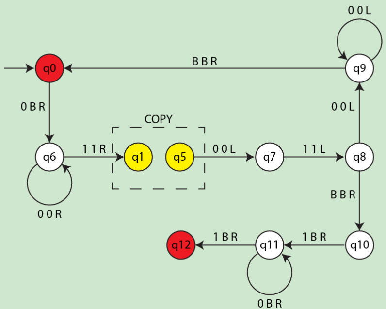
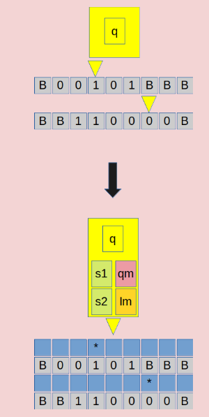

# Ulteriori costrutti per le Macchine di Turing

## Recall questions 
    - Cosa sono le subroutine? Come vengono implementate?
    - Cosa sono le estensioni della macchina di Turing? C'è differenza con la macchina normale?
    - Come funziona una macchina multinastro? Come cambia la settupla?
    - Dimostrare che una macchina multinastro (k nastri) è equivalente a una mononastro con 2k tracce.
    - Dimostrare che una macchina multinastro (k nastri) può essere emulata da una mononastro con 2k tracce in tempo O(n^2).
    - Come funziona una macchina di Turing non deterministica? 
    - Dimostrare che una TM normale può emulare una macchina di Turing non deterministica (iff).

## Macchine di Turing

### Subroutines

Una subroutine per una macchina di Turing è un ==set di stati che esegue una computazione utile==, include uno stato di inizio e un altro stato che temporaneamente non ha mosse e che serve come stati di ritorno per passare il controllo al set di stati che hanno invocato la subroutine.

Funzione ==CALL==: transizione allo stato iniziale della subroutine

Funzione ==RETURN==: siccome non c'è metodo per identificare lo stato che chiama la subroutine, creiamo una copia della subroutine per ogni stato chiamante.

Ad esempio, questa macchina di Turing moltiplica due cifre fatte di 0: per ogni 0 della stringa a sx, viene chiamata una subroutine che copia gli 0 della stringa a dx alla fine, fino a quando ogni zero della prima stringa è esaurito.

### Estensioni della macchina di Turing

Esistono alcuni modelli che ==cambiano il funzionamento== della macchina di Turing ma ==hanno lo stesso potere riconoscitivo== per quanto riguarda i linguaggi.

### Macchina Multi Nastro

Si tratta di una variante della macchina con ==nastri multipli in numero finito== puntati ognuno da una testina. Il ==primo nastro== contiene la stringa e i simboli di input. Valgono le stesse regole per le macchine viste in precedenza.

Un'altra differenza sostanziale è  ==che ogni nastro può avere il suo alfabeto di nastro==.

Formalmente è definita come ==una settupla== $M = (Q,\Sigma,(\Gamma_1, \ldots, \Gamma_m), \delta, q_0,B,F)$ dove:
- $\Sigma \subset \Gamma_1$ 
- $\delta$ è la funzione di transizione $\delta(q,[X_1, \ldots, X_m]) = (p,[Y_1, \ldots, Y_m],[D_1, \ldots, D_m])$ dove:
  - $q,p \in Q$
  - $X_n, Y_n \in \Gamma_n$
  - $D_n \in \{L,R,S\}$, ovvero le mosse sono DX, SX o stationary (fermo)

### Equivalenza Single e Multi Nastro

==Teorema==:
>Ogni linguaggio accettato da un macchina di Turing multinastro $TM$ è RE.

Supponiamo che un linguaggio $L$ sia accettato da una macchina di Turing $M$ a $k$ nastri. Definiamo poi una macchina di Turing mononastro $N$ con $2k$ tracce dove:
- $k$ tracce contengono i nastri di $M$
- le restanti $k$ invece contengono un segno che indica dove la testa del nastro corrispondente in $M$ è piazzata
- un componente del controllo finito memorizza il numero di markers a sinistra della testa 
- un componente del controllo finito memorizza lo stato di $M$
- $k$ componenti del controllo finito memorizzanoil contenuto dei simboli letti

Le mosse di $M$ sono implementate da $N$ nel seguente modo. $N$ visita tutti i $k$ marker che indicano la posizione delle testine di $M$ e salva il simbolo che stanno leggendo. $N$ conosce inoltre lo stato di $M$, quindi sa le mosse che verrebbero eseguite da quest'ultima.

### Complessità temporale della macchina

==Teorema==:
>Il tepo impiegato da $N$ per simulare $n$ mosse della macchina $M$ multi nastro è $O(n^2)$

Dopo $n$ mosse, non ci sono infatti più di $2n$ celle di distanza tra i markers, quindi sono necessarie al massimo $2n$ mosse per leggere tutti i marker.
Per tornare a sinistra sono necessarie altre $2n$ mosse e, evenutalmente, altre $2k$ per scrivere un marker a destra (qualora la testina si sia spostata a dx e non a sinistra).
In totale, per simulare ==una== mossa di $M$ sono necessarie $4n + 2k$ mosse di $N$.

Per $n$ mosse ovviamente questo diventa $O(n^2)$.

### Macchina di Turing non deterministica

A differenza delle macchine precedenti la macchina in questione può ==scegliere una qualsiasi transizione tra le triple elencate==. Le funzioni di transizione infatti sono del tipo: $\delta(q,X) = \{(q_1,X_1,D_1), \ldots, (q_n, X_n, D_n)\}$ e la ==NTM== può scegliere ad ogni step una delle triple a scelta.

Teorema:
>Se $M_N$ è una macchina di Turing non deterministica, allora c'è una macchina di Turing $M_D$ tale che $L(M_N) = L(M_D)$.

Possiamo creare $M_D$ come una TM multinastro, dove il primo nastro contiene una sequenza delle descrizioni istantanee di $M_N$ separate da un carattere speciale. Tra questi, c'è ne uno marcato per indicare la ID che si sta leggendo al momento.

Per processare la ID corrente sul primo nastro, la $TM$ $M_D$:
- esamino lo stato e la descrizione istantanea letta, e se lo stato è di accettazione si ferma
- se lo stato non è di accettazione, e la combinazione stato simbolo ha $k$ mosse, allora fa prima una copia della ID sul secondo nastro, poi usandolo come appoggio fa $k$ copie di quella ID dopo l'ultima ID preceduta dal marker sul primo nastro, ognuna modificata secondo una delle $k$ scelte possibili di $M_N$; ritorna infine alla ID corrente, elimina il marker e lo muove sulla prossima ID a destra. 

All'effettivo questa macchina non fa altro che "enumerare" le scelte come fossero nodi di un albero e le esamina con ==una ricerca breadth first==.

Dobbiamo ora mostrare che $M_D$ accetta sempre se lo fa $M_N$, questo perchè l'altro lato dell'implicazione $\leftarrow$ è provato per costruzione in quanto $M_D$ accetta solo se $M_N$ lo fa.

Supponiamo che sia $m$ il massimo numero di scelte per $M_N$ in ogni configurazione. Quindi, dopo $n$ mosse, $M_N$ può raggiungere al massimo $1 + m + m^2 + \ldots + m^n \leq nm^n$ stati. 
Se $M_N$ entra in uno stato di accettazione in $n$ mosse, una ID accettata sarà esaminata entro $nm^n$ sul secondo nastro di $M_D$.

Infatti solo la ==visita in ampiezza== ci garantisce che visitiamo anche i rami che ci portano ad uno stato di accettazione...la macchina originale potrebbe avere infatti una sequenza che va in loop e se esplorassimo in profondità non finiremmo mai.

<small> Vedi anche #[[Lezione II - Macchine di Turing]] </small>