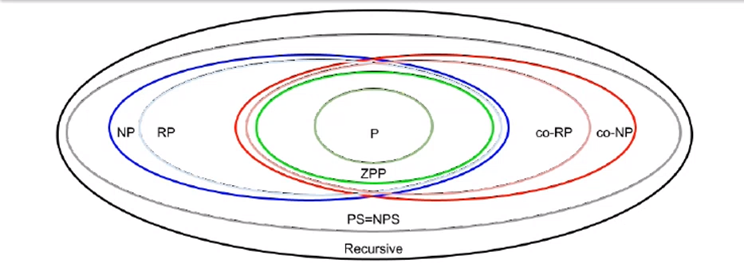
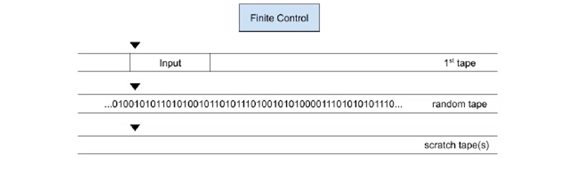
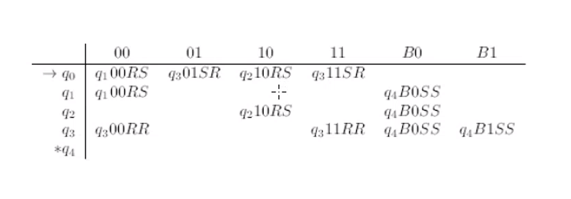
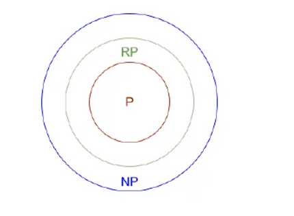

# Altre classi di complessità

## Recall questions
    - Fai un esempio di TM che possono sfruttare la randomizzazione. Hint: quicksort
    - Che problema legato all'accettazione presentano le TM randomizzate?
    - Descrivi la classe dei linguaggi RP e le TM montecarlo, anche con un esempio.
    - Che escamotage possiamo usare per risolvere il problema appena presentato?
    - Che rapporto ha RP con NP?
    - Descrivi la classe ZPP e le TM las vegas.
    - Mostra che ZPP = co-RP intersecato RP
    - Mostra che P è incluso in ZPP

## Classi di complessità addizionali

### Diagramma delle classi di complessità

Come è possibile vedere nel disegno, esistono molte classi di complessità oltre quelle già mostrate. Nel dettaglio, andremo a vedere:
- ==$co-NP$==, la classe dei ==complementi dei linguaggi in $NP$==;
- ==$RP$ a.k.a. random polinomial languages==, la classe degli ==algoritmi che girano in tempo polinomiale e che accettano una stringa del linguaggio con una probabilità $P > 0$==;
- ==$ZPP$ a.k.a zero error, probabilistic polinomial==, linguaggi degli ==algoritmi che accettano stirnghe nel linguaggio con tempo atteso di esecuzione polinomiale==;

<small> Vedi anche #[[Lezione XI - Altre classi di problemi]] </small>

### Classi di linguaggi basate sulla randomizzazione

Per presentare questa classe di macchine prendiamo come caso di studio un noto algoritmo: il ==quicksort==. Questa procedura di sorting funziona scegliendo, ad ogni iterazione, un ==pivot== da usare per confrontare gli elementi. Questa scelta, nelle migliori implementazioni, viene fatta ==casualmente==.

Possiamo pensare una $TM$ che risolve proprio questo algoritmo:
- sul primo nastro abbiamo l'istanza da ordinare
- sul secondo nastro abbiamo una serie di bits, scelti ognuno con probabilità $\frac{1}{2}$ tra $0,1$ in una sequenza infinita
- sul terzo abbiamo un nastro di appoggio

Questo modello, che chiamiamo ==macchina di Turing randomizzata==, è però effettivamente irrealizzabile: difficilmente una $TM$ può pre-compilare un nastro con una sequenza infinita di bit. Facciamo dunque una semplificazione, e assumiamo che ==ogni volta che sul secondo nastro è letto un blank, avviene un lancio di moneta e generato un bit==. In questo modo, potremo scegliere un numero per il pivot calcolato sui bit scritti fino ad ora. 

Possiamo dunque implementare l'algoritmo:
1. Scegliamo $\lceil(2 log m) \rceil$ bits casuali tra quelli creati finora, dove $m$ è la lunghezza della sequenza - il motivo di questa scelta è che anche in caso di un numero dispari ci permette di scegliere con equa probabilità ogni elemento del nastro come potenziale pivot;
2. Scegliamo il pivot, pari al numero rappresentato sul secondo nastro, diviso per $m$ e incrementato di 1 e scriviamolo sul 5 nastro
3. Leggiamo il primo nastro, copiando gli elementi minori del pivot sul quarto nastro e quelli maggiori sul quinto
4. Copiamo le due nuove sequenze appena generate sul primo nastro, dove si trovava la sequenza originale, separate da un marker, e applichiamo nuovamente il sorting (1-3) fino a quando le liste hanno un solo elemento.

### Il problema delle macchine randomizzate

La questione dell'accettazione è più complessa quando si parla di macchine randomizzate: infatti ==non conta solo l'appartenenza al linguaggio dell'input $w$, ma anche il contenuto del nastro random!== Ogni input $w$ avrà una ==probabilità di accettazione pari ad una frazione di tutti i possibili contenuti del nastro casuale compatibili con l'accettazione==.

Questa probabilità sarebbe $0$ in quanto il nastro casuale è infinito, ==tuttavia del nastro random guardiamo solo una parte (vedremo che le macchine $RP$ sono in $PS$)==. Quindi questa probabilità in realtà pari a $2^{-m}$, in quanto abbiamo, su $m$ bit, una delle possibili $2^m$ configurazioni.

Mostriamo un altro caso di $TM$ randomica e calcoliamo la probabilità che stringhe del linguaggio siano accettate.

La macchina seguente può fare due scelte:
- se il primo random bit letto è uno 0, allora verifica che la stringa di input sia composta tutta dallo stesso simbolo (es. $111111$)
- se il primo random bit letto è uno 1, verifica invece che la stringa in input sia uguale a quella casuale a partire dal secondo bit di quest'ultima

Quindi la probabilità che $w$ sia accettato è:
- $\frac{1}{2} + (\frac{1}{2})2^{-1}$ se l'input è ==omogeneo== - dove $\frac{1}{2}$ è la probabilità che sul secondo nastro esca zero, mentre il secondo pezzo della formula indica la probabilità che sul secondo nastro esca $1$ e la stringa casuale sia anche essa omogena
- $2^{-(i+1)}$ se l'input è ==etereogeneo==

### La classe dei linguaggi $RP$

Diremo che ==un linguaggio è in $RP$== se accettato da una $TM$ descritta come segue:
1. se $w \notin L$, allora la probabilità che sia accettato è 0 
2. se $w \in L$, allora la $TM$ lo accetta con probabilità almeno $\frac{1}{2}$ 
3. esiste un polinomio $T(n)$ per cui su un input $w$ di lunghezza $n$ tutte le esecuzioni della $TM$ si fermano dopo al più $T(n)$ step , al di là del contenuto del nastro.

È facile vedere che questa $TM$ ==non ha falsi positivi, ma può avere dei falsi negativi====. Una $TM$ che rispetta i primi due punti è detta Monte-Carlo.== Vediamo un algoritmo di esempio, che ricerca grafi con triangoli al loro interno: 
1. seleziona una coppia di nodi $(x,y)$ a caso e un terzo nodo $z$ e verifica se sono un triangolo
2. se c'è un triangolo accetta, altrimenti fa altri $k$ tentativi dopo i quali risponde negativamente e si ferma senza accettare

È evidente che non ci sono falsi positivi, calcoliamo invece le probabilità di accettazione.
Su un grafo con $n$ nodi e $m$ archi, se c'è il triangolo, la probabilità che una coppia di 3 nodi sia selezionata è $(\frac{3}{m})(\frac{1}{n-2})$. Il primo membro della formula indica la probabilità che uno dei lati del triangolo sia scelto, la seconda che il nodo mancante venga poi selezionato. Questa probabilità va calcolata per un esperimento ripetuto $k$ volte, per tutti i test, arrivando a una probabilità di (la parte di formula a sinistra esprime la probabilità che in $k$ test io **non** trovi il triangolo):
> $1 - (1 - \frac{3}{m(n-2)})^k$

Questa quantità $1 - x^k$ si può approssimare a $e^{-kx}$ e notiamo che per $k$ t.c $kx = 1$ alora $e^{-kx} < \frac{1}{2}$ e $1 - e^{-kx} > \frac{1}{2}$. Con $k = \frac{m(n-2)}{3}$ abbiamo una probabilità di accettazione $> \frac{1}{2}$. 
Quindi $m, n$ non sono più grandi della lunghezza di input, $k$ viene scelto per non superare il quadrato della lunghezza dell'input ($O(|w|^2)$) e ogni test è lineare nella lunghezza dell'input ($O(|w|)$) legge il nastro al più 4 volte. Quindi la $TM$ si ferma dopo un tempo che è al più cubico nella lunghezza dell'input, $O(|w|^3)$.

### Riconoscere linguaggi in $RP$

Possiamo applicare una ==precisazione al modo in cui abbiamo definito l'appartenenza di un linguaggio a $RP$ finora==. Infatti sebbene abbiamo garanzie sui falsi positivi, ==potremmo dover eseguire varie volte l'algoritmo per determinare se un negativo è, ad esempio, un falso negativo==.
Quello che possiamo dunque fare è distinguere la $TM$ randomica e l'algoritmo che decide se $w$ è effettivamente in $L$. In generale, se vogliamo una probabilità di falsi negativi minore di $c$, con $c > 0$, allora dobbiamo fare il test $log_2 (\frac{1}{c})$ volte.
Dato che questo numero è costante se lo è $c$ e ogni test richiede tempo polinomiale, ==possiamo comunque dire che decidere l'appartenenza richiede tempo polinomiale==. 
In questo modo ==creiamo $TM$ che siano sempre in $RP$, ma con un numero di falsi negativi che diventa potenzialmente molto minore di $\frac{1}{2}$==.

>Se $L$ è in $RP$, allora per ogni costante $c > 0$, non importa quanto piccola, esiste un algoritmo randomizzato in tempo polinomiale che decide se $w \in L$, non da falsi positivi e risponde con falsi negativi con probabilità $\leq c$.

### $RP$ e la classe $NP$

Mostriamo che (==Theorem==):
> $RP \subseteq NP$

Supponiamo di avere una $TM$ Monte Carlo $M_1$ per un linguaggio $L$ polynomial space bounded. Possiamo costruire $M_2$ $NTM$ con lo stesso bound temporale. Ogni volta che la $TM$ $M_1$ legge un bit casuale, $M_2$ simula la sua randomicità copiando, tramite il nondterminismo, entrambi i possibili valori di tale bit. Ovviamente $M_2$ accetta solo se lo fa anche $M_1$.
Supponiamo che $w \in L$, allora esiste una sequenza di bit sul nastro random che porta $M_1$ all'accettazione. Anche $M_2$ sceglierà prima o poi tale sequenza e potrà quindi accettare $w$.
Quindi $w \in L(M_2)$. Inoltre se $w \notin L$, non c'è rischio che $M_2$ accetti perchè non lo farà $M_1$, al di là della stringa posta sul nastro casuale.

### Complemento di $RP$

Definiamo la classe co-$RP$:
> Classe dei linguaggi $L$ t.c. $\not L \in RP$

Questa classe è definita perchè, come per $NP$, non siamo sicuri che $RP$ sia chiuso per quanto riguarda l'operazione di complementazione.

### La classe $ZPP$

Classe basata sulle TM randomizzate che:
1. si ferma sempre
2. ha un ==tempo atteso di stop== pari ad un qualche polinomio nella lunghezza dell'input
3. accetta l'input se entra in uno stato di accettazione (e quindi si ferma) e lo rigetta se si ferma senza accettare

È facile vedere che $ZPP$ si discosta poco dalla classe $P$, con le sostanziali differenze di ==permettere randomicità== e ==essere =limitate da un polinomio per quanto riguarda il tempo atteso di esecuzione== e non il caso peggiore.

Il linguaggio $ZPP$ è accettato dalle ==$TM$ Las Vegas che hanno un tempo atteso di esecuzione polinomiale==.
Una ==$TM$ Las Vegas infatti è una macchina di Turing che non fa errori ma il cui tempo di esecuzione potrebbe variare in base a qualche elemento random==.

### Teoremi su $ZPP$

Diamo ora alcuni teoremi importanti su $ZPP$. Il primo, e più semplice, è il seguente ==theorem==:
> $ZPP$ è chiuso per quanto riguarda l'operazione di complemento

La dimostrazione è banale: data una $TM$ $M$ Las Vegas che accetta $L \in ZPP$ possiamo costruire una $TM$ che fa esattamente l'opposto, ovvero accetta se $M$ si fermava e rifiuta se $M$ accettava. In questo modo abbiamo costruito una $TM$ per $\lnot L$.

Un ==theorem== più interessante è invece il seguente:
> $ZPP = RP \cap co-RP$

Per dimostrarlo ricorriamo alla doppia inclusione:

==$RP \cap co-RP \subseteq ZPP$==. Sia $L \in RP \cap co-RP$ e sia $p(n)$ il bound polinomiale massimo per $M_1,M_2$, rispettivamente $TM$ per $L, \lnot L$. Costruiamo una $TM$ Las Vegas per $L$ come segue:
   1. M fa girare $M_1$, se questa accetta allora lo fa anche $M$
   2. M fa girare $M_2$, s e questa accetta allora $M$ si ferma senza accettare. Altrimenti riparte dallo step 1.

La seguente TM accetta l'input $w \iff w \in L$. I primi due step hanno un tempo atteso di $p(n)$. Inoltre la probabilità che un round conduca a uno stop è almeno $\frac{1}{2}$, come da definizione.
Il tempo atteso di esecuzione di $M$ è dunque non più di $2p(n) + \frac{1}{2}p(n) + \frac{1}{4}p(n) + \frac{1}{8}p(n) \ldots = 4p(n)$

==$ZPP \subseteq RP \cap co-RP$==. Sia $L \in ZPP$, accettato da una $TM$ Las Vegas $M_1$. Costruiamo la $TM$ Monte-Carlo $M_2$ come segue: $M_2$ simulerà $M_1$ per $2p(n)$ step e se durante questa simulazione $M_1$ accetta lo farà anche lei, altrimenti a fine simulazione non accetterà.
Se diamo $w$ in input a tale $TM$ si possono verificare due situazioni:
1. se $w \notin L$, allora nè $M_1$ nè $M_2$ accettano
2. se $w \in L$, allora $M_1$ eventualmente accetta ma potrebbe non farlo in $2p(n)$ steps. Tuttavia la probabilità che $M_1$ accetti entro $2p(n)$ steps è almeno $\frac{1}{2}$. Supponiamo che questa probabilità fosse una costante $c < \frac{1}{2}$. Allora il tempo atteso di esecuzione di $M_1$ sull'input $w$ è almeno $(1-c) 2p(n)$, in quanto dobbiamo moltiplicare il tempo $2p(n)$ per la probabilità che $M_1$ giri di più, ossia $(1-c)$. Ma dato che $c < \frac{1}{2}$, allora $2(c-1) > 1$ e quindi il tempo atteso è più grande di $p(n)$, che è una **contraddizione**.

Concludiamo con l'ultimo ==theorem== importante:
> $P \subseteq ZPP$

È facile vedere come ==ogni $TM$ in $P$ sia anche una $TM$ las vegas che non usa la propria capacità di fare scelte randomiche.==
