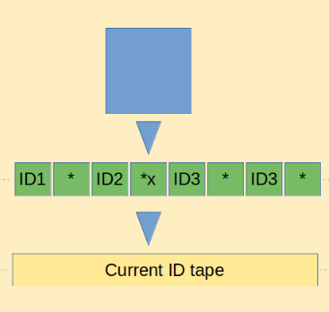
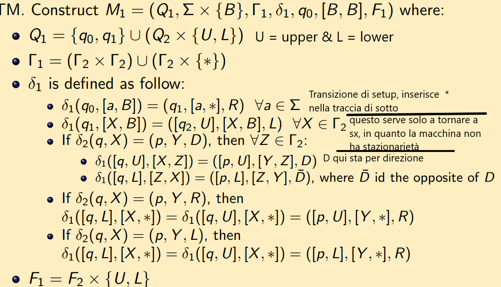
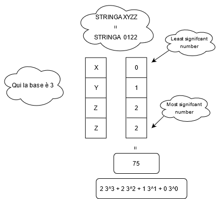
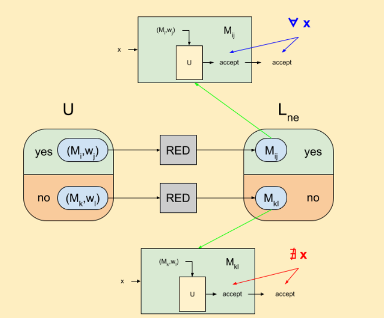

# Lista teoremi e dimostrazioni

## Macchine di Turing 

### Macchina multinastro è RE

==Teorema==:
>Ogni linguaggio accettato da un macchina di Turing multinastro $TM$ è RE.

*Hint: mostrare con una TM multitraccia come funziona l'accettazione*

Supponiamo che un linguaggio $L$ sia accettato da una macchina di Turing $M$ a $k$ nastri. Definiamo poi una macchina di Turing mononastro $N$ con $2k$ tracce dove:
- $k$ tracce contengono i nastri di $M$
- le restanti $k$ invece contengono un segno che indica dove la testa del nastro corrispondente in $M$ è piazzata
- un componente del controllo finito memorizza il numero di markers a sinistra della testa 
- un componente del controllo finito memorizza lo stato di $M$
- $k$ componenti del controllo finito memorizzanoil contenuto dei simboli letti

Le mosse di $M$ sono implementate da $N$ nel seguente modo. $N$ visita tutti i $k$ marker che indicano la posizione delle testine di $M$ e salva il simbolo che stanno leggendo. $N$ conosce inoltre lo stato di $M$, quindi sa le mosse che verrebbero eseguite da quest'ultima.

### Complessità macchina multinastro

==Teorema==:
>Il tepo impiegato da $N$ per simulare $n$ mosse della macchina $M$ multi nastro è $O(n^2)$

*Hint: mostrare quanto tempo una tm impiega dopo n mosse per fare avanti e indietro sulla traccia e tra le tracce*

Dopo $n$ mosse, non ci sono infatti più di $2n$ celle di distanza tra i markers, quindi sono necessarie al massimo $2n$ mosse per leggere il marker più a destra.
Per tornare a sinistra e cambiare nastro sono invece necessarie $2n + 2k$ mosse.
In totale, per simulare ==una== mossa di $M$ sono necessarie $4n + 2k$ mosse di $N$.

Per $n$ mosse ovviamente questo diventa $O(n^2)$.

### Macchina di Turing ND è RE

==Teorema==:
>Se $M_N$ è una macchina di Turing non deterministica, allora c'è una macchina di Turing $M_D$ tale che $L(M_N) = L(M_D)$.

*Hint: 2 step: costruire una TM nd tramite TM multinastro, poi mostrare una TM nd con $m$ stati dopo $n$ mosse*

Possiamo creare $M_D$ come una TM multinastro, dove il primo nastro contiene una sequenza delle descrizioni istantanee di $M_N$ separate da un carattere speciale. Tra questi, c'è ne uno marcato per indicare la ID che si sta leggendo al momento.

Per processare la ID corrente sul primo nastro, la $TM$ $M_D$:
- esamino lo stato e la descrizione istantanea letta, e se lo stato è di accettazione si ferma
- se lo stato non è di accettazione, e la combinazione stato simbolo ha $k$ mosse, allora fa prima una copia della ID sul secondo nastro, poi usandolo come appoggio fa $k$ copie di quella ID dopo l'ultima ID preceduta dal marker sul primo nastro, ognuna modificata secondo una delle $k$ scelte possibili di $M_N$; ritorna infine alla ID corrente, elimina il marker e lo muove sulla prossima ID a destra. 

All'effettivo questa macchina non fa altro che "enumerare" le scelte come fossero nodi di un albero e le esamina con ==una ricerca breadth first==.

Dobbiamo ora mostrare che $M_D$ accetta sempre se lo fa $M_N$, questo perchè l'altro lato dell'implicazione $\leftarrow$ è provato per costruzione in quanto $M_D$ accetta solo se $M_N$ lo fa.

Supponiamo che sia $m$ il massimo numero di scelte per $M_N$ in ogni configurazione. Quindi, dopo $n$ mosse, $M_N$ può raggiungere al massimo $1 + m + m^2 + \ldots + m^n \leq nm^n$ stati. 
Se $M_N$ entra in uno stato di accettazione in $n$ mosse, una ID accettata sarà esaminata entro $nm^n$ sul secondo nastro di $M_D$.

Infatti solo la ==visita in ampiezza== ci garantisce che visitiamo anche i rami che ci portano ad uno stato di accettazione...la macchina originale potrebbe avere infatti una sequenza che va in loop e se esplorassimo in profondità non finiremmo mai.

### Macchina con nastri semi infiniti è RE

Vogliamo ora provare che (==teorema==):
> Ogni linguaggio accettato da una $TM$ $M$ è anche accettato da una $TM$ $M_1$ cone le seguenti restrizioni: 
> - la testa di $M_1$ non si muove mai a sinistra della posizione iniziale
> - $M_1$ non scrive mai un blank

*Hint: costruire una TM che non va mai a sx*

Per soddisfare la ==seconda condizione==, possiamo costruire una $M_2$ dalla $M$ e aggiungere un nuovo simbolo di blank $B_1$. La funzione di transizione $\delta_2$ in $M_2$ è la stessa di $\delta$, ossia ne è una copia, in $M$ ma con i seguenti cambiamenti:
- se $\delta_2(q,X) = (p,B,D)$ allora viene cambiata con $\delta_2(q,X) = (p,B_1,D)$
- $\delta_2(q,B_1) = \delta_2(q,B)$, ovvero la macchina accetta i nuovi blank al posto di quelli vecchi che sono stati già sostituiti.

Per soddisfare invece la condizione 1, si costruisce $M_1$ a partire da $M_2$. 

Le ultime due transizioni servono a gestire il caso particolare in cui si trova a inizio input e quindi bisogna scavallare per evitare che la $TM$ si muova appunto a sinistra.

### Macchina a 2 stack è RE

Dimostriamo ora che (==teorema==):
> Se un linguaggio $L$ è accettato da una $TM$, allora $L$ è accettato da una macchina a 2 pile

*Hint: mostrare come 2 stack simulano una TM*

Infatti se $L \in RE$, allora esiste una $TM$ $M$ a un nastro che lo riconosce. 
Per dimostrare il teorema basta mostrare come la macchina a due pile $S$ simuli $M$. Una pila 
conterrà quello che si trova a sinistra della testina e l'altra quello che si trova a destra:
- $S$ inizia con un marker di fine stack, il simbolo *, in ogni stack
- quando legge l'input $w\$$,$S$ copia la stringa nel primo stack, e poi dal primo al secondo
- $S$ entra in uno stato che simula quello iniziale di $M$ e fa una mossa
- se $M$ si trova in uno stato di accettazione, allora $S$ si ferma, altrimenti simula un'altra mossa
  
La doppia copia serve in quanto la stringa, venendo copiata nel primo stack, è capovolta, e poi viene riportata al verso iniziale copiandola nuovamente.

Nel dettaglio, la ==simulazione avviene in questo modo==:
- $S$ conosce ovviamente lo stato di $M$, i.e. $q$, in quanto lo simula nel suo controllo finito
- $S$ conosce anche il simbolo $X$ letto dalla testina di $M$: infatti è quello in cima al secondo stack; se questo contiene solo * allora $M$ era finita su un blank
- $S$ qunidi conosce la prossima mossa di $M$ sapendo $\delta(q,X)$ e cambia il nuovo stato nel controllo finito
- se $\delta_M(q,X) = (p,Y,R)$, allora $S$ *pusha* $Y$ nel primo stack, tranne se questo è vuoto e $Y = B$, e fa *pop* di $X$ dal secondo, tranne se ovviamente $X=$*.
- se $\delta_M(q,X) = (p,Y,L)$, allora $S$ fa *pop* di $Z$ dal primo stack e rimpiazza $X$ nel secondo con $ZY$, tranne se $Z = *$, caso in cui viene *pushato* $BY$.

### Macchina a 3 contatori è equivalente a macchina a 2 stack (RE)

*Hint: simulare pop, push e sostituzione tramite contatore. Ricorda, r-1 simboli -> base r*

Per dimostrare il ==primo teorema==, dobbiamo ==simulare due stack con 3 contatori==.
Supponiamo che ci siano $r-1$ simboli di nastro usati dalla stack machine $SC$, identificati con i numeri da 1 a $r-1$. Lo stack $X_1 X_2 \ldots X_n$ in questo modo viene espresso come una sequenza in ==base $r$== del tipo $X_n r^{n-1} + X_{n-1} r^{n-2} + \ldots + X_2 r + X_1$.

Avremo quindi ==2 contatori con all'interno il contenuto dei 2 stack==, uno a testa, mentre il ==terzo sarà usato come supporto== agli altri nelle operazioni di moltiplicazione e divisione per $r$.

Per effettuare una ==operazione di pop== sostituiremo $i$ con $i / r$ senza considerare il resto. Iniziando con il terzo contatore a 0, riduciamo ripetutamente $i$ di $r$ e incrementiamo il terzo contatore di 1. Quando il contatore che aveva $i$ al suo interno diventa 0 ci fermiamo e poi lo reicrementiamo fino a quando il suo valore diventa quello ora memorizzato nel contatore di supporto, che nel contempo riportiamo a 0.

Per effettuare invece una ==sostituzione==, se $Y > X$ allora andremo a incrementare di $Y - X$, altrimenti a decrementare di $X - Y$ con l'aiuto del 3 counter. 

Per fare una ==operazione di push== su un contatore con $i$ all'interno, rimpiazziamo $i$ con $i r + X$. Inizialmente moltiplichiamo $i$ per $r$ volte, decrementando $i$ e incrementando il terzo contatore di $r$. Quando il contatore originale diventa 0, allora nel terzo abbiamo $i r$. Si copia quindi nel contatore originale, riportando a 0 quello di supproto, e poi si icrementa di $X$.

### Macchina a 2 contatori è equivalente a macchina a 3 contatori (RE)

*Hint: simulare decremento, incremento e controllo per diversità da 0*

Per dimostrare invece il ==secondo teorema==, adottiamo una doppia equivalenza. Mostriamo infatti che ==una macchina a 2 contatori è equivalente ad una con 3 contatori==.
Per fare ciò rappresentiamo i 3 contatori originali, $i,j,k$ come un singolo intero contenuto nel primo counter, i.e. $m = 2^i3^j5^k)$. L'altro, come nel caso precedente, farà da supporto.
Ovviamente dovendo simulare una macchina a contatori dovremo simulare l'incremento, il decremento o il check se diverso da 0.

Per simulare ==l'incremento o il decremento==, basta moltiplicare per uno dei tre primi a seconda di quale contatore scegliamo di incrementare. Per farlo, adottiamo la stessa tecnica precedentemente mostrata.

Per controllare se ==un contatore è zero== invece dobbiamo controllare se il contatore è divisibile per il primo corrispondente (i.e. 2 per il contatore $i$). Per fare ciò copiamo $m$ nel secondo contatore usando lo stato finito della $CM$ per ricordare se lo abbiamo, nel caso di $i$, decrementato un numero pari di volte o un numero dispari di volte. Se questa cifra è pari quando $m$ è zero, allora il numero era divisibile per 2. In modo simile possiamo operare per 3 e 5. 

## Problemi indecidibili

### Teorema sui complementi

==Complemento di un linguaggio $R$== (th):
>Se $L \in R, allora \neg L \in R$

*Hint: complemento di TM per L*

La dimostrazione è semplice: se abbiamo la garanzia che la $TM$ si fermi per stringhe non nel linguaggio, allora basta "invertirne" il funzionamento per avere unaa $TM$ che opera con $\neg  L$ e abbiamo garanzia che si fermi sempre:
- gli stati di accettazione nella $M$ originale vengono trasformati in stati di non accettazione
- quelli di non accettazione invece ora possono proseguire in uno stato di accettazione con una nuova transizione

==Complemento di un linguaggio $RE$== (th):
>Se $L \in RE$ e $\neg L \in RE$, allora $L \in R$ e $\neg L \in R$

*Hint: macchina che opera in parallelo*

Anche qui la dimostrazione è semplice: costruiamo una $TM$, $N$, che opera simulando le due $TM$, una che accetta $L(M)$ e uno che accetta il suo complemento, tramite due nastri in parallelo:
- se $w \in L$, allora $M$ accetta e quindi lo fa anche $N$
- se $w \in L$, allora $\neg M$ accetta e quindi $N$ si ferma senza accettare

Quindi $N$ si ferma su tutti gli input, ossia $L = L(M)$ e quindi $L \in R$ (e di conseguenza anche il suo complemento)

### Linguaggio di diagonalizzazione non in RE

Mostriamo infine che, ==Teorema==:
>$L_d$ non è un linguaggio ricorsivamente enumerabile

*Hint: inesistenza tramite contraddizione. Usa tabella delle TM*

Supponiamo che $L_d$ sia accettato da qualche $M$, ossia è $L(M)$. Siccome $L_d$ è un linguaggio su {0,1}, deve trovarsi nella lista delle macchine di Turing della tabella costruita precedentemente. Quindi $M = M_i$ per qualche $i$:
- se $w_i \in L_d$, $M_i$ accetta $w_i$, ma per definizione questa allora non si può trovare nel linguaggio di diagonalizzazione (**contraddizione**)
- se $w_i \notin L_d$, allora $M_i$ non la accetta, ma per definizione il linguaggio di diagonalizzazione contiene proprio le stringhe non accettate con indici $M_i, w_i$ uguali (**contraddizione**)  

Quindi la $TM$ definita non può esistere, $L_d \notin RE$ e quindi non esistono $TM$ che lo accettino. Ricordiamo che ==l'inaccettabiità è condizione più forte dell'indecidibilità==.

### Linguaggio universale in RE

Mostriamo ora che ==(theorem)==:
>$L_u \in RE$ 

*Hint: costruire una TM multinastro che determina se la TM è benformata e poi la esegue (come?)*

Lo faremo creando un $TM \space U$ che accetta proprio $L_u$.
$U$ è costruita come macchina multinastro:
- il primo contiene le coppie $M,w$
- il secondo simula $M$
- il terzo contiene lo stato simulato di $M$

$U$ ==opera== nel seguente modo:
- se $M$ è un codice per una $TM$ valida copia $w$ nel secondo nastro e simula $M$ 
- altrimenti si ferma senza accettare

Notare che $w$ viene codificata in modo da essere compatabile con la notazione di $M$, ovvero viene mappato 0 con 10 e 1 con 100 etc... Per comodità, come step addizionale, si possono anche raddoppiare, ossia 0 = 1100 e 1 = 110000, in modo tale da semplificare ulteriormente i controlli sulle transizioni.

Continua poi:
- piazzando 0 nella prima cella del nastro e mettendo la testina sulla prima cella del secondo
- simulando un mossa di $M$: se $M$ non ha più transizioni allora $U$ si ferma senza accettare, altrimenti prosegue con la simulazione
- se $M$ entra in uno stato di accettazione allora $U$ si ferma e accetta

La simulazione di una mossa avviene nel seguente modo:
- si muove a sinistra alla ricerca di una transizione t.c. lo stato sia uguale a quello nel terzo nastro e il simbolo sia uguale a quello correntemente letto
- cambia lo stato nel terzo nastro
- cambia il simbolo letto con quello indicato nella transizione e fa uso di un nastro di supporto nel caso in cui questo sia più corto/lungo del precedente
- muove la testina sul secondo nastro a dx o sx sul prossimo bit simulato

### Linguaggio universale non in R

Mostriamo ora che ==(theorem)==:
> $L_u \notin R$

*Hint: puoi ridurre il complemento a qualcosa di indecidibile/inammissibile ?*

Per fare ciò mostriamo come sarebbe possibile costruire una macchina che accetta $L_d$ (che non è $RE$) se tale affermazione fosse falsa.

Supponiamo che $L_u \in R$, allora il suo complemento $\neg L \in R$ e deve esiste una $TM$ t.c $\neg L_u = L(M)$. Costuriamo $M_1$:
- dato $w$ in input, lo cambia in $d(w) + 111 + $w$, dove $d(\dot)$ raddoppia la stringa per codificare una $TM$ valida
- $M_1$ simula il comportamento di $M$ su tale stringa e accetta se $M$ accetta, rifiuta se $M$ rifiuta

Ora $M_1$ accetta $w_i$ se e solo se $M_i$ non accetta $w_i$, ossia se $w_i \in L_d$, ma questa è una **contraddizione**. Abbiamo infatti mostrato che non esiste una $TM$ per il linguaggio di diagonalizzazione.

### Teorema sulle riduzioni

==Teorema== sulle riduzioni:
>Se esiste una riduzione da $P_1$ a $P_2$:
>- se $P_1$ è indecidibile lo è anche $P_2$
>- se $P_2$ è non-$RE$ lo è anche $P_2$

*Hint: assurdo su $P_2$*

Dimostriamo i due punti teorema:
1. se $P_2$ fosse decidibile, possiamo combinare la riduzione da $P_1$ per fare in modo di costruire una $TM$ che, presa un'istanza di $P_1$, la traduce in una di $P_2$. Questa macchina poi accetterà se $P_1$ accetta, altrimenti non accetterà, in quanto stiamo facendo uso della riduzione. In questo modo abbiamo costruito una macchina che decide $P_1$, ovvero un algoritmo, ma per ipotesi $P_1$ era indecidibile (**contraddizione**);
2. se $P_2$ fosse $RE$, allora possiamo sfruttare di nuovo la riduzione. Se infatti un'istanza del problema (che non può essere accettato da una $TM$) viene dato in input alla $TM$ per $P_2$ dopo essere stato ridotta, questa accetterà se $P_2$ accetta. Ma in questo modo abbiamo costruito una $TM$ che accetta indirettamente istanze di $P_1$, che per ipotesi era non-$RE$. (**contraddizione**)

### Linguaggio TM con linguaggio non vuoto in RE 

Mostriamo ora che ==(theorem)==:
>$L_{ne} \in RE$, ossia è ricorsivamente enumerabile

*Hint: costruire TM nd che simula la TM in questione*

La dimostrazione consiste nel creare una $TM$ non-deterministica che accetta $L_{ne}$, che chiameremo $M$:
- $M$ prende il codice per la $TM$ $M_i$ con input
- $M$ "indovina", facendo uso del non-determinismo, una input $w$ per $M_i$
- $M$ poi testa se $M_i$ accetta l'input $w$ simulando la $TM$ del linguaggio universale $U$
- se $U$ accetta allora lo fa anche $M_i$ e di conseguenza $M$ accetta

### Linguaggio TM con linguaggio non vuoto non in R

Mostriamo ora che ==(theorem)==:
>$L_{ne} \in R$, ossia non è ricorsivo

*Hint: riduzione da $L_u$*

Dimostrando questo teorema ne verrà ovviamente che $L_e \notin RE$, in quanto se entrambi fossero in $RE$ allora sarebbero anche in $R$. Lo faremo riducendo il linguaggio universale a $L_ne$, ossia mostrando che questo è difficile almeno quanto $L_u$ che sappiamo essere in $RE$.

Costruiamo un algoritmo di riduzione $RED$ che converte un input $(M,w)$ nel codice di una $TM$ $M_1$ tale che $L(M_1) \neq \emptyset$ se e solo se $M$ accetta $w$:
- $M_1$ ignora il suo input $x$, qualsiasi esso sia, e lo reimpiazza con la coppia $(M,w)$
- procede poi simulando la $TM$ del linguaggio universale $U$
- se $U$ accetta, allora $M_1$ accetta

Avremo in output una $TM$ che accetta sempre (qualunque sia l'input) se la coppia $(M,w)$ è accettata da $U$, altrimenti rifiuterà sempre. Avendo compiuto una riduzione,conlcudiamo quindi che $L_{ne}$ è difficile almeno quanto $L_u$ e quindi non si può trovare in $R$.

### Teorema di Rice

==Teorema di Rice==:
>Ogni proprietà non banale dei linguaggi $RE$ non è decidibile, ovvero non esiste una $TM$ che riconosce se una stringa che codifichi una $TM$ rispetti la proprietà.

*Hint: Riduzione da L_u a TM che riconosce proprietà generica*

Dimostriamo ora il teorema: sia $P$ una proprietà non banale e supponiamo che il linguaggio vuoto non sia in $P$ - ovvero che ci sia almeno una macchina che riconosce un linguggio con tale proprietà. Sia $L$ tale linguaggio e $L = L(M_L)$. Se riduciamo $L_u$ a $L_p$ proviamo che questo è indecidibile.

La riduzione prende in input una coppia $(M,w)$ e produce il codice per $M_1$:
- se $M$ accetta $w$, allora $L(M_1) = L$
- altrimenti $L(M_1) = \emptyset$

$M_1$ sarà una macchina a due nastri:
- il primo simula $M$ su input $w$
- il secondo simula $M_L$ su input $x$

E si comporta nel seguente modo:
- simula $M$ su input $w$ con la $TM$ universale
- se $M$ non accetta $w$ non fa nient'altro
- se accetta, allora simula $M_L$ su input $x$

È chiaro che questa modifica può essere scritta sotto forma di un algoritmo, quindi abbiamo effetivamente una riduzione che prova che il generico $L_p$ dove $P$ è una ==proprietà non banale== è difficile almeno quanto $L_u$.

Rimane solo il caso in cui $\emptyset \in P$. Se consideriamo il complemento di $P$, ossia $\neg P$, sappiamo che questo è indecidibile (per il th. di Rice). È facile vedere che se $P$ fosse stato decidibile,  allora lo sarebbe stato anche il suo complemento, che per ipotesi è però indecidibile (**contraddizione**).

## Complexity of R problems