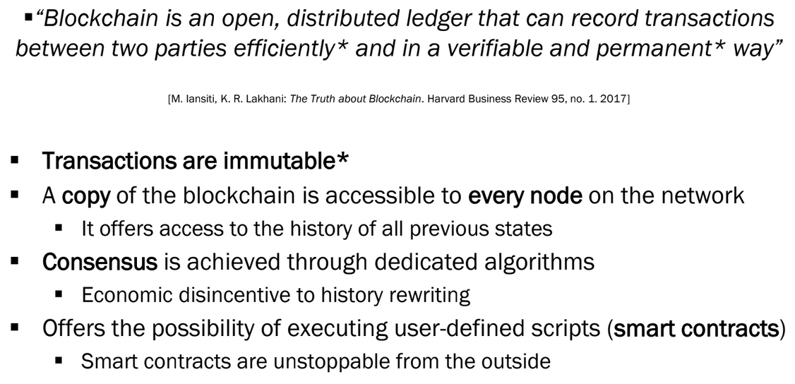

# Blockchain and DLT

### Recall questions

1. 

 What is a good definition for the blockchain? 

    
    \
    

2. 

 Define the key elements of a blockchain. 

    
    \
    Key elements:
    - ==transaction==
    - ==ledger==: double spending
    - ==block==

