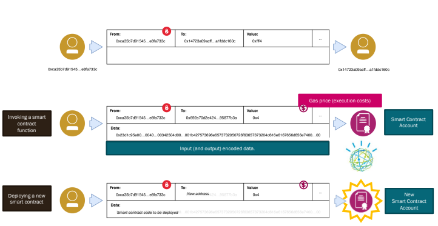

# Blockchain and DLT

### Recall questions

1. 

 What is a good definition for the blockchain? 

    
    \
    

2. 

 Define the key elements of a blockchain. 

    
    \
    Key elements of a blockchain:
    - ==transaction==: transfer ==crypto assets== from account A to B;
    - ==ledger==: ordered ==collection of transactions==;
    - ==block==: ==group and collate== transactions, also ==refer back to predecessors== in the chain.

3. 

 What is a smart contract? 

    
    \
	It's "merely" a ==piece of code== that executes a function when called. It  also ==has its own balance==.

	

	Note that invoking a smart contract or just creating it requires ==gas fees== to be paid! Code  in smart contract is also ==immutable==.

