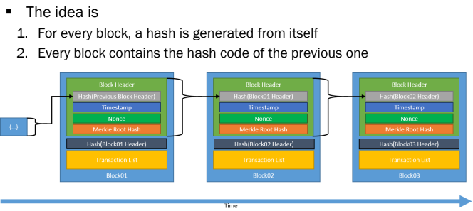

# Bitcoin

Also see :
- [[DS III - Bitcoin]]
- [[DS II - Reaching Consensus]]

### Recall questions

1. 

 Why do we say the blockchain is a pr...? 

    
    \
    

	The blockchain is ==not a software, neither a computer== and so on.

2. 

 What is the concept of min(t)ing?  

    
    \
    The idea for a currency based on computing a (really hard)  ==one way function== that must be ==tunable== and thus comes with a ==specific cost==.

3. 

 Explain how transactions are prepared in order to be added to a block. Hint: pool!  

    
    \
	The overall process goes like this:
	- a node ==makes a transaction== and propagates it to the network;
	- a ==mining node receives the message== and puts the transaction in a ==pool==,  ready to add it to a block;
	- a mining node that solved the PoW function then requests the block to be added to the blockchain.

4. 

 Explain why the CAP theorem    matters for blockchains. What does the blockchain "give up", although not entirely? 

    
    \
	When dealing with distributed systems,  propagation in the network will almost (always) end up in ==conflicts==.

	

	The ==CAP theorem== is relevant as it applies to ==distributed data storages==:

	

    The blockchain gives up ==consistency==. in the sense that it ==reaches eventual consistency.==

5. 

  Why hashing matters in the bitcoin blockchain and how is it used? Why is it a "good fit" for our PoW function?

    
    \
    

	This works well as event ==smallest change of input will result in a completely different output digest==. This ensures that not only the PoW function (==SHA3==) cannot be computed backwards but also that ==rewriting history== gets ==increasingly more expensive== (thus limiting malicious attacks).

6. 

  What is the incentive to solve a block? Why?

    
    \
    Coins! This ensures that ==the work done to solve the PoW function is rewarded adequately.==
    Note that nodes that make transactions will also reward mining nodes with ==transaction fees==, which can be made ==higher in order to give a transaction more precedence over the others==.
    

7. 

 What is block time? What is the effect of a long/short block time?   

    
    \
    Block time ==refers to how often a block is published==. Having: ==short block time== makes the process faster but more error prone (e.g can get the ==order of transactions wrong==), while a ==longer block time== does the opposite effect.

7. 

  Use the concept of the 51% attack to explain why proof of work effectively avoids malicious transactions (e.g. double spending).

    
    \
	
    

8. 

 Why do we say the blockchain grants "pseudonimity"? 

    
    \
    Because ==while account holders are not public, their addresses and their activities are.==
    Privacy is still granted through the use of private and public keys.

