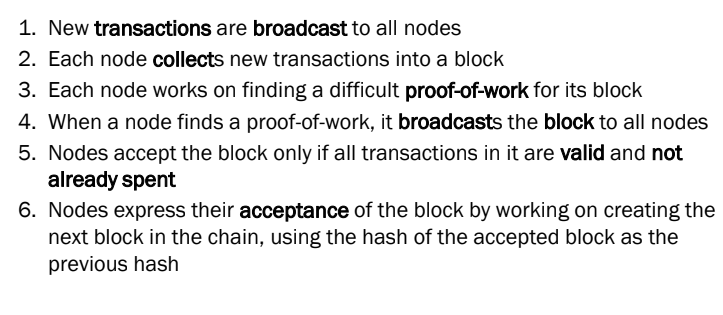

# Bitcoin in depth

Also see :
- [[DS III - Bitcoin]]
- [[DS II - Reaching Consensus]]
- [[BDLT II - Bitcoin]]

### Recall questions pt.1

1. 

 Describe the detailed behavior of each full node receiving a transaction. 

    
    \
    

2. 

 Describe bitcoin as a chain of signatures.  Explain then how a the hash inside a transaction is generated.

    
    \
    

	As it can be seen, a ==transaction can have multiple inputs and outputs.== This inputs are ==references to an output from previous transactions==, while the outputs are usually the ==sender and the redeemer==.

	We say it's a chain of signatures as ==each sender it's going to sign the transaction with the hash of a previous transaction and his private key== and this process is going to be repeated for each successive transaction.
    

3. 

 Describe bitcoin as a state transition system. How do we express transaction fees? 

    
    \
	We can see the state of each node as follows:

	

	Each node has a ==state defined by unspent transaction units. Every time a transaction is actually taking place, it replaces the existing transaction units with the new ones that were created==.

	Transaction ==fees== are expressed ==implicitly,== in the sense that they are computed as the ==difference between the value sent to the redeemer and the change sent back to the user who created the transaction==.
    

4. 

 Explain how the validity of a transaction is verified.  What is the next state of the state machine?

    
    \
	The transition applies if and only if all of the following apply:
	- for each input in the current state the UTXO is in the current state
	- the signature matches the owner of the UTXO
	- the sum of denominations of all input UTXOs is higher than or equal to the sum of denominations in the output

	

5. 

 What about the validity of a transaction in a block?

    
    \
	We also check that ==the block timestamp is greater than the median timestamp of previous 11 blocks, and less than the network-adjusted time + 2 hours.==

6. 

 Explain how the PoW algorithm works. 

    
    \
    The goal of the PoW of bitcoin ==is finding a hash for the current block s.t. it has a certain numbers of 0 in the prefix==. Once such hash is found, a node can the submit the block to the others (see question 1).

7. 

 What is the difference between a full and a light node? 

    
    \
    A ==light node== only has to 
    - ==download block headers==
    - ==verify the PoW on such headers==
    - download only the ==branches with transactions relevant for them==
    

8. 

 What is a coinbase transaction? 

    
    \
    A coinbase transaction is ==the first transaction of block, from the miner to itself==. it is a special transaction as it's signed by the miner for the miner!
    

