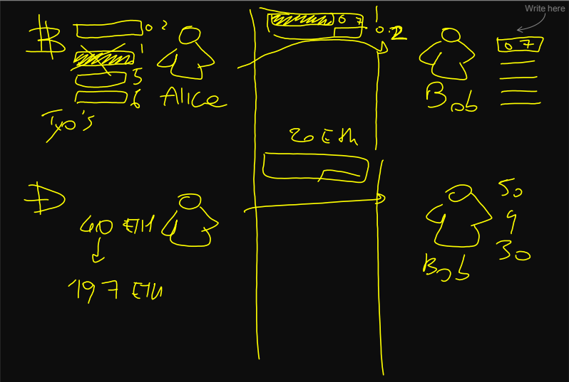

# Ethereum

### Recall questions

1. 

 What is the difference between the transaction model in bitcoin and the balance mode in eth? 

    
    \
    In eth, ==a user does not have to have previous transaction in order to create new ones==. What he can do is simply create new ones. This is possible because ==each eth account as its own balance==.

	

2. 

 What info is included into each eth account?  

    
    \
    Each account has ==local state info== (compared to btc in which we only have the list of transactions):
    - ==nonce=== that indicates the ==number of transactions sent, for EOAs==, or the ==number of contract creations made, for a CA (code artifacts)==
    - ==balance== counted in ==Weis==
    - a ==key/value== storage to retain data
    - ==immutable code, in the case of CA==

	

3. 

 What are the capabilities of contracts in ethereum (implications of eth contracts being turing complete)? Where are they run? 

    
    \
    In eth, smart contracts can:
    - ==read and write== to internal storage
    - ==send other messages==
    - ==create/call other contracts==

	Eth smart contracts are run on the ==Ethereum Virtual Machine==.
	

