# Consensus

### Recall questions

1. 

 Why can't we just "save" hashes that start with a certain number of zeros? What is an actually better strategy? 

    
    \
    No! In fact, either ==the block header== or the ==position of the nonce (hence the name hasharound)== is going to change depending on the block. \
    A much better strategy for achieving faster solving times is to ==split computation among different nodes, having each machine working on different partitions of possible nonces==. Note however that only the winning node is going to get the reward...
    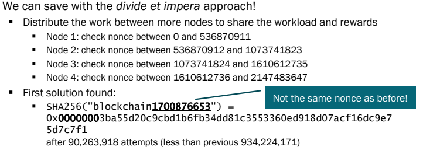

2. 

 What is the "re-target" operation in bitcoin?  

    
    \
    It's the operation by which ==the bitcoin protocol ensures a constant difficulty, namely 2016 blocks every 2 weeks==. The name comes from the fact in the PoW algorithm, we look for a block digest ==less or equal to a given target==.

4. 

 Who gets the reward if 2 nodes solve the same block in Bitcoin? And in ethereum? What is the reward then? Does everybody get it? 

    
    \
    Sadly for bitcoin miners, only the ==winning node==! In ethereum, however, things work a bit differently:  we have ==ommers (a.k.a uncles)==, which are ==blocks for which the PoW has been solved but not "in time"== (i.e. the chain continued after another block.)
    
    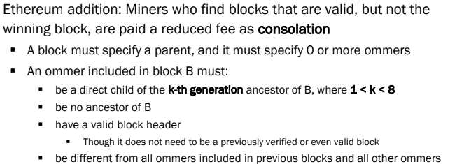

	Interestingly, ==for every uncle U in block B, the miner of B gets an additional 3.125%== of reward.

5. 

 What is ethash and how does it prevent hardware optimization for solving PoW?  

    
    \
    Ethash is ethereum's way of ==defending against hardware optimised computation==. One common example in the bitcoin blockchain are ASICs. \
    What ethash does is ==relying on a DAG weighing in at 1GB, changing every 125 hours==.  This makes it harder as 1TB of RAM, especially at the time of release, was really expensive.
    

6. 

 What changed in the ethereum blockchain with the London upgrade?  Hint: transaction fees.

    
    \
    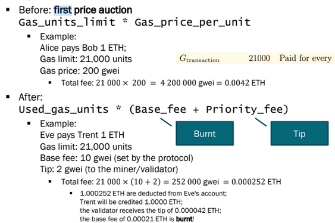

	In short, ==part of eth is now burnt== in order ==
    

7. 

 Explain how the fees are regulated after the London upgrade.  

    
    \
	After london upgrade, ==fees are automatically regulated by the system==. An example follows:

	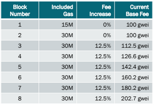

	The ==target size is 15M gas units==, with a ==30M max cap==. If ==network utilisation does not decrease, the base fee is increased by 12.5==, otherwise it is ==decreased if network capacity goes below 50%==. 

8. 

 What is the proof of stake algorithm proposed for ethereum? What should it enforce in order to work?  Hint: slashing 

    
    \
    The main idea is the following: ==the more is left at stake by users, the less likely they are to subvert the blockchain==. This is effectively ensured by having ==**validators** place a bet on the blockchain they deem true==. If they are "right", they get a reward. \
    However, in order to work, ==this protocol must ensure  that one cannot simply bet on all chains in order to win==. Because of this, ==slashing is introduced==: some of the ==validator's deposit is going to be burnt with immediate logout if the slashing conditions are violated!==. 

	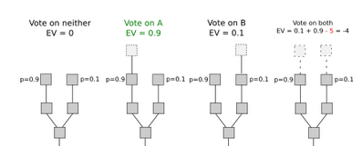

	This overlay (consisting of more things than just slashing!) for the existing PoW chain is known as ==Casper, the friendly finality gadget==.
   
    

### Towards eth 2.0

9. 

 What is the beacon? What is its main purpose? Does it work already? 

    
    \
    The beacon is ==a proof of stake chain, which will be the "next" evolution of the existing eth blockchain==. The main idea is to ==make things faster: delegate smart contracts executions to shards, while the backbone executes transactions.==
    After a while, the shards ==roll up to synch with the beacon==. \
    The beacon mechanism effectively started working on ==September 2022, with the Paris upgrade, a.k.a. the Merge==.

	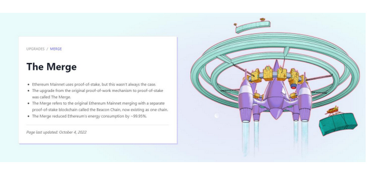
    

10. 

 What is the role of a validator? How does a node express his agreement? How expensive is to be one (i.e. how much is "at stake")?. 

    
    \
    At the moment, being a validator is expensive!
    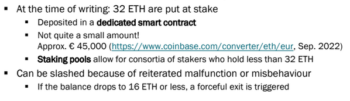

	A validator is responsible for:
	- ==checking the validity of propagated blocks==
	- ==create and propagate new blocks, if they are the proposer==

	==Agreement is expressed with attestations== for block deemed valid.

11. 

 Explain the use of LDM GHOST to solve conflicts. Explain then how casper is used to finalize blocks (hint: checkpoints). What is a supermajority? 

    
    \
	LDM GHOST is used to ==decide agreement on the next block in a chain==. It basically ==favours the block with the most attestations, only considering the most recent messages from each validator== (hence the greediness). Here is an example of the mechanism (reads from bottom to top!):

	 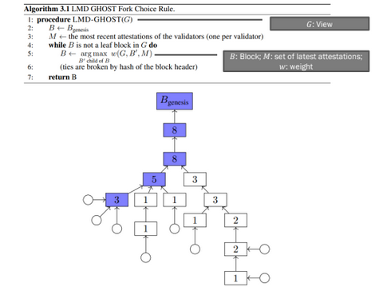

	For what regards Casper instead:

	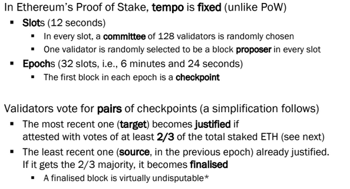

	It is also important that a ==“supermajority link” must exist between successive checkpoints A and B== (i.e., 2/3 of the total staked ETH voting that checkpoint B is the correct descendant of checkpoint A) ==to upgrade A to finalized and B to justified==.

	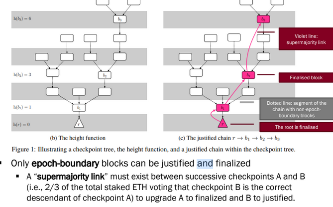

12. 

 What is the sync committee and its purpose? 

    
    \
	Every 256 epochs (~27 hours), a sync committee is randomly assigned. It is a ==group of 512 validators that signs block headers for each new slot. A light client can take these headers to represent accurate and validated blocks==. 
    

13. 

 How does whistleblowing help against malicious nodes? What are possible cases of misbehaviour?  What is a particular case of misbehaviour that is not necessarily voluntary?  What happens to node that vote against the majority after 4 failed epochs? 

    
    \
	A ==whistleblowing validator sends a message to be included in the next block, in order to signal a node that is caught doing one of the following==:

	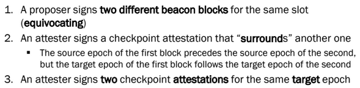

	The offending node is going to be ==slashed and eventually removed==. Note that ==inactivity is also considered as sabotage==: after 4 failed epochs, nodes that vote against the majority are penalised.
    

13. 

 What is the total (minimum) number of validators needed per epoch? What assumptions are made on their behaviour (hint: bizantine). What is a key "countermeasure" to avoid too many bizantine nodes? 

    
    \
	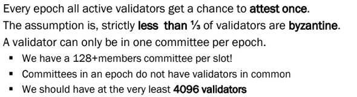

	One key thing:

	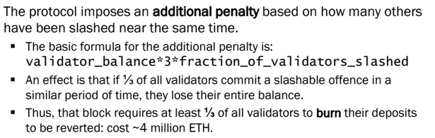

	Also note that ==nodes can voluntarily exit after serving 2048 epochs (~9 days)==, but will be given their stake back ==after 4 epochs==, in order to be able to slash malicious nodes that are trying to exit. 
    

14. 

 What are forks? What is the difference between soft and hard forks?

    
    \
	Forks:
	- ==hard==: non backwards compatible, old nodes are "excluded from the new blockchain and go on their own;
	- ==soft==: backwards compatible, i.e. nodes that ==refuse to acknowledge the fork simply ignore the updated protocol==.
    

15. 

 What is effective balance? How does it influence the maximum amount of eth put at stake for each committee member?

    
    \
	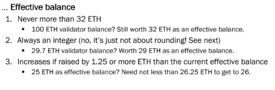
    

