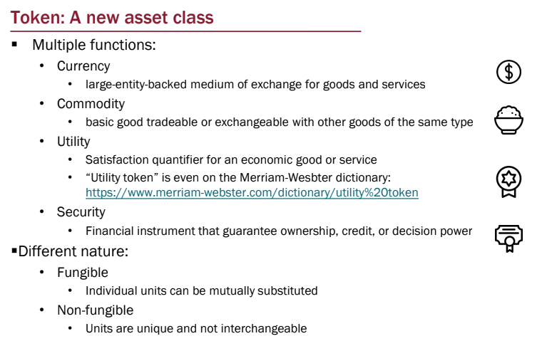

# Solidity

### Recall questions

1. 

  What is a token? Which (potential) functions does it have? What types of tokens do exist?

    
    \

	

The rest of these lectures were spent coding, so use the slides as reference.

