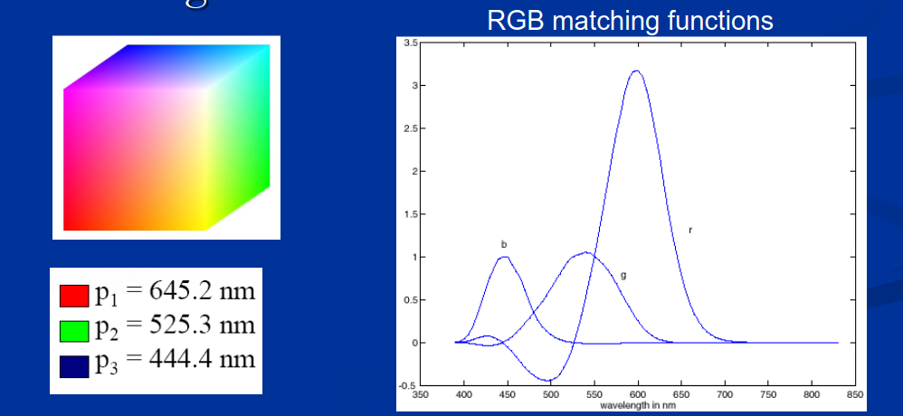
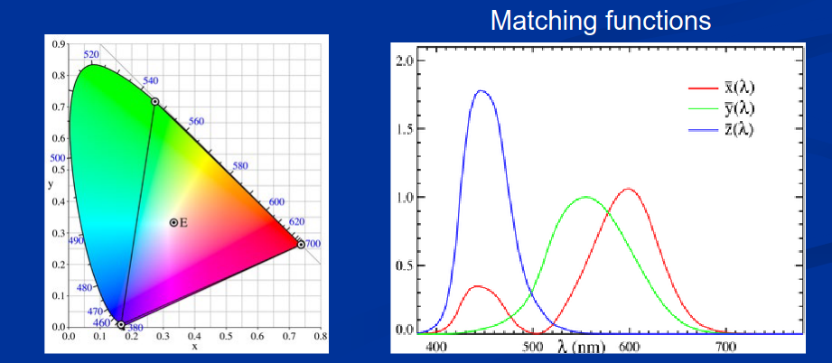
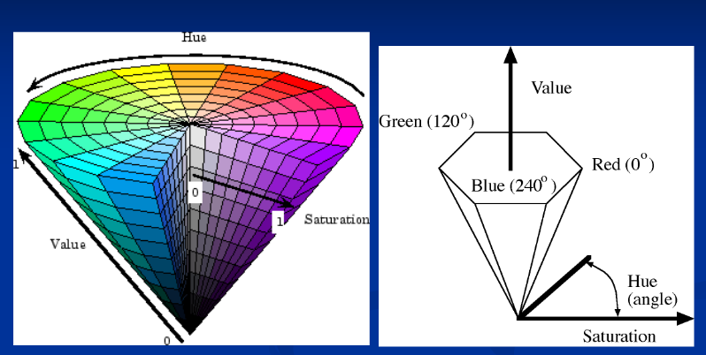
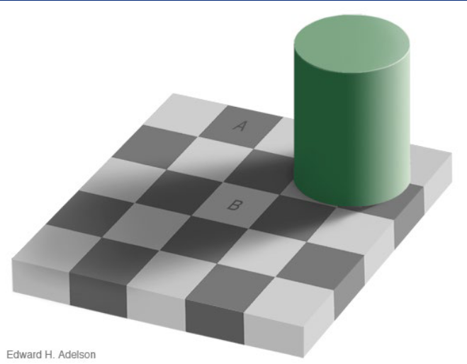
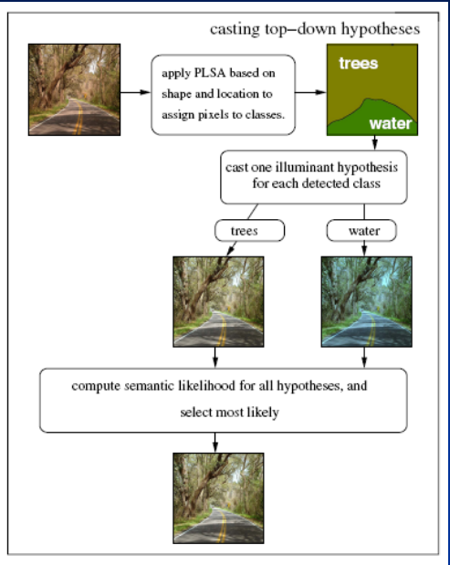

# Basics of color

### Recall questions

1. 

  Describe the most common colour spaces. 

    
    \
    Most common ==color spaces==:
    - ==linear== color spaces:
	    - ==RGB==: primaries are monochromatic lights + subtractive matching for some wavelengths 
	    - ==CIE XYZ==: primaries are imaginary, but matching functions are everywhere positive  
	- ==uniform color spaces==
	- ==nonlinear color spaces==:
		- ==HSV== or ==Hue, Saturation, Value== 

2. 

Describe common issues in colour perception. 

    
    \
	Common "issues" in colour perception:
	- ==lightness constancy==  
	- ==simultaneous contrast==: background colour affects perceived colour of  the target
	- ==chromatic adaptation== to different levels of ==illumination== or ==image temperature==
	- white balancing

3. 

 Describe possible techniques for white balancing.

    
    \
    Possible techniques:
    - ==gray cards==
    - ==gray world== assumption 
    - ==brightest pixel assumption==: assume highlights have colour of light source
    - AI techniques 

