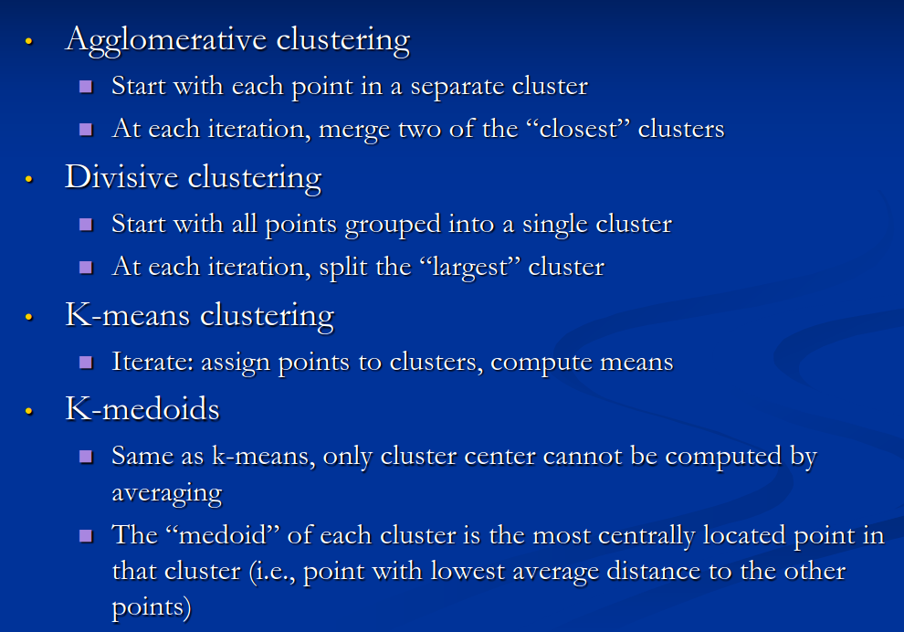
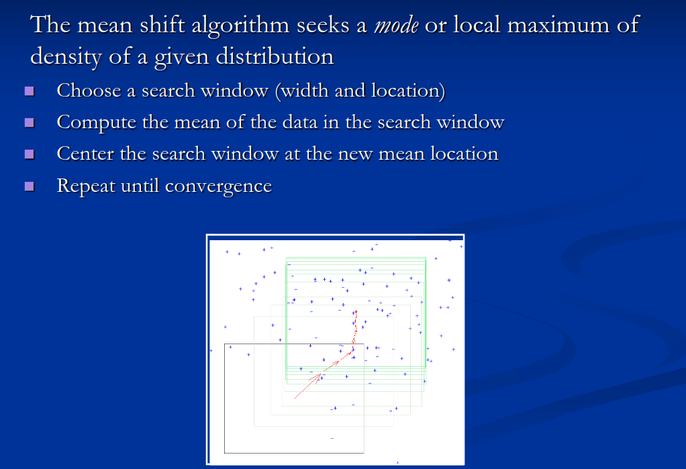
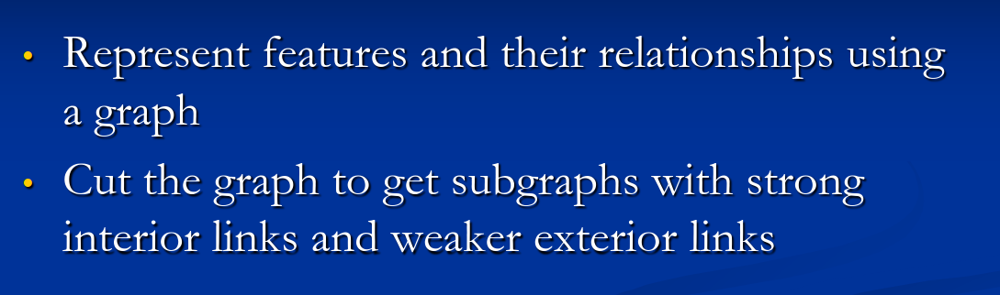

# Segmentation

### Recall questions

1. 

  What are the 2 main approaches to segmentation? 

    
    \
    Two main approaches::
    - separate images into =="coherent objects"==
    - ==group together similar looking pixels==, for further processing
 

2. 

   What are possible clustering strategies? 

    
    \
	

3. 

 What is mean shift? What is its purpose? 

    
    \
	Another ==really expensive== algorithm for ==pixel clustering==.
	

4. 

 Describe the general idea behind graph segmentation. 

    
    \
	
	We can measure ==affinity based on colour, intensity or distance==.

