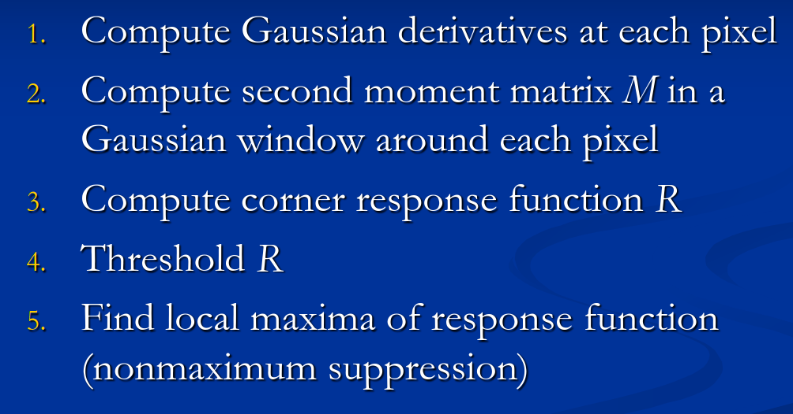

# Blobs

### Recall questions

1. 

  What is a blob?  

    
    \
    The ==patch of an image that differs in properties, such as brightness or colour, compared to surrounding regions.==

2. 

   What are characteristics of good features? 

    
    \
    A good feature is:
    - ==repeatable==, in the sense that it can be ==found in several images despite potential transformations==
    - ==compact/efficient==
    - ==local==
	

3. 

  Summarise the basic steps of Harris corner detector.

    
    \
    

	Here is a good explanation of how the Harris corner detector works: https://docs.opencv.org/3.4/dc/d0d/tutorial_py_features_harris.html

4. 

  To which transformations is the Harris corner detector invariant?

    
    \
	Harris corner detector is invariant to:
	- ==rotation==
	- ==affine intensity change (partially)==

	It is ==not invariant to scaling!==

6. 

  

    
    \

