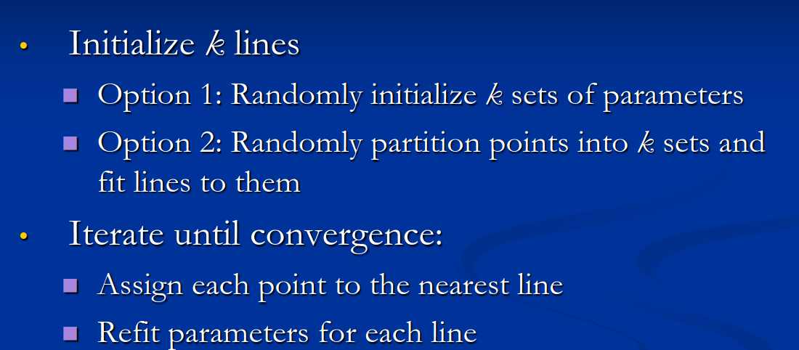
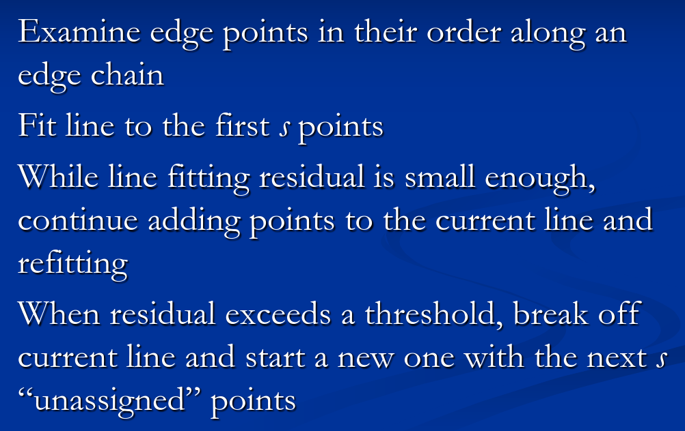

# Fitting

### Recall questions

1. 

 What is fitting? 

    
    \
    With fitting we ==choose a parametric model to represent a set of features==.
    

Techniques:
- voting with hough transform:
	- https://www.youtube.com/watch?v=4zHbI-fFIlI
	-  https://en.wikipedia.org/wiki/Hough_transform
-  total least squares
- ransac:
	- https://en.wikipedia.org/wiki/Random_sample_consensus
	- https://www.youtube.com/watch?v=9D5rrtCC_E0
-  k lines:
	- 
- incremental fitting:
	- 

