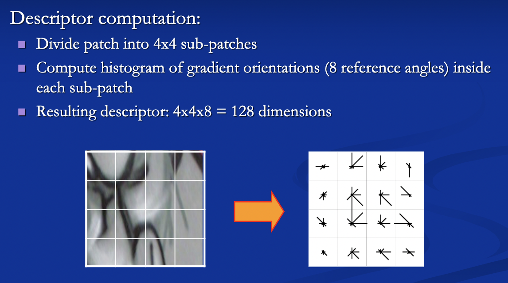
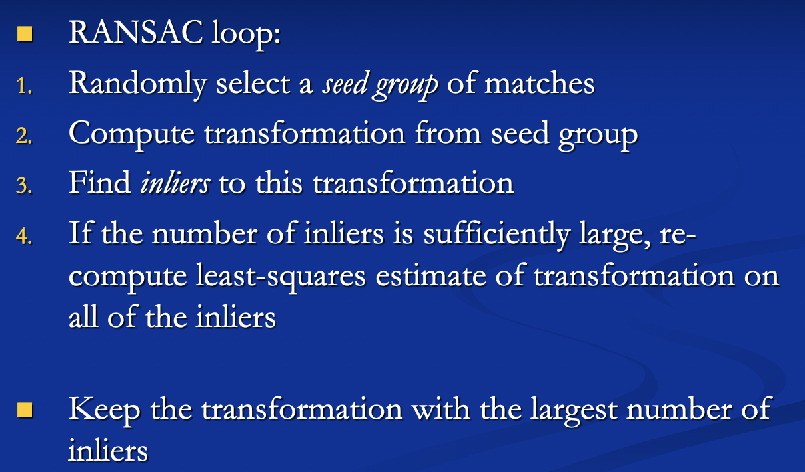
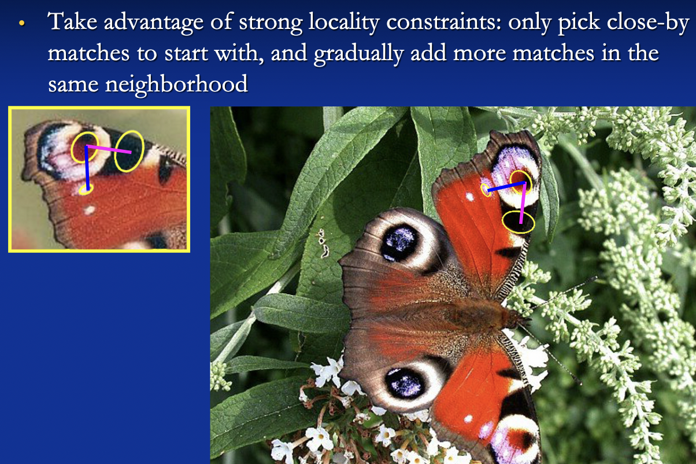
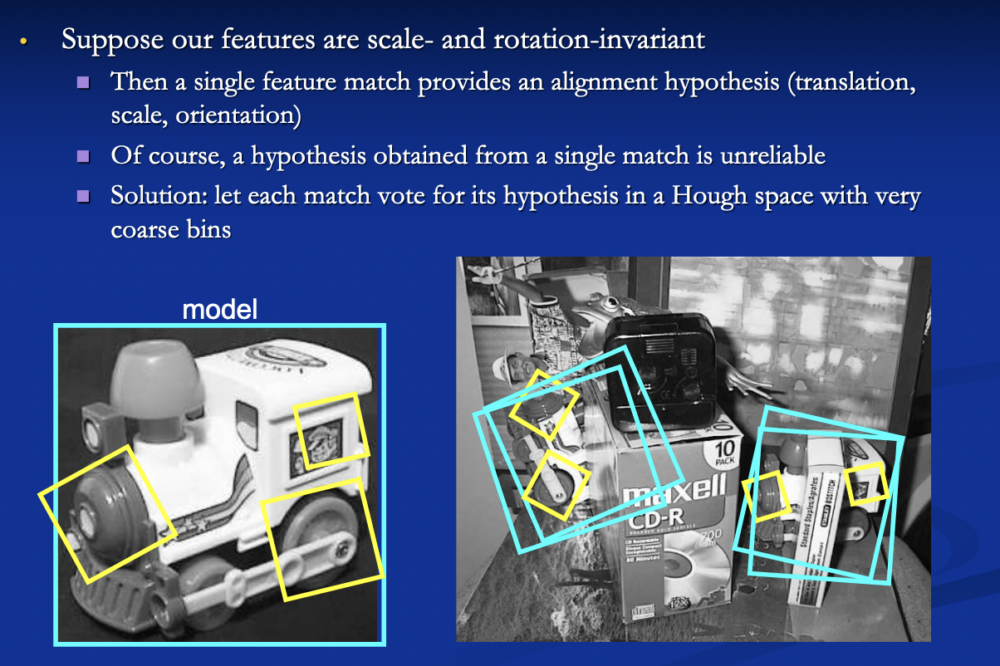
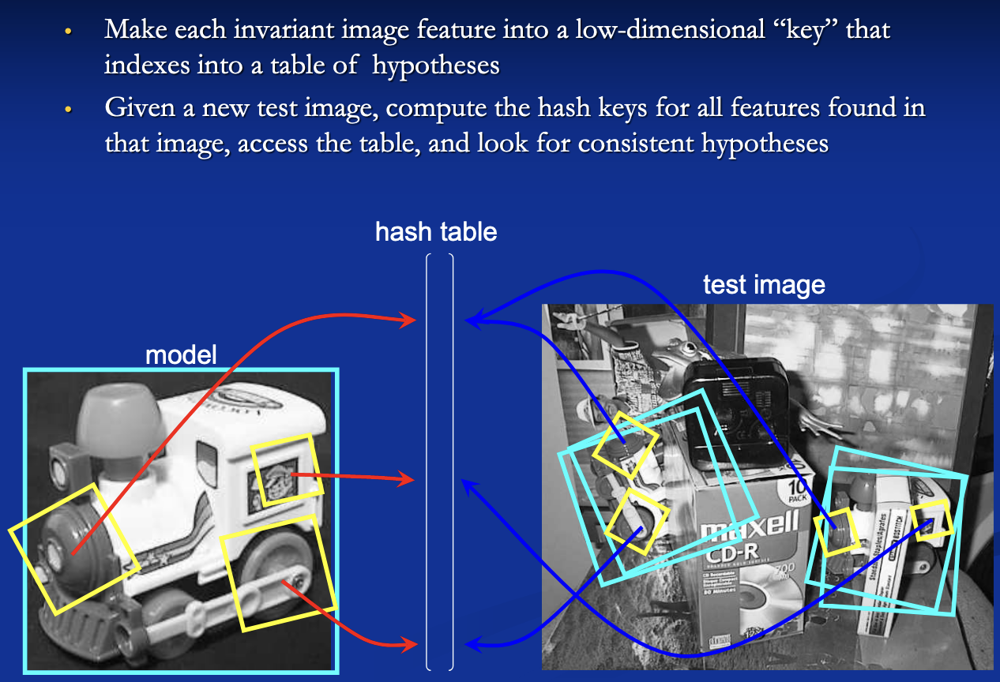

# Alignment

### Recall questions

1. 

 What are the 2 most common alignment techniques? 

    
    \
	Two broad approaches:
	- direct ==pixel based alignment==
	- ==feature based== alignment: align where ==feature descriptors agree==

2. 

 What are the most basic 2d transformations? 

    
    \
    Most common:
    - similarity: ==translation, scale, rotation==
    - ==affine==
    - ==projective (homography)==
    
    

3. 

 How do we compare 2 patches that could be aligned? Which feature descriptors can we use? 

    
    \
    Possible techniques:
    - ==compare vectors of raw intensity values==
    - ==compare histogram==, for example using ==SIFT== 
    

4. 

 What are the 2 main strategies for feature matching? What do we have to deal with? 

    
    \
    To carry on with the alignment, we want to generate ==putative matches==, which are ==patches in the other image which could match the original based on the appearance==. \
    In doing so, we can adopt 2 strategies:
    - ==exhaustive search==
    - ==fast approximate nearest neighbor search==

	In both cases, however, we might have ==many outliers that we have to deal with==.
	

5. 

 How can we use RANSAC to find inliers in putative matches? 

    
    \
	

6. 

 What about incremental alignment ?

    
    \
	

7. 

 Is it possible to also use Hough transforms? 

    
    \
	

8. 

 And hashing? How is it used for finding inliers? 

    
    \
	

