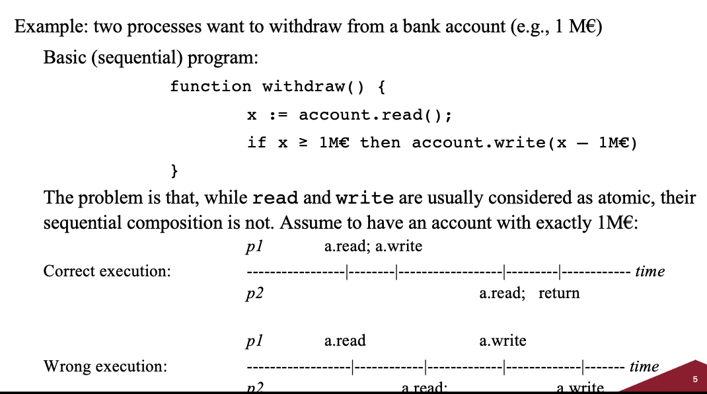

# Introduction to concurrency

### Recall questions

1. 

  Give a basic definition of concurrency. 

    
    \
	Concurrency: a ==set of sequential state machines, that run simultaneously and interact through a shared medium==.

2. 

  What are the main assumptions on the type of systems partaking in concurrency? 

    
    \
    We'll assume our systems to be:
    - ==reliable==: every process ==correctly executes its program==;
    - ==asynchronous==: no timing assumption;
    - ==shared memory==: every process has ==its own storage==, but can access ==few shared registers==.

3. 

 When do we need synchronization? Which elements does it involve? Give a brief definition through simple examples. 

    
    \
    ==Synchronization== is required whenever ==the behavior of one process depends from the others==.
    It involves:
    - ==cooperation==: a ==rendevouz== is a good example of a problem where cooperation is required;
    - ==competition==: 

4. 

  What is atomicity? How do we call atomic sections of code?  

    
    \
    Atomicity ==ensures that a piece of code runs without intermission from any other programs==. A piece of code that is marked as =="critical section" (C.S.) must be atomic==. 

5. 

 Explain the mutual exclusion problem and which assumptions we make. 

    
    \
	In the mutex problem we want to ==design an entry protocol (lock) and an exit protocol (unlock)== such that, when ==used to encapsulate a C.S.== (for a given shared object), ==ensure that at most one process at a time is in a C.S. (for that shared object).== \
	To keep things simple, we assume:
	- that ==all C.S. terminate==
	- that ==code is well formed==, e.g. "lock-CS-unlock"

6. 

  Which properties should a solution for a problem satisfy?  Why do we need them both? 

    
    \
    A solution for a problem should satisfy:
    - ==safety==: ==nothing bad ever happens==
    - ==liveness==: ==something good eventually happens==

	Note that safety without liveness means that nothing bad OR good happens, while liveness without safety is dangerous.

7. 

  Which forms of these properties are ensured  in concurrent systems? Explain the hierarchy for .... 

    
    \
    In concurrent systems we can easily ==ensure safety==. For what regards ==consistency==, there is a hierarchy of possible forms:
    - ==bounded bypass==: let $n$ be the number of processes; then, there exists $f : N \to N$ s.t. every lock enters the CS after at most $f(n)$ other CSs.
    - ==starvation freedom==: every invocation of lock eventually grants access to the associated C.S.
    - ==deadlock freedom==: if there is at least one invocation of lock, afterwards, eventually, at least one process enters a C.S

8. 

  Explain what atomic write/read operations mean.  

    
    \
    For safety reasons, we want read/write operations on registers to be ==atomic==. This means that each ==invocation of an operation==:
    - looks ==instantaneous==: there exist a function $t: OpInv \to \textbf{R}^+$
    - may be located in ==any point== between its start and end time: $t(opInv) \in [t_{start}(OpInv),t_{end}(OpInv)]$
    - does ==not happen together without any other operation==, so $t$ is ==injective==: $t(OpInv) \neq t(OpInv')$ whenever $OpInv \neq OpInv'$

	For read operations, we also ==require it to returns the closest preceding value ==written in the register, or the ==initial value (if no WRITE has occurred)==.

9. 

  Describe possible register types w.r.t. read/write properties.  

    
    \
    Register types:
    - $SRSW$: single read, single write
    - $MRSW$: multiple read, single write
    - $SRMW$: single read, multiple write
    - $MRMR$: multiple read, multiple write

10. 

  Describe Peterson's algorithm for solving concurrency for 2 processes. 

    
    \

11. 

  Prove that Peterson's algorithm satisfies safety and liveness for 2 processes.

    
    \

12. 

  How can we generalize Peterson's algorithm to n processes?  Explain the new proofs and which properties are satisfied.   

    
    \

13. 

  What are the costs of Peterson's algorithm in terms of  nr. of registers and accesses? 

    
    \

14. 

  Why does Pet. algorithm for k processes does not grant bounded bypass? Which version of liveness does it grant? 

    
    \

