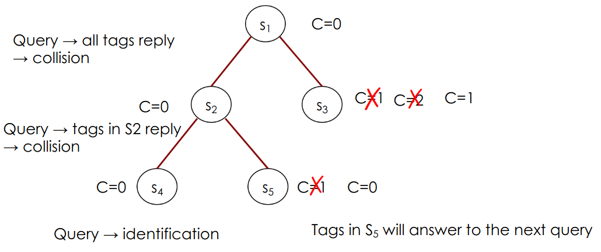
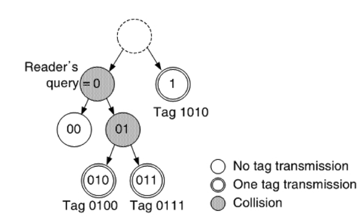
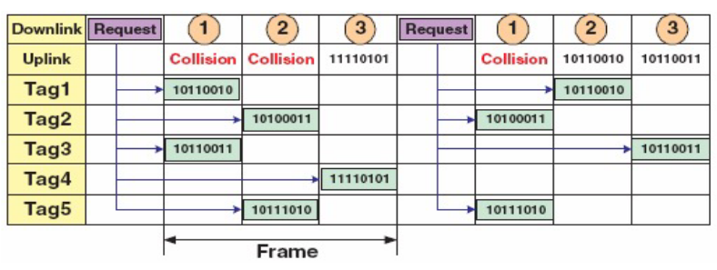
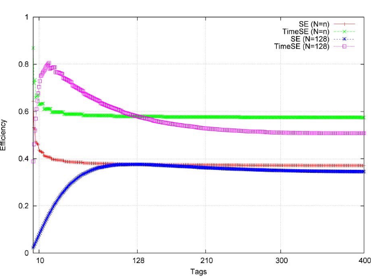
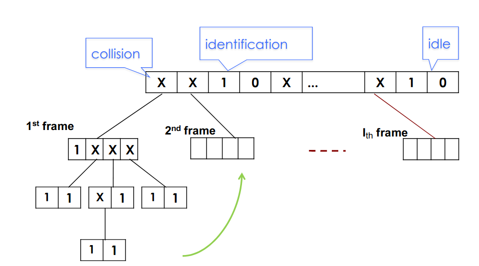

# RFID

## Recall questions
        - What components make up a RFID system?
        - What is the type of communication? What is the network topology?
        - What are the characteristics of the RFID channel?
        - Why collision avoidance is used in RFID systems? What are 2 common types of protocols?
        - How do tree protocols work? Descrive both binary tree and query tree.
        - What is System Efficiency? How is it measured? What is the SE for tree protocols?
        - How does Frame Slotted Aloha work? What is its SE?
        - What is the standard protocol? Why it takes into account the Time System Efficiency?
        - What are the 2 key points of the standard protocol? (idle is better, node number)
        - How does TSA work? What is its SE?
        - What is the technique used in BSTSA to evaluate the number of tags? What is its TSE when the number of tags is accurate?

## Radio Frequency Identification

### What is an RFID system

==2 main components==:
- ==RFID labels== that store a unique ==ID with the tag inside them (96 bits)==
- ==RFID reader== that queries tags to get their ID

The most common use of RFID is object identification:
- ==access control object tracking==
- ==domotics and assisted living==

### Types of communication

==Reader to tag or tag to reader==
- tag to tag doesn't work 

The tags work with back-scattering: when they receive the signal from the reader
they use its energy to send a response

The ==topology of this network is a star.==

### RFID channel

The ==RFID channel== is:
- ==wireless==
- ==shared==
- ==low datarate== ~40Kbps
- ==simultaneous==, so collision is possible

Transimission range is usually 0-10m depedning on obstructions.

### Collision avoidance

==Collision detection (CD) / Carrier sense (CSMA) is pretty much impossible since tags can't communicate spountaneously with each other==.
This means that the reader must decide how tags access the channel.

==Proposed protocols== to solve the issue:
- ==sequential==: make tags transmit one at the time
- ==concurrent==: detect collision with signal processing

## Sequential protocols

### Binary splitting

In this protocol, ==the queries are done multiple times until only node responds==.
The principle is called ==binary splitting== cause the splitting is based on the random generation of a binary number.

Binary splitting:
1. each tag initially has a counter $C$ set to 0
2. reader sends a query
3. all tags reply and there is collision, then they generate a random binary number and add it to the counter
4. repeat step 1, but only tags with $C$=0 reply
5. if there is a collision, all tags generate a random binary number and add it to the counter // silent tags just add 1 to their counter C
6. else if none or one tag replies, the counter is reduced by one (and the tag who answered becomes silent) 

In this example, a set of 8 tags replies to the reader:

### Query tree

In ==this protocol, the tags split based on their ID. The reader sends a string and only the tags with such string as a prefix in their ID answer to the query==.
- the process is the same of binary splitting, except the starting string is NULL

### Performance of tree protocols

==System efficiency : $SE = \frac{n}{q}$==
- where $n$ is the number of successful queries (and of tags)
- and $q$ is the number of queries

Only the ideal ==optimal protocol has $n=q$==. We can estimate the efficiency of tree looking at the average
number of queries $BS_{tot}$ using a binomial distribution:

$BS_{tot}(n) = \cases{1 \ \ se \ \ n \leq 1 \\ 1 + \sum_{k=0}^{n} \binom{n}{k} (\frac{1}{2})^k  (1-\frac{1}{2})^{n-k} \ (BS_{tot}(k) + BS_{tot}(n-k)) \ \ se n > 1}$

For ==Binary Splitting and QS $SE = 0.38$==
- so the efficiency is pretty low

### Framed Slotted Aloha 

==In aloha protocols the time is slotted, and the slots are grouped into frames. Each tag then picks a random slot to respond.==

Performance of ==FSA is $SE = 0.37$==, the rest is collision and idle queries

### Standard protocol

The protocol used in RFID is EPC GEN 2 class 1, and is based upon FSA. It also specifies the transmission time model (TTM) that allows us to make a temporal evaluation of the protocol performance.

The key aspect of ==TTM is that idle responses (no response) lasts less than identification or collision responses==.

- RX_threshold: time at which reader should receive the first bit of tag transmission
- R1, R2: reps. tag an reader reaction time

The metric that takes time into the account when evaluating performance is $TIME_{SE}$:

$TIME_{SE} = \frac{R_{ident}}{\beta R_{idle} + R_{ident} + R_{coll}} = \frac{n(1-\frac{1}{N})^{n-1}}{(\beta - 1) N(1 - \frac{1}{N})^n + N}$
- $R_{idle} = N(1 - \frac{1}{N})^n$ where $\beta$ factor helps with the fact that idle rounds last less than identification and collision ones
- $R_{ident} = n(1 - \frac{1}{N})^{n-1}$
- $R_{coll} = N - R_{idle} - R_{ident}$

Ideally, ==knowing how many tags are in the environment leads to higher performance. Overestimating is also 
more efficent than underestimating.==
- but identifying the number of tags is not a trivial problem

### Tree slotted aloha

==To reduce the number of time used for collision and idle slots, slots can be executed following a tree:
after a collision, a new child frame is created and only the colliding tags partecipate in this new slot==.

A good way to estimate TSA performance is to count the number of nodes into the TSA tree.

$TSA_{tot}(n) = \cases{1 \ \ se \ \ n \leq 1 \\ n + n \sum_{k=2}^{n} \binom{n}{k} (\frac{1}{n})^k  (1-\frac{1}{n})^{n-k} \ TSA_{tot}(k) \ \ se n > 1}$

For large values, ==$SE_{TSA} = 0.43$==. What can be inferred from test data is: knowing the number of tags is a way to make TSA more efficient
- but how can we do that?

## Estimating the number of tags

### Total number of tags

The formula to decide the best amount of tags to assign to a collision slot is:

$tags = \frac{estimated tot. tags - identified tags}{collision slots}$

So we need a way to estimate the total number of tags!

### Estimate using Chebyshev's inequality

==One way of estimating the total number of tags is using Chebyshev's inequality:==

Where given $N$ and a possible value of $n$, the expected number of slots with $r$ tags is estimated as $a_{r}^{N,n} = N \times \binom{n}{r}  (\frac{1}{N})^r (1 -frac{1}{N})^{n-r}$ 

This way of estimating:
- doesn't capture the possibly high variance of the number of tags
- is unefficient for large node numbers!

### Binary Splitting Tree Slotted Aloha

==The basic principle of BSTSA is that 2 group of elements randomly split in 2 groups of roughly the same size==.
What the procotol does is:
- ==using BS to dive tags into groups, whose size can be easily estimated==
- ==use TSA to identify tags in the groups==

==Performance is evaluated as the mix (average?) of BS performance up to the last split and TSA performance on each group:==

