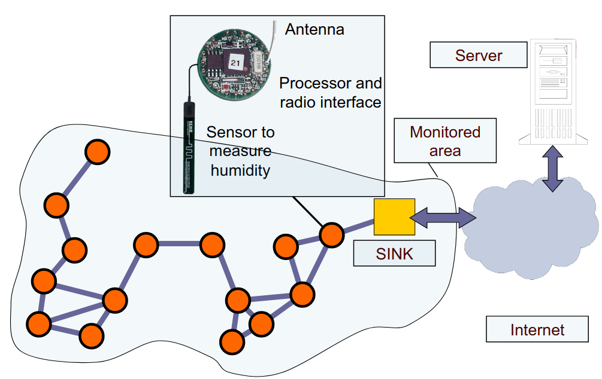
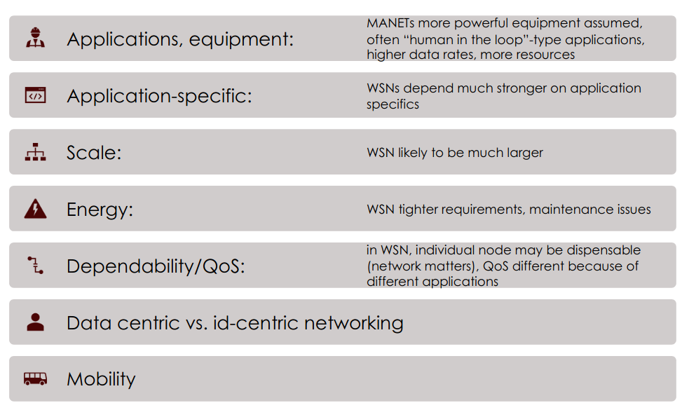
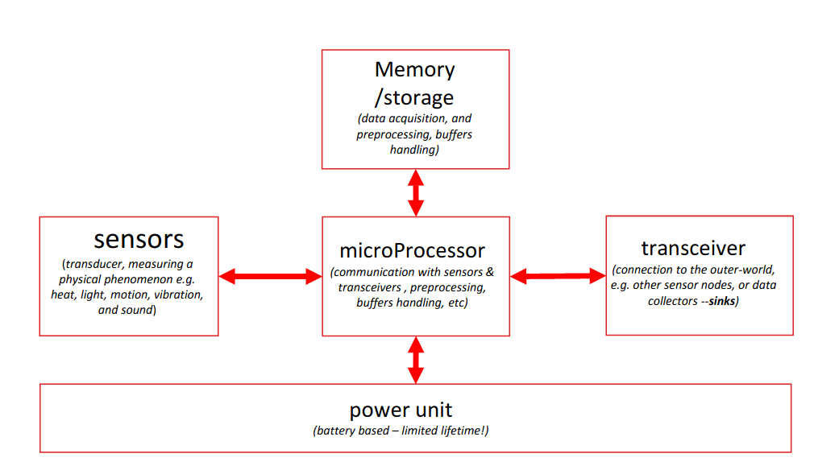

# Infrastracture-less wireless networks

## Recall questions
        - What is the context in which infrastracture less networks are applied? What are the main challenges?
        - What is a WSN? What are the characteristics and some key applications?
        - What are the sink and the actuators?
        - How can we deploy a WSN?
        - What are the main characteristics of a WSN?
        - What are the main mechanisms adopted in a WSN?
        - What are the common issues that affect a WSN?
        - What are the characteristics of ideal MAC protocols for a WSN? What are the 2 main types and their advantages/drawbacks? (contention based, schedule based)

## Infrastracture-less wireles networks

### Challenges in infrastracture-less WN

Assuming there is a central entity too coordinate the partecipants of the network, solutions
like a Wireles Ad Hoc Network can be used
- i.e. few computers connected together in a room

However ==if there is no central entity that acts a centralized creating a network becomes harder==. On top of that, infrastracture less networks are often used in contexts where:
- the ==range is limited==
- ==partecipants are mobile==
- ==devices operate with a battery==

Some of the most common challenges:==
- ==discovering new devices
- ==finding routes to other partecipants - multihop==
- ==mac addresses must be assigned in a distributed fashion==
- ==high energy efficiency==: devices must not consume a lot of energy and operate for a prolonged period

One proposal was to create Mobile Ad Hoc Networks (MANET), but they were never really used much.
A similar concept however, called ==Wireless Sensor Network, is instead widely in use today.==

## WSN 

### Wireless Sensor Networks (WSN)

In a wireless sensor wireless network
- ==devices are smaller, less powerful (low datarate)==
- ==devices can sense the environment==
- ==devices can be many more than in other networks==

==Applications of WSN==:
- industrial control
- environmental monitoring / structural health monitor (i.e. bridges, buildings, volcanos ...)
- healthcare (i.e. sensors for patients heartbeat, pressure, ...)
- smart houses 
- underwater, where signal is passed through sound 
- dronets

### Roles of devices in a WSN

==Sensors==: collect data and send them to a sink

==Sink==: registers sensor's data

==Actuators/Actors==: ==can control devices based on sensor's data==

### WSN deployment

==Deployment==:
- ==random==: often an uniform distribution of nodes is assumed
- ==regular==: planned, often a geometric shape

==Mobile sensor nodes== can also compensate for deployment shortcomings:
- they can be moved
- they can search interesting areas to monitorate

### Characteristics of a WSN

==Scalability==: support large number of nodes

==Wide range of densisties==: one can have many or few sensors per area

==Limited resources for each device==

==Mostly static topology==

==Fault tolerant==: it is not uncommon for many sensors to stop working, so the network is built to be really fault tolerant. It also built to last for long, be mantainable and reprogrammable to adapt to changes.

Services: ==communication is triggered by queries and events==

### Mechanisms adopted in a WSN

Mechanism typically adopted in a WSN:
- ==multihop wireless communication==
- ==self configuration==
- collaboration & in-network processing
- ==energy efficiency==
- ==data centric==
- local
- exploits tradeoff

### Manets vs WSN

### Components of a sensor

The sensor then converts the signal from analog to digital (ADC).

### WSN common issues

A WSN is commonly subject to the following ==issues==:
- ==attenuation of the signal==
- ==multi path propagation (i.e. signal bouncing and arriving after multiple deflections, multihop)==
- ==interference from the sensor itself or an hidden terminal==

There is also the common issue of the ==exposed terminal==, when a node is prevented from sending packets to other nodes because of co-channel interference with a neighboring transmitter 

### MAC strategies for WSN

Ideally, we want a ==MAC service that addresses:==
- ==collision avoidance==
- ==energy efficiency==
- ==scalability==
- ==bandwith utilization==

2 protocol types:
- ==contention based==: scalable but subject to collisions, hidden terminals issue and high energy consumption
- ==schedule based==: needs a central node, not scalable, but energy efficient and less interference