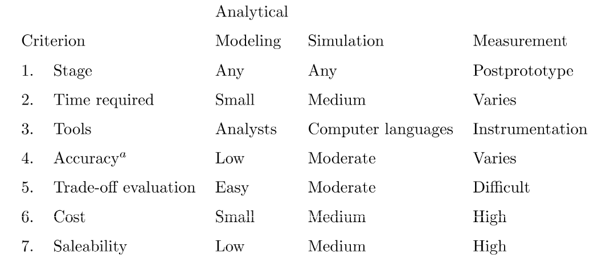
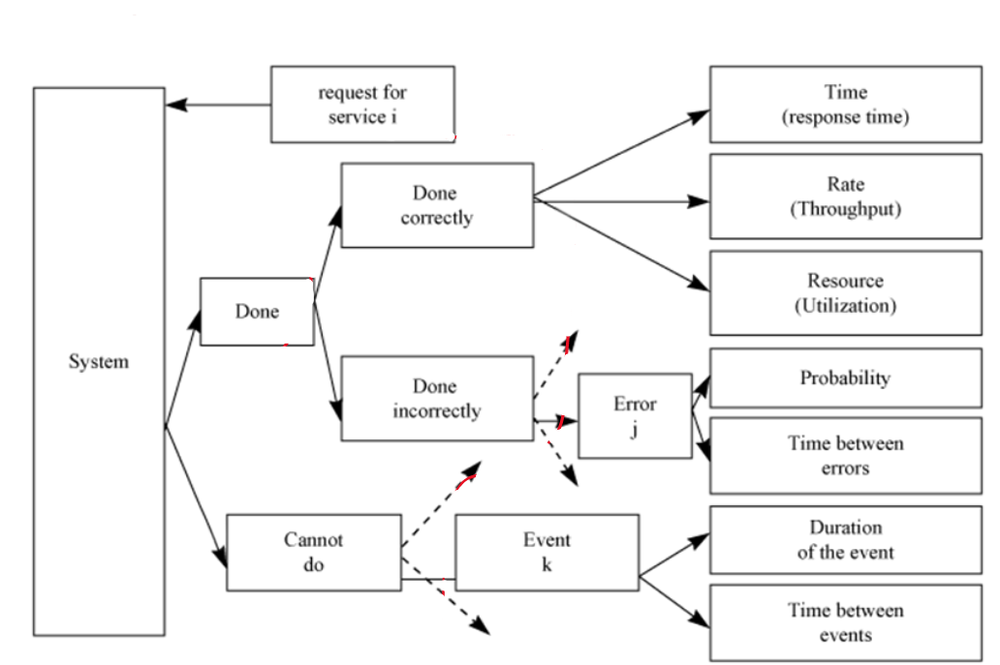

# Performance evaluation 

## Recall questions
        - What must be taken into account when choosing an appropriate evaluation technique?
        - How do we analyze responses based on system behaviour?
        - What are global and invidual metrics? Can they be differnet?
        - What is our "mean" of choice? Why?
        - What are efficient ways of measuring variability? Why a low variability is desirable?

## ==Systematic approach to PE==

1. State the goal and define the system
2. List services and outcomes
3. Select metrics
4. List parameters
5. Select factors to study
6. Select an evaluation technique
7. Select the workload
8. Design experiments
9. Analyze and interpret data
10. Present results

(11: Rinse and repeat)

## Choosing the evaluation technique

We'll now see how to choose the evaluation technique, among:
- simulation
- analytical modelling
- measurement

==Using at least 2 of the techniques is desirable==. If the outcome of 2 different techniques
is similar the evaluation is more precise.

## Selecting the performance metric

### Analyzing responses

If the ==system performs correctly==, we want to analyze:
- ==responsiveness==: time necessary to perform the service
- ==productivity==: rate at which the service is performed
- ==resource utilization==

If the ==system performs a wrong action, an error is occurred==. So we try to ==classify the errors and determine their probability==.

If the ==system instead does not perform the service at all, a failure occured==. So we try to ==classify failure models and determine their probability==.

### Global and individual metrics

==Global metrics reflect the system utility==. In this case all the metric seen before are global.

==Individual metrics reflect instead the utility of the single user==. In this case, only response time and throughput are individual.

==Some of them can be both (response time, throughput), but the value of the individual metric may differ from the global one.==
- i.e. maximizing throughput for a single user may lead to different results than maximizing it for the whole system

### Performing the selection

Reduce redundancy: metrics that give the same information can be removed.

Completeness: ideally we want to model each aspect of the system.

## Summarizing measured data (to present it)

Summarizing:
- in a single number
- or reducing variability

### Empirical mean vs geometrical mean

Empirical mean is one of the most used central tendency measure, but has many flaws:
- when dealing with skewed data results could be useless
- $E(xy) \neq E(x) E(y)$
 
To avoid this we ==perform a geometric mean: for $n$ values $x_1, \ldots, x_n$ the geometric mean is $(\prod_{i=1}^{n})^{\frac{1}{n}}$==

### Summarizing variability

We want systems with ==low variability because performance won't deviate too much from the mean.==
There are many ways to measure variability:
- range $max - min$: only useful if the variables are bounded 
- ==variance $s^2 = \frac{1}{n-1}\sum_{i=1}^{n}(x_i - \overline{x})^2$: measure in squared units==
- ==standard deviation $\sqrt{s^2}$: square root of variance and measured in the same units as the data==

Other efficient ways of visualizing data are the quantile and percentile
- ==pth quantile==: value below which the fraction p of the values lie (e.g. median is the 0.5 quantile)
- ==percentile==: 90th percentile is the value bigger than 90% of the data

>a-quantile: $[(n-1)a + 1]$-th element in the ordered set

