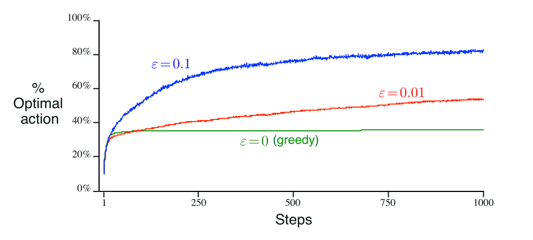
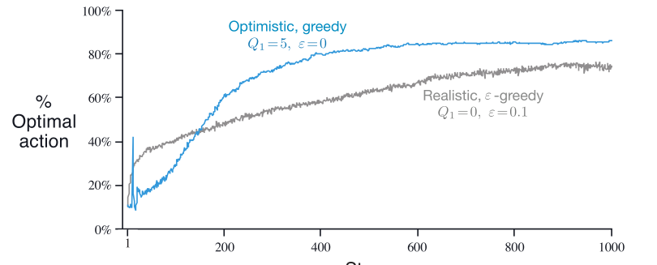
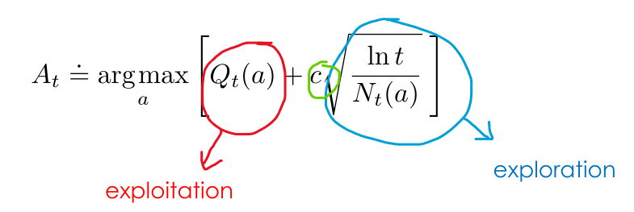
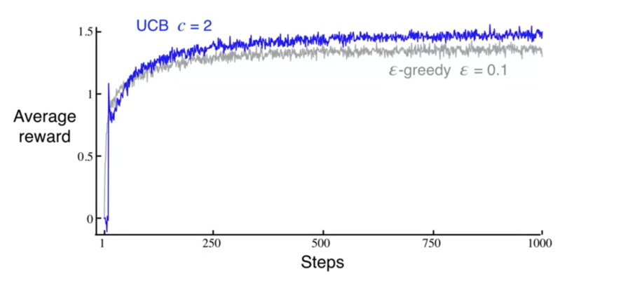

# Performance of methods for action selection

## Recall questions

- What can be said about the performance of the greedy action selection? And for greedy?

- What changes if we start with optimistic values?

- What are the ideal use cases for greedy and optimistic initial values?

- What is optimism in the face of uncertainty? What is the driving principle behind it?

>do not take the arm you believe is best, take the one with the most potential to be the best

- How do we measure uncertainty? What is the upper confidence bound (UCB)?

- Explain the formula for action selection using UCB. What is $c$?

- What can be said about UCB performance? What happens if the problem is nonstationary?

