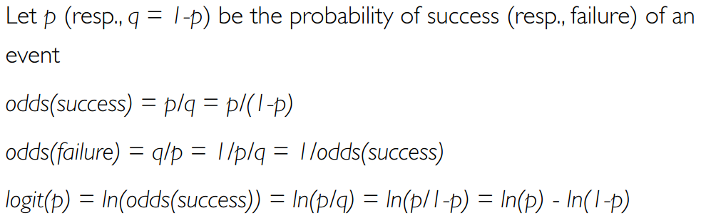
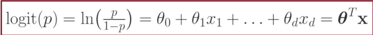
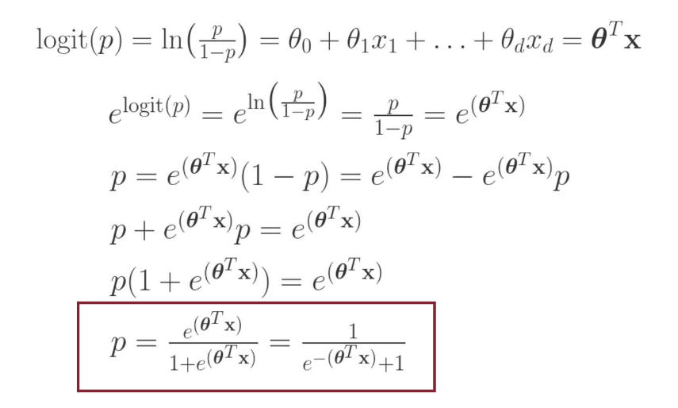
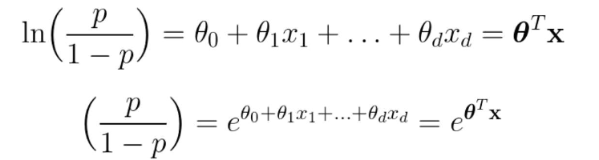
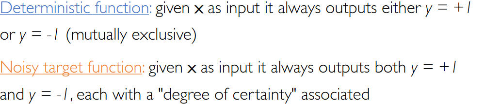
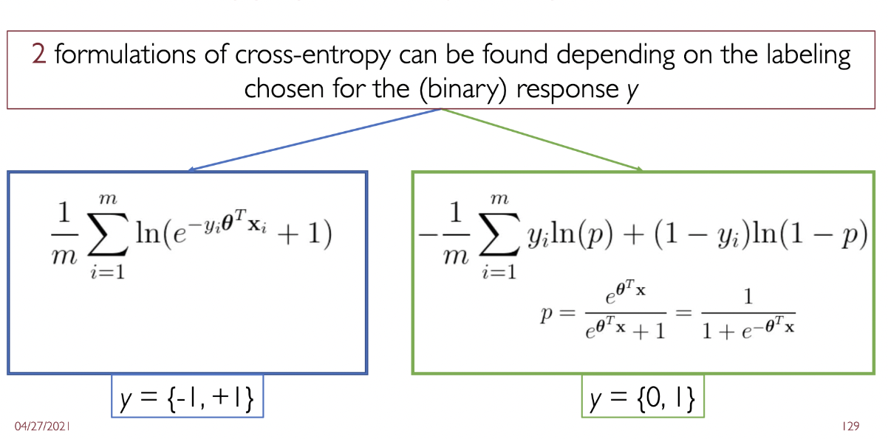

# Logistic Regression

Also see:
- [[../Foundations of Data Science/FDS IV - Classification]]

Note that in the steps about going from MLE to Cross entropy it is assumed that the random distribution has samples with values (-1, +1), so the final formulation is different from the one shown in FDS ==although equivalent==.

Suggested read: extensive explanation of gradient descent (slides)

### Recall questions

1. 

 What is the main issue when trying to do classification with linear regression?

    
    \
	There is ==no natural way to convert a K-ary (K > 2) response  into a quantitative response that is ready for linear regression==

2. 

 What are odds? How are they linked to logistic regresssion?

    
    \
	We define the odds as:
	 \
	==Logistic regression is an ordinary linear regression where logit is the response variable==.

3. 

 So why do we use odds instead of a probabilities?

    
    \
	Because ==odds are defined over the range $[-\infty, +\infty]$, so we cab use the standard regression equation==.
	

4. 

  Show that we can go from odds to probabilities.

    
    \
	

5. 

 Why do we use odd ratios?

    
    \
	Using odds rather ==provides an easier interpretationof the model's learnt coefficients==:
	 \
	For instance, if ==we compute the odds ratio we can measure how much  a variable can influence the final probability==. (see slide 80 for an example)	

6. 

 Why (in this case) we are estimating a noisy target, rather than a deterministic function ?

	\
	Because ==our goal, in fact, is to approximate a noisy target $\phi$. We'll do this leveraging the logistic function as explained before.==
	

7. 

 What are the 2 formulations for cross entropy loss? Are they equivalent? 

	\
	 \
	Yes, they are ==indeed equivalent== and this can proven through simple algebra.

