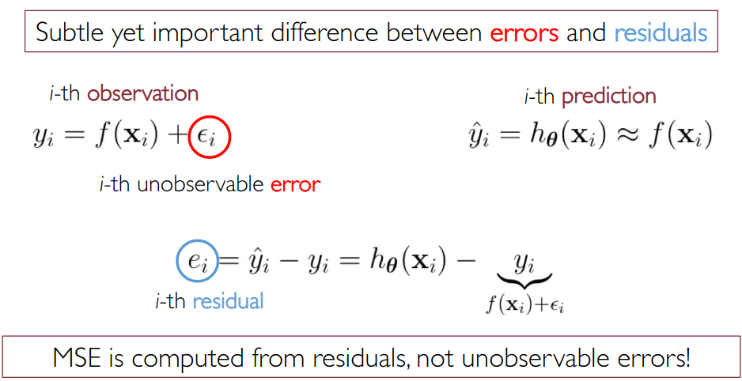
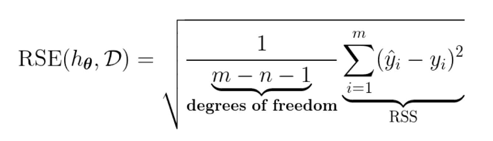
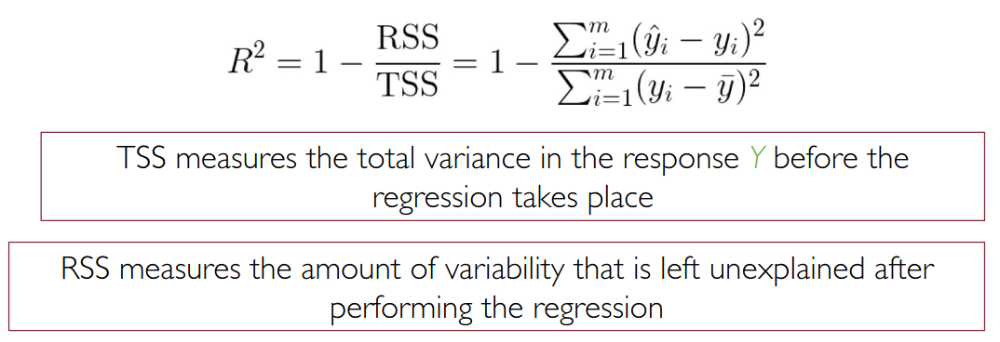
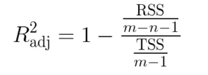
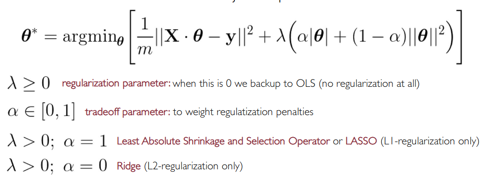

# Linear Regression

Also see #[[FDS III - Regression]]

### Recall questions

1. 

 What is the formulation of the supervised learning problem as an optimization problem?

    
    \
    We can define the supervised learning problem as the optimization problem known as ==Ordinary Least Squares (OLS)==.
    Our goal is to find $h^* = h_{\theta^*} = \text{arg min}_{\theta} \ L(h_{\theta},D)$.

2. 

What is the difference between errors and residuals (just a brief remark)?

    
    \
    

3. 

What are the 5 key assumptions made in OLS? How do we check that they are true?. 

    
    \
    Five key assumptions:
    - ==weak exogeneity==: ==predictor variables can be treated as error free constants==
    - ==linearity==
    - ==error indipendence==: we assume the errors on the variables are i.i.d
    - ==homoscedasticity==: ==different values of the response variable have the same variance in their errors, regardless of the feature values==.
    - ==no multicollinearity==

    To verify this assumptions, we can use ==residual plots==.

4. 

What is Residual standar error? What does it measure

    
    \
    RSE is one of the presented measures for =="goodness of a fit of a model==". Formally, it measures the ==std deviation of the error associated with each prediction==:
    
    

5. 

 How do we compute the degree of freedom? Is it related to nr. of variables/features?

    
    \
    The $df = m - n - 1$ where:
    - $m$ = #observations
    - $n$ = #features
    - 1 is the intercept
    

6. 

 What is R²?

    
    \
    The other presented measure. In short, it measures ==the proportion of variability in $Y$ that can be explained with $X$==.
    

7. 

Why do we need an adjusted version of R² in practice?

    
    \
    Since ==RSS can be drecreased arbitrarily by incrementing the number of features, we need to balance the fact that we could get a better score by simply adding useless features==.
    
    

8. 

 What is the elastic net framework?

    
    \
    It's a ==more general framework, of which OLS is just a special case of==:
    
    

