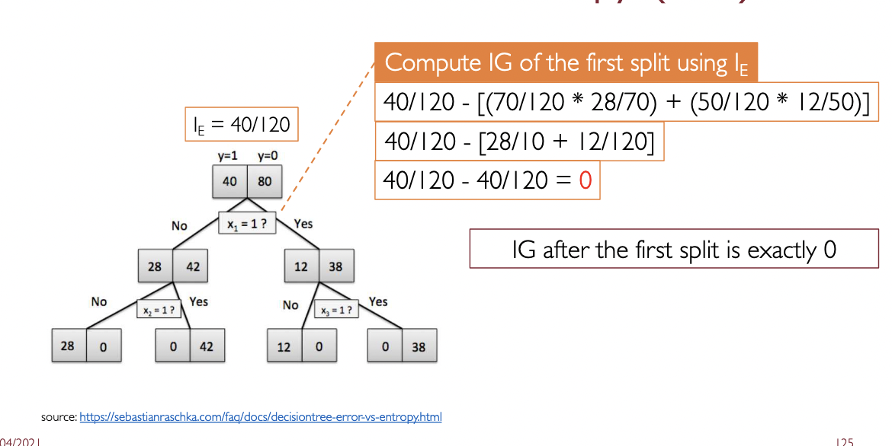

# Tree methods and ensembles

Also see [[../Machine Learning/ML III - Supervised Learning]]  and [[../Machine Learning/ML VIII - Ensemble methods]]

### Recall questions

1. 

 How do decision trees output predictions? What can be said about these regions? 

    \
	The ==feature space is split into non overlapping regions== and the prediction is the ==mean of the values in that region==. For simplicity reasons, we assume each ==region is a hyperrectangle==, so that we compute the total error with ==RSS==.

2. 

 What is the expressiveness of decision tree? Explain both the discrete and continuous case. 

    \
	Discrete values: ==can easily express them as CNF== formulas.
	Continuous values: ==can approximate any function arbitrarily closely==, but with more precision the risk of overfitting increases. 

3. 

 Why do we use RBS to compute the "best" tree? (Hint: what is the nr. of tables that have to be learned?) 

    \
	We use RBS to compute a ==greedy solution== to an otherwise ==NP-complete problem==. In fact, we have $2^{2^n}$ possible tables, and exploring all of them is infeasible.
    

4. 

 What are 3 possible measures for impurity? Is there any difference between them? 

    \
	Three measures:
	- classification error rate: percentage of nodes with ==different label from the rest of the set in the current node==
	- gini index: variance across $K$ classes
	- entropy
    
	The gini index and entropy are preferred, ==as using classification error can lead to situation where the tree does not split further== even if it is the right thing to do.
	
	

5. 

 Explain the difference between decision trees and linear models. 

    \
	Ideally, ==linear models work better when there is a strong linear relationship between input and output==, while ==trees work better when there is a non linear relationship==.

