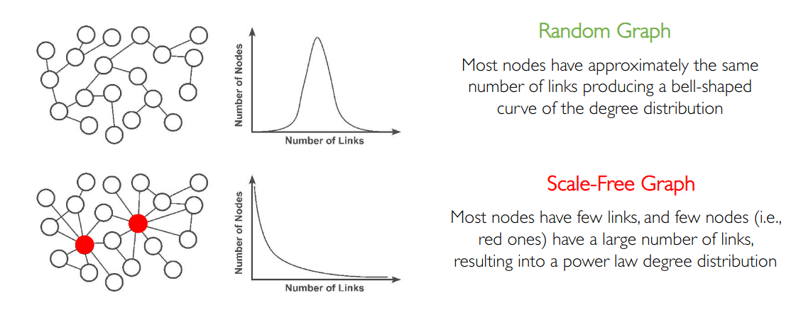
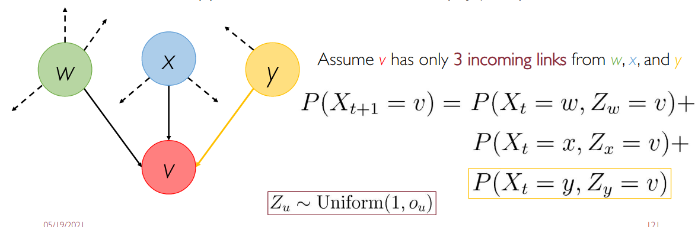

# Graph Link Analysis

### Recall questions

1. 

What is graph link analysis? 

    \
	A ==data analysis technique, used to evaluate relationships between nodes of a graph==. 

2. 

What are 2 issues of traditional ranking approaches? 

    \
	Two issues:
	- ==information overload==:  millions of pages must be ranked quickly
	- ==results trustworthiness==: traditional IR approaches work on "small sets of trusted documents"
	

3. 

Why do we say the web is a scale free graph? 

    \
	Because the distribution of the degrees of its nodes ==follows a power law==.
	

#### ==page rank==

4. 

What are the 2 main intuitions used in page rank? 

    \
	Two main intuitions:
	- ==count incoming links as votes== of trustworthiness
	- ==weigh such links w.r.t. to the rank of the original page== from which the link originates

5. 

Define the formalism for Page Rank. 

    \
	

###### ==linear algebra interpretation==

6. 

What is the first formulation of Page Rank? What is the main issue? 

    \
	The first formulation computes the ranking in the following way:
	
	
	The most intuitive way of solving this ==recursive formulation is through flow equations==, as shown in the following. The main issue is that, in the case of web pages, these equations are in the order of millions!
	

7. 

How can we fix the issue with flow equations? Explain the matrix formulation.

    \
	We can store the graph with a ==column stochastic matrix (since all columns sum up to 1)==. 
	
	

	We also have a rank vector of length $N$:
	
	

8. 

 How can we express the vector of ranks? Why is it useful? What vector rank do we choose?

    \
	
	
	As it can be easily seen, $\mathbb{M} \cdot \mathbb{r} = \mathbb{r}$. This implies that the ==rank vector is an eigenvector of matrix $\mathbb{M}$==  and ==it corresponds to the eigenvalue $\lambda =1$==. \ 
	We choose the rank vector for which the values add up to 1, which is associated to $\lambda = 1$. This is useful as ==column stochastic matrix have 1 as max eigenvalue, so $\mathbb{r$}$ is going to be exactly its principal eigenvector==.  \
	This can be solved iteratively with the ==power iteration method==
	

##### ==PROBABILISTIC INTERPRETATION==

9. 

What is the probabilistic interpretation of Page Rank?

    \
	==Consider a web crawler following the outgoing links from each page. Its behaviour can be described  as a Random Walk==. \
	
	
	Interestingly, ==Random Walks are a known stochastic process with Markov property!==
	
	

10. 

Can we say the 2 formulations are equivalent then?

    \
	
	
	Note that a steady state indicates a situation where the  stochastic vector $\mathbb{p}^*$ does not change anymore
	

11. 

What conditions are necessary to ensure that both formulations work?

    \
	We are asking for both ==existence and uniqueness== of the solutions. Luckily, the ==Perron Frobenius theorem says==:
	
	
	However, we cannot grant that the matrix has some values different from 0...so what do we do?

##### ==GOOGLE's PAGE RANK==

12. 

 What are the 2 main issue that Google's Page Rank solves? 

    \
	Two main issues:
	- dangling node: causes ==page rank vector to vanish==
	- spider trap: causes ==page rank vector to not converge==

	

13. 

Which technique is used to fix dangling nodes? What is the reason behind it?

    \
	We ==add outgoing links to every other node.==
	
	
	==The idea is based on the behaviour of a random web surfer, which is going to choose a random page (uniformly) if no outgoing link is provided==.

14. 

 What about spider traps?

    \
	The solution applied is the same, and we call it ==probabilistic teleporting==.
	

	==At each time, the crawler will either follow a link with probability $d$, or teleport with probability $1-d$.  This constant is called the damping factor==.

16. 

What is the final formulation for page Rank?

    \
	

