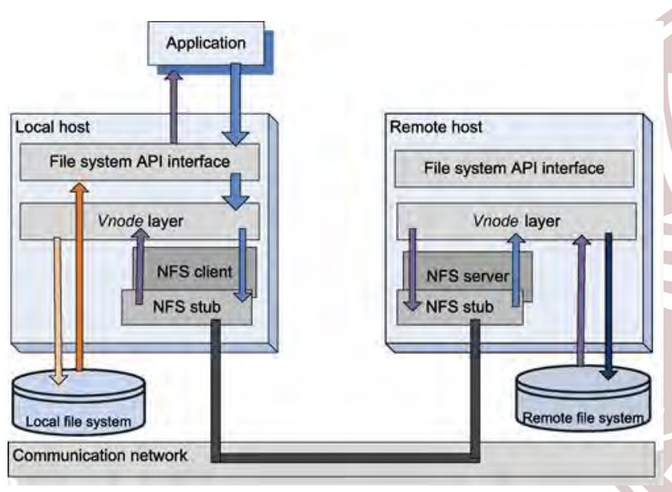
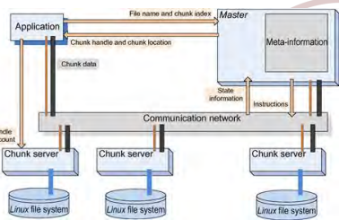
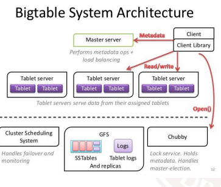
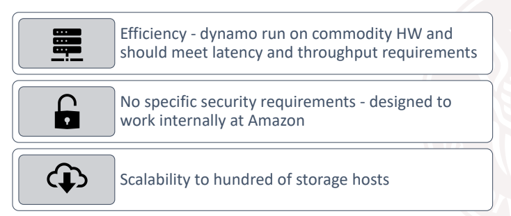

# Cloud Storage

### Recall questions

1. 

 What is atomicity?  Explain the 2 possible types. 

    
    \
    We want ==multi step operations that complete without any interruption==. Two types are:
    - ==all or nothing==: ex 2PC protocol (see #[[DS II - Reaching Consensus]])
    - ==before or after==: the result of every write/read is the same no matter the order.

2. 

 What is the storage model and what are 2 possible types? What properties should it guarantee? 

    
    \
    It is  a model that ==describes the layout of a data structure in physical storage==. Two possible types are:
    - ==cell storage==
    - ==journal storage==

    We also want the model to guarantee ==read/write coherence== and the previously mentioned forms of ==atomicity==.
    

3. 

 Describe how the cell storage model works (what does it reflect?). Which assumption are made? What properties are guaranteed?

    
    \
    In the cell storage model, we assume that:
    - ==cells have the same size==
    - each ==object fits exactly in one cell==
    - ==read/write unit are either sectors or blocks==

    The structure of the model ==reflects the physical organization of common storage media==. \
    It guarantees ==read/write coherence==, ==before or after atomicity==.
    

4. 

 How does the journal storage model work? Describe how the log works. What properties are guaranteed? 

    
    \
    In this model, we have a ==manager and cell storage==. The idea is that ==the manager will interact with the cells, while the user can use an API to communicate with the manager==. 
    There is also a ==log to mantain the history of each cell==. \
    It guarantees ==all-or-nothing atomicity==.

5. 

 What are possible types of file system for cloud storage? 

    
    \
    Possible types are:
    - ==network file system== (HP)
    - ==storage area network==
    - ==parallel file system== (HP)

    In the following we'll focus on high performance file systems.
    

6. 

 Describe (briefly) the network file system. 

    
    \
    The nfs is characterized by:
    - ==client server model==
    - ==rpc interaction==
    - ==no scalability==
    
    

7. 

 How does the general parallel file system work? 

    
    \
    The idea behind the PFS is to ==allow multiple clients to read and write concurrently from the same file==. It uses ==RAID== and is also able to recover from failure through the use of ==logs==.

8. 

 What is the goal behind the design of the GFS? What are its characteristics? 

    
    \
    The google file system is ==built to manage petabytes of storage==. Its design is based on:
    - ==high reliability==
    - careful analysis of the file characteristics (?)
    - access model (?)
    

9. 

 What are the main features of the GFS? 

    
    \
    Main features:
    - ==focus on appends== rather than random writes
    - ==sequential reads==
    - ==relaxed consistency==

10. 

 How are files in the GFS structured? Why? 

    
    \
    Files in the GFS consist of ==multiple chunks==, to allow for ==better performance when dealing with large files== and ==reduce disk fragmentation==. 
    

11. 

 What is the architecture of a GFS cluster? 

    
    \
     \
    While not shown in the picture, an operation log is mantained in order to recover from potential failures.

12. 

 How does file access and creation work in the GFS? 

    
	\
	In case of an access, the ==master guarantees a lease on a certain chunk==. In case of creation, ==the master is directly responsible==. (?)
    

13. 

 And file write (hint: primary and secondary)? 

    
	\
	

14. 

 What is the HFS? 

    
    \
	==Distributed filesystem that implements all the operations necessary to handle big data==.

15. 

 What is the architecture of the HFS? 

    
    \
	The model is a ==classic master/slave model==, as also seen in [[BD II - MapReduce]] and [[BD III - Spark]]
    

16. 

 What are the stages of HDFS write protocol? 

    
    \
	Three stages:
	- ==set up pipeline==
	- ==data streaming and replication== (req.)
	- ==shutdown of pipeline== (ack.)
    

Part on ==databases starts here==

17. 

 What are the key aspects of online transaction processing? 

    
    \
	Necessary characteristics:
	- ==low latency==
	- ==scalability (horizontally)==
	- built in ==support for consensus== protocols
	- ==fault tolerance== (no single point of failure)
    

18. 

 What is the main difference between relational and noSQL dbs? 

    
    \
	==NoSQL dbs guarantee that data will eventually be consistent== at some point in time.
    

19. 

 What is the particular aspect of google Big Table model? 

    
    \
	In BigTable ==data is treated as uninterpreted strings==.
    

20. 

 Describe the structure of the bigtable model. 

    
    \
	A BigTable is a ==sorted map==, described by:
	- ==row==
	- ==column==
	- ==timestamp==

	
    

21. 

 What is a row? What property does it have? 

    
    \
	Rows:
	- are arbitrary ==strings==
	- ==guarantee atomic read/write==
	- are divided in ==tablets for load balancing purposes==
    

22. 

 What about columns? 

    
    \
	Columns:
	- are grouped into ==families==
	- have ==keys==

	For instance, a column might be `Language: ID`, another `Language: region` and so on. 

23. 

 Why does BigTable use timestamps? 

    
    \
	BigTable uses ==timestamps in order to keep multiple versions of the same data==. Depending on the garbage collection, ==either the $n$ last versions or the versions of the $i$ previous days can are kept.==

24. 

 What are the main technologies used in BT? 

    
    \
	Main technologies:
	- ==Google File System==
	- ==SSTable file format== 
	- ==Chubby==: distributed lock system
    

25. 

 What is google BT's architecture? 

    
    \
	Again, we have a ==master/slave== arch. In particular:
	- ==master server==: assign tablets to servers
	- ==tablet server== (slaves) can be dinamically reassigned 
    
	

26. 

 What is the main characteristic of Amazon Dynamo?  Why is it used? 

    
    \
	It is based on ==optimistic replication techniques==: ==replicas can diverge, but eventually are updated to the same value==.
    This is used to increase ==availability in an environment prone to failure==.

27. 

 What are the requirements satisfied by Dynamo? 

    
    \
	 \
	Note that this efficiency is achieved through ==weak consistency==.
    

28. 

 What are the key design principles of dynamo? 

    
    \
	Key principles:
	- ==scalability==
	- ==symmetry: equal responsibility among nodes==
	- ==decentralized==
	- ==heterogeneous infrastructure==

29. 

 How does the partitioning system work 

    
    \
	See [[DS IX - A brief overview of consistent hashing]]
    

