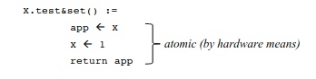
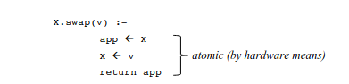
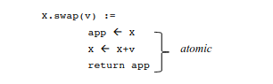
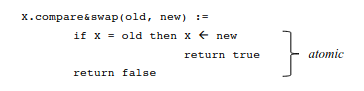
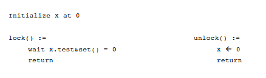
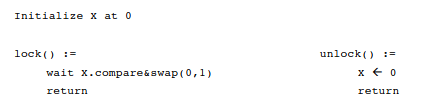
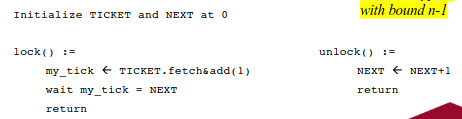
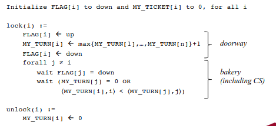
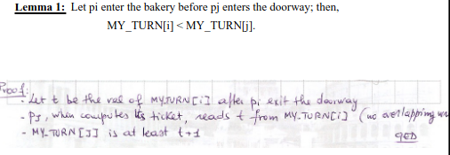

# Hardware assisted primitives

### Recall questions

1. 

  What are specialised hardware primitives?  

    
    \
    Specialised hardware primitives ==are combinations of instructions that behave atomically==. Operative systems often provide one of (or more):
    - ==test & set==: atomic ==read+write of boolean register== 
    - ==swap==: atomic ==read+write of a general register== 
    - ==fetch & add==: atomic ==read+increment of an integer register== 
    - ==compare & swap==: atomic ==comparison+write of general register + returns boolean result of the comparison== .
    

2. 

  Describe how we can implement mutual exclusion with the new primitives. 

    
    \
    ==Test & Set==: 

	==Swap==: adapt previous implementation: note that ==X.test&set()=X.swap(1)==.

	==Compare & Swap==: 
    

3. 

  Why is fetch and & add "better" than previous solutions? What does it guarantee?  

    
    \
    All previous solutions ==guarantee deadlock freedom== but ==no starvation freedom==. One solution, besides using ==round robin==, would be using the ==fetch&add== primitive that grants ==bounded bypass with bound $n-1$==.

	

4. 

  What are safe registers? What happens when different operations overlap? Why? 

    
    \
	We are interested in implementing ==mutual exclusion in contexts in which atomicity for registers is not granted==. \
	We describe 2 types of ==safe registers==:
	- ==MRSW Safe register==:
		1. every ==read that does not overlap with a write returns the value stored== in the register
		2. a ==read that overlaps with a write can return any value== from the register domain
	- ==MRMW Safe register==:
		1. behaves ==like MRSW Safe register when write operations do not overlap==
		2. otherwise it ==can contain any value== from the register domain. 

5. 

  Describer how the bakery algorithm works (hint: ticket). As usual, prove mutual exclusion and ...

    
    \
    Every process gets a ticket, the smallest pair grants access to the C.S. (typo in image, $MY_TICKET[i]$ should be $MY_TURN[i]$):
    

	Proofs for:
	- lemma 1:  
	- lemma 2:    
	- mutual exclusion and ==bounded bypass with bound $2n-2$==:

6. 

   

    
    \
    

