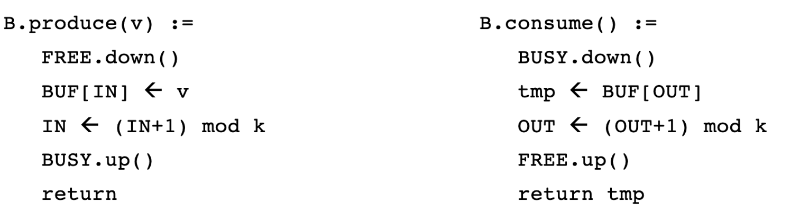

# Semaphores

### Recall questions

1. 

 What are semaphores? Which problem do they solve?  Which types of semaphores do exist? 

    
    \
    A semaphore is a ==shared counter $S$== accessed via primitives ==*up* and *down*== s.t.:
	    - it is always ==initialised at $s_0 \geq 0$==
	    - it is ==always $\geq 0$==
	    - ==*up* atomically increases $S$==
	    - ==*down* atomically decreases $S$ if $S \geq 0$, otherwise the invoking process is blocked and waits==

	The main use of a semaphore is ==preventing busy waiting==, i.e. a process continually calling an instruction to check whether it can do something. Depending on the type of blocking mechanism we have:
	- ==strong semaphore== if it uses a ==FIFO queue==, ==weak== otherwise;
	- ==binary== if it is ==at most 1==; note that this also makes up blocking.
    

2. 

 Compare the ideal vs actual implementation of semaphores.  

    
    \
	==Ideal== implementation:  

	$S$ should ideally ==return the number of waiting processes if negative==.

	==Actual== implementation:  
	

3. 

 What is the producer/consumer problem? How can it be parallelized? Why do we need a while loop?   

    
    \
    Description of problem:
    - $BUF[0,1,..,k-1]$ ==registers accesses in FIFO== (not necessarily safe)
    - $IN/OUT$ : two ==variables pointing to locations in $BUF$ to (circularly) insert/remove items==, both initialized at 0
    - $FREE/BUSY$ : ==two semaphores that count thew number of free/busy cells== of $BUF$,  initialized at $k$ and 0 respectively

	

	Accessing the ==buffer in mutual exclusion slows thing down==. We can support ==parallel access== using:
	- ==2 arrays FULL and EMPTY of atomic boolean registers==, initialized at ff and tt 
	- ==two extra semaphores SP and SC==, both initialized at 1

	
	
	The reason for ==having a while loop== for incrementing the index is that we can make ==no assumption on consumers' speed==:

	
    

4. 

  What is the readers/writers problem? What does it generalize?  

    
    \
    Problem description:
    - multiple ==readers/writers want to access a file==
    - readers and writers are ==mutually exclusive==
    - there can be ==multiple readers accessing the file== at the same time
    - there can be ==only one writer accessing the file== at one time

	

	This problem ==generalizes the mutual exclusion problem==
    

5. 

 Describe the "weak" and "strong" priority solutions for the readers.  What is the main issue?  

    
    \
	==Weak== solution: 
	- if a ==reader arrives during a read, it can surpass possible suspended writers== 
	- when a ==writer terminates, it activates the first suspended process==, regardless of their role (hence the weak priority)

	

	==Strong== solution: when a ==writer terminates, it activates the first reader== if there's one, a writer otherwise.

	

    Main ==issue: can possibly== (and probably will in the strong case) ==starve writers==.
    

7. 

  Describe the "weak writer priority" solution. 

    
    \
    
    

8. 

  What are monitors? Which properties do they guarantee? What is the difference between Hoare and Mesa semantics (hint: signal).

    
    \
    Monitors are high level objects that ==guarantee that at most one operation invocation is active inside them==.

	They provide:
    -  a ==wait condition==: the ==invoking process suspends==, enters into the condition’s ==queue, and releases the mutex== on the monitor
    -  a ==signal (condition)==, that:
	    - does nothing if there is no process in the wait queue
	    - ==*Hoare* semantics==: reactivates the first suspended process, suspends the signaling  process that however has a priority to re-enter the monitor (w.r.t.  processes that are suspended on conditions)
	    - ==*Mesa* semantics==: terminates its task and the first process in the condition’s queue has  priority to enter the monitor (after that the signaling one terminates  or suspends)
    

9. 

  How can we implement a rendez-vous protocol with monitors?  

    
    \
	We have ==$m$ control points (one for every process involved)==, each of which ==can be passed when all processes are at their control points==.  
	The set of all control points is called ==barrier==.

	
    

10. 

  What is the underlying implementation of semaphores, i.e. with MUTEX? 

    
    \
    To implement monitors, we need:
    - a ==semaphore $MUTEX$ to ensure mutual exclusion==
    - for ==every condition $C$, a semaphore $SEM_c$ initialised at $0$ and an integer $N_C$ initialised at 0== (to store and count the number of suspended processes on the given condition)
    - A ==semaphore $PRIO$ initialised at $0$ and an integer $N_{PR}$ initialised at $0$== (to store and count the number of  processes that have performed a signal, and so have priority to re-enter the monitor)

	

11. 

  Describe the new readers/writers solution  using monitors. 

    
    \
    Strong p. to readers: 

	Strong p. to writers: 
    

12. 

  Describe the fair solution for the readers/writers problem. 

    
    \
	

