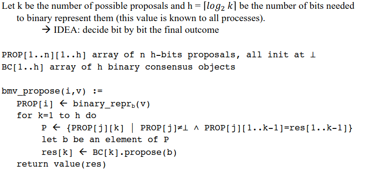

# Universal objects and consensus 

### Recall questions 

1. 

 What is the type of an object? Which type of object are we interested in? 

    
    \
    The type of an object is:
     - ==the set of all possible values for states== of objects of that type
     - a ==set of operations for manipulating the object, each provided with a specification==, i.e. a description of the conditions under which the operation can be invoked and the effect of the  invocation

	We are interested in types ==whose operations== are:
	- ==total==, i.e. can be ==invoked in any state== of the object;
	- ==sequentially specified==, ==given the initial state of an obj, the behaviour depends only by the sequence of operations==, where the output to every operation invocation only depends on the input arguments and  the invocations preceding it - we write $\delta(s, op(args)) = \{<s_1, res_1> \ldots <s_k, res_k>\}$ and we call it ==deterministic if $k=1$== (i.e. only one possible result)

2. 

 Describe what an universal object is.  

    
    \
    We say that an ==object of type $T_U$ is universal if every other object== can be ==wait-free implemented== by ==only using objects of type $T_U$ and atomic $R/W$ registers==

3. 

 Describe an instance (not detailed) of an universal object and prove its properties. 

    
    \
    A ==consensus object is a one-shot (a process can access it only once)== whose type has only one operation $propose(v)$ with the following properties:
    - ==validity==: the returned value is one of the arguments proposed in an invocation
    - ==integrity==: every process ==decides at most once==
    - ==agreement==: the decided value is ==the same== for all processes
    - ==wait-freedom==: every invocation of $propose$ by a correct process terminates

	To prove that it is universal, we observe that ==given an object $O$ of type $Z$==, if each participant runs a ==local copy of $O$==, initialised at the same value, we can create a ==total order on the operations on $O$== by using a consensus object and then ==force all processes to follow this order== to locally simulate $O$.
	

4. 

 Explain this code attempting to implement the universal object. What is the main issue? 

    
    \
    Every process that ==wants to invoke operations of object $Z$$ locally run==: 

	And they also have their ==own local copy of $Z$ called $z_i$==, initialised at the same value and used to ==replicate the same operations== performed by all processes on $Z$

	If we assume to have $CON$, an unbounded array of consensus objects we can implement $z_i$ (and $Z$) as: 

	The issue with this solution is that it is ==non-blocking==, but not ==wait-free==

5. 

 Describe the construction of the new implementation of the universal object. Prove it's wait free,  that operations invoked are executed only once and that the local copies all behave in the same way.

    
    \
    Missing +1 on last_sn: 

	Proof of ==wait free==: 

	Proof of ==op. being executed only once per invocation==: 

	Proof of ==local copies behaving in the same way==: 

6. 

 How can we deal with an universal object that is not deterministic? 

    
    \
	Assuming multiple pairs are returned, we have 3 choices:
	1. ==brute force==, i.e. only choose first pair
	2. use ==an additional consensus object for each element of the list==
	3. make it so ==every consensus object not only chooses the list of invocations, but also the final state of each one==

7. 

 What is binary consensus? Is it equivalent to multi-valued consensus? 

    
    \
    We now describe binary consensus, and we'll later ==prove that it is equivalent to multi-valued consensus==, i.e. it can be used to implement multi-valued consensus.

	We have $n$ processes and $n$ binary consensus rounds: 
    
	Properties: 

8. 

  How can we use binary consensus to implement multi-valued consensus? Explain bounded...

    
    \
	Implementation: 

    Properties: 

