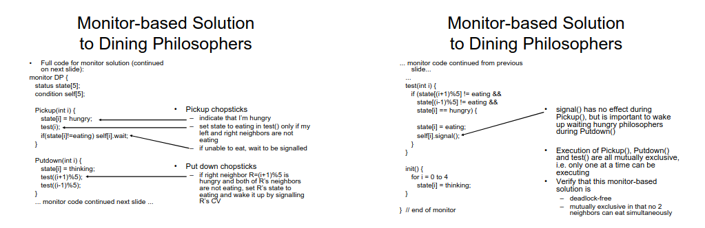

# Dining Philosophers 

### Recall questions on Dining Philosophers

1. 

 Describe the problem of dining philosophers. 

    
    \
    We have ==$N$ philosophers seated at a circular table==:
    - there is ==$1$ chopstick between each philosopher==
    - ==a philosopher must pick its 2 nearest chopsticks== in order to eat
    - ==a philosopher cannot pick two chopsticks at once== 

	

	We want a solution that is ==deadlock free== and, ideally,  ==starvation free==.

2. 

 Describe an intuitive solution using semaphores for the previous problem. What is the main issue?

    
    \
    We could simply ==protect each chopstick with a mutual exclusion semaphore==. This solution, although simple, ==results in deadlock==.
	

3. 

 Describe 3 "naïve" solutions for the previous problem. 

    
    \
    Some "naïve" solutions include:
	- allow ==at most $N$ philosophers at the table, where $N = M - 1$ and $M$ is the number of resources== 
	- odd philosophers pick ==first left then right==, while even  philosophers pick first right then left 
	- ==numbering chopsticks== and always going for the ==smallest first== 
	

4. 

 Describe the solution for the dining philosophers that uses monitors. Is it a "perfect" solution?  

    
    \
	The key points of this solution:
	- a philosopher ==goes into eating state only if both neighbours are not eating==
	- if ==one of my neighbours is eating, and I’m hungry, they can signal() me when they’re done==

	
	
	This solution, again, is ==only deadlock free and not starvation free==.

#  Software Transactional Memory

### Recall questions on SMT

1. 

 What is an STM system?What are the main components and what is its purpose? Answer to these last questions first.

    
    \
    Main components:
    - ==transaction==: ==atomic unit of computation== that can ==access atomic objects== that we ==assume successfully terminate when executed alone==
    - ==program==: set of sequential processes, each ==alternating between transactional and non-transactional code==

	A STM system then is ==online algorithm that has to ensure the atomic execution of the transactional code  of the program==.

	The reason for which we want to create a STM is that we want to ==group together parts of the code that must look like atomic==, in a way that is ==transparent, scalable and easy-to-use for the programmer==.
    
	

2. 

 How do we ensure efficient execution? What is a necessary requirement? Is it always true? 

    
    \
    To guarantee efficiency, we allow ==several transactions to be executed simultaneously,== i.e. we have an ==optimistic execution approach==. To make this work, ==there must exist a total ordering of the transaction==. This total ordering, however, ==does not always exist==.
	

3. 

 What is the structure of a transaction? Are there any other steps besides the "usual reads and writes"? Why? 

    
    \
    A transaction is composed of 3 parts:
    - ==[READ]== of an ==atomic register==
    - some ==local computation==
    - ==[WRITE]== into ==shared memory==

	However, a "4th" step is necessary in order to ==ensure consistency==, a ==try to commit== step: provided the transaction ==has not been aborted==, a process will verify whether there are ==consistency issues== before effectively writing values in the shared memory.
	

4. 

  How are the operations of a transaction effectively implemented?  

    
    \
    Every transaction uses a ==local working space==:
    - the ==first READ copies the value of the reg. in the local copy==; successive ==READs will then read from the local copy==
    - every ==WRITE modifies the local copy== and ==puts the final value in the shared memory only at the end of the transaction== 

	We will make use of the ==following 4 operations==: 
    

5. 

 What is the read prefix of a transaction? 

    
    \
    Let $T$ be a transaction, its ==read prefix is formed by all its successful READ before its potential abortion==.
	

6. 

 When do we say an execution is opaque? 

    
    \
    An execution is opaque ==if all committed transactions and all the read prefixes of all aborted  transactions appear as if executed one after the other==, by following their real-time occurrence order.
    
	

7. 

 Describe the system implemented by Transactional Locking 2. What is the main idea behind it? What are the 2 main checks to ensure consistency? 

    
    \
    

	Main idea behind it: ==commit a transaction $\iff$ it could appear as executed at its birth-date time==. \
	To grant consistency, we have 2 checks:
	- it $T$ reads $X$, then it ==must be that $XX.date < birthdate(T)$==
	- to commit, all ==registers accessed by $T$ cannot have been modified after $T$'s birth-date==
	

8. 

 Explain the implementation of each operation for the TL2 system. How do we avoid deadlock? 

    
    \
    
    
	To ==avoid deadlock, there is a total order on the registers and locks are required by respecting  this order==.

9. 

 How can we weaken opacity? Why would we want to do so?  

    
    \
	We can weaken opacity by ==imposing that the read prefix of an aborted transaction is consistent only w.r.t. its causal past (i.e., its virtual world)==.

	

     We can then require ==Virtual World Consistency==:  we want a ==total ordering on all committed transaction== but only a ==partial ordering on committed transactions and the read prefixes of aborted transactions.==

	WVC allows ==for more transactions to commit==, being a more ==liberal== property than opacity.
    
    
	

9. 

 Describe the Vector Clock based STM system. 

    
    \
     

	Operation implementation:

	
	

