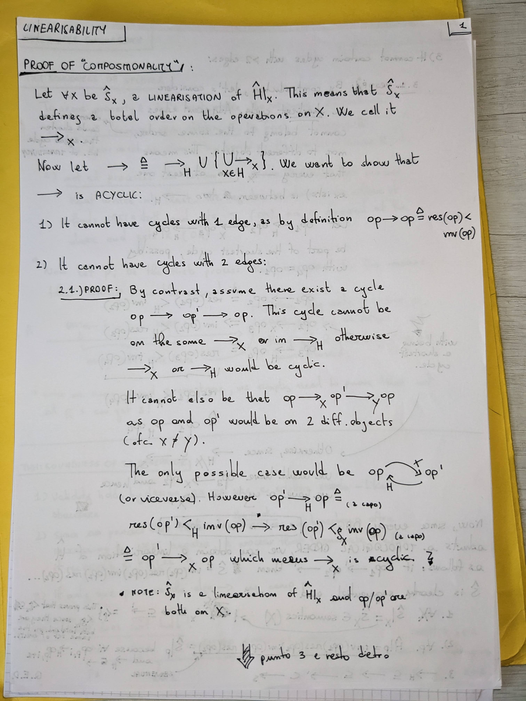
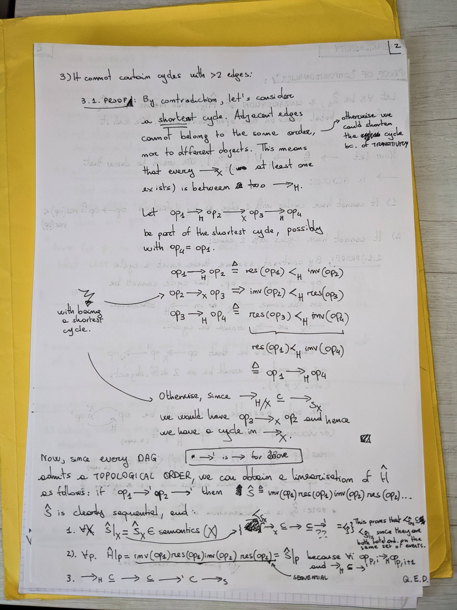
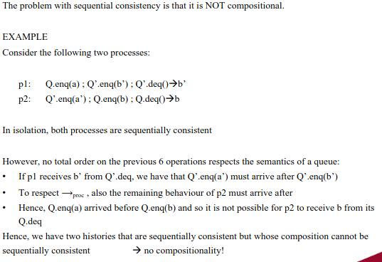

Also see [[DS I - Intro]]

# More on atomicity

### Recall questions on atomicity

1. 

  What is a history/trace? 

    
    \
    A history or trace is a ==pair $\hat{H} = (H, <_H)$ where $H$ is a set of events and $<_H$ is a total order on them==.
    

2. 

 What is a sequential history? And a complete one? 

    
    \
    A history is:
    - sequential, it is of the ==form of $inv$, $res$, where every $res$ is the return operation of the immediately preceding $inv$==
    - complete, if ==every $inv$ is eventually followed by a corresponding $res$, partial otherwise.==
    

3. 

  What is a linearisable history? 

    
    \
    A ==complete history $\hat{H}$ is== linearisable if $\exists \hat{S}$  s.t.:
    - $\forall X \ \hat{S}|_X \in$ the semantics of $X$ (==it respects the semantics==)
    - $\forall p \ \hat{H}|_p = \hat{S}|_p$ (==same operations in the 2 "versions"==)
    - if $res[op] <_H inv[op'] \to res[op] <_S inv[op']$ - this can be rewritten as 

	An example:
	

4. 

  Explain whether the following examples are linearisable or not. 

    
    \
    

5. 

  Prove the compositionality of linearisability.  Why does it matter? 

    
    \
    Makes ==linearising much easier, as we can now compose multiple smaller object that we know are linearisable.==

	 

6. 

  What is sequential consistency? 

    
    \
	Define  ==$op \to_{proc} op’$ to hold whenever there exists a process $p$ that issues both invocations  with $res[op]$ happening before $inv[op’]$==.

    A complete history $\hat{H}$ is sequentially consistent if $\exists \hat{S}$ :
    - same ==1 and 2 of linearisability==
    - ==$\to_{proc} \subseteq \to_S$==

	It is laxer notion compared to linearisability. Example: 

7. 

  What do we lose requiring "only" sequential consistency? 

    
    \
    

8. 

 What is a serialisable history? Does this one have compositionality? 

    
    \
	

    A complete history $\hat{H}$ is sequentially serialisable if $\exists \hat{S}$ :
    - same ==1 of linearisability==
    - ==$S = \{e \in H | e \in t \in CT(\hat{H})\}$== where $CT$ means ==committed transactions==
    - ==$\to_{trans} \subseteq \to_S$== where $\to_{trans}$ is defined like $\to_{proc}$ in sequential consistency

    This is also ==not compositional.==

