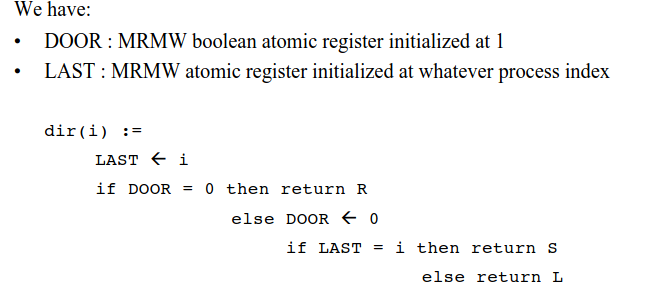
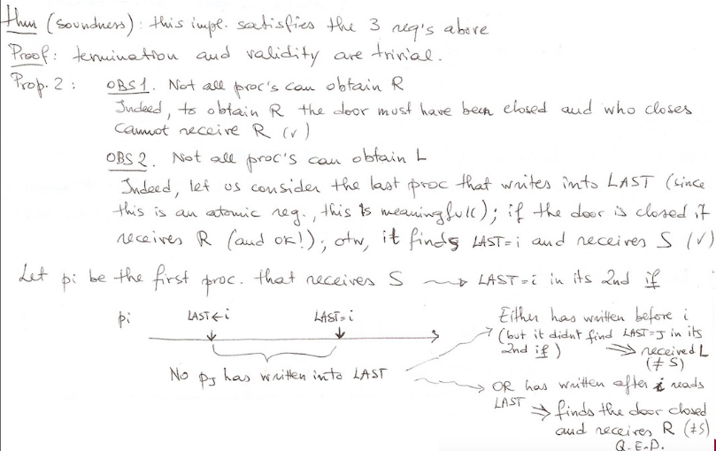
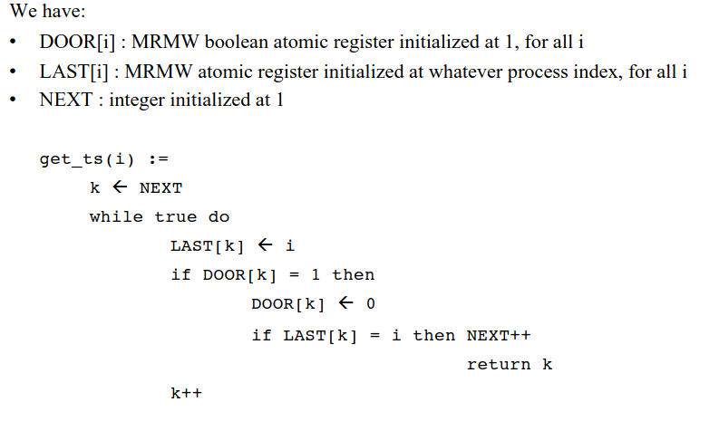
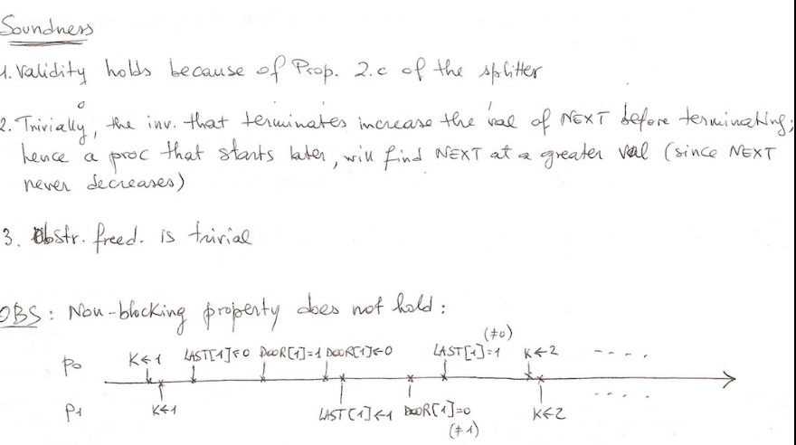
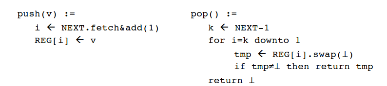
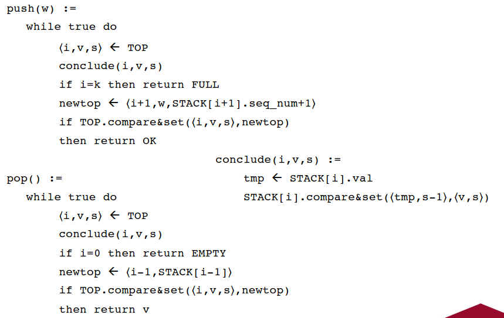
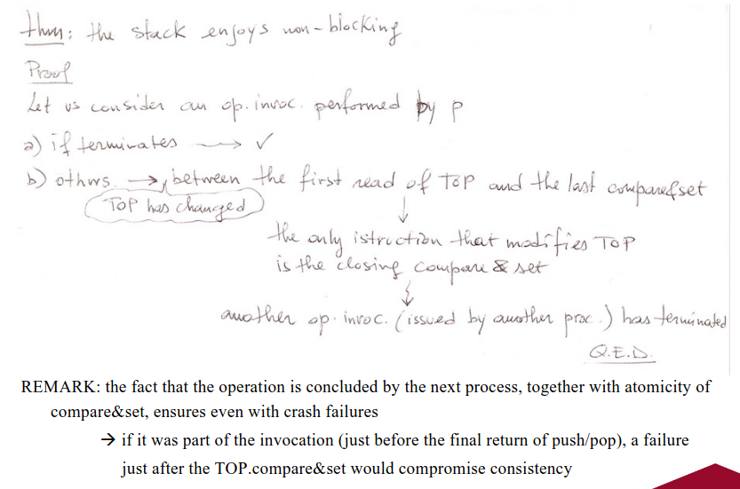

# Mutex free concurrency

### Recall questions 

1. 

 What is the main drawback of writing code with critical sections? What can we do about it? 

    
    \
	Code that includes critical sections can be:
	- ==less efficient==, if the locks are not put at the right level of granularity
	- ==delay the whole system==: so far we have assumed that our processes do not crash, however this is not a realistic scenario - see [[DS V - FLP]]

	However, we can implement another type of concurrency, ==mutex free concurrency==, in which the ==only atomicity is the one provided by the primitives themselves==.

2. 

 Describe the various forms of liveness in mutex free concurrency.

    
    \
    In mutex free concurrency, we have different forms of liveness:
    - ==obstruction freedom==: every time an operation is ==run in isolation it terminates==;
    - ==non blocking==: whenever ==an operation is invoked on an object==, eventually ==one operation on that object terminates==;
    - ==wait freedom==: ==whenever an operation is invoked== on an object, ==it eventually terminates==;
    - ==bounded wait freedom==: bounded version of W.F.
    

3. 

 What is a splitter? Describe and prove its properties. 

    
    \
    A splitter is a ==concurrent object== that provides a single operation, ==$dir$==, with the following properties
    - ==validity==: it returns $L$, $S$ or $R$;
    - ==concurrency==: in case of $n$ ==simultaneous invocations== of $dir$ ensures that ==at most $n-1$ $L$ (or $R$) are returned, and at most $1$ $S$==;
    - ==wait freedom==: it eventually terminates.

	Implementation: 

	We now prove =="soundness"==, which includes the previous 3 properties: 

4. 

 What is a timestamp generator? Describe and prove its properties. What is the main drawback (hint: property 3) 

    
    \
	A timestamp generator is a ==concurrent object== that provides a single operation, ==$get\_ts$==, with the following properties
    - ==validity==: ==two invocations of $get\_ts$ never return the same value==;
    - ==consistency==: if ==one process terminates its invocation before another one starts==, it receives a ==timestamp that is smaller== w.r.t. to the latter process;
    - ==obstruction freedom==: if run in isolation, it eventually terminates.

	Implementation (using a ==splitter-like structure==): 

	We now prove =="soundness"==, which includes the previous 3 properties: 
    

5. 

 What is a wait-free stack? What good property does it have? What is the main issue and how can we improve it? 

    
    \
    We have:
    - $REG$, an ==unbounded array== of atomic registers (our stack)
    - $REG[i]$ (a cell), that can be ==written, read by swap($v$) primitives== and is ==initialised at $\perp$==
    - $NEXT$, an atomic ==register pointing at the next free location== in the stack that can be ==read, fetch(ed)&add(ed)== and is ==initialised at 1==

	Implementation: 

	While the stack is built so that ==crashes do not compromise progress==, the use of ==unbounded arrays is not realistic==.

6. 

 Describe how a better non-blocking bounded stack can be created. List its properties and prove them. 

    
    \
    This implementation of a stack works by ==having every operation that is started by an invoking process finalised by the next process==.

	We have :
	- $STACK[0,...,k]$, an ==array of registers== that support ==read and compare&set== operations;
	- $STACK[i]$, a ==pair $(val, seq\_num)$ initialised at $(\perp, 0)$== - this is needed to ==avoid the "ABA" problem==
	- $TOP$: a register that can be ==read or compared&set== and is implemented as a triple ==($index, val, seq\_num$) initialised at $(0,\perp,1)$==; the first element is in stack, the other 2 are a pair to be put on top of the stack.
    
    Implementation: 
    
    We now prove that the stack "enjoys" a ==non blocking liveness==: 

