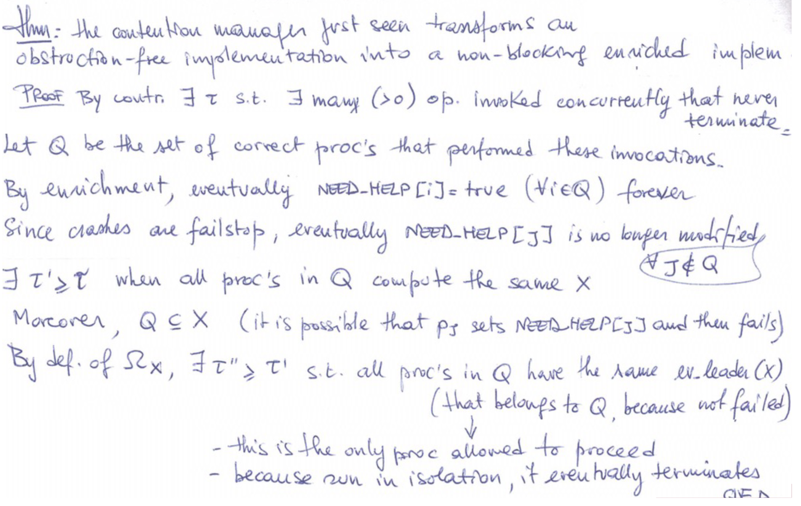

This is similar to [[CS II  - Faster concurrency]]

Also see [[DS VII - Failure Detector]]
# Enhancing liveness

### Recall questions

1. 

 Describe the framework for enhancing liveness in mutex free concurrency. What "tool" do we use? What is the main difference with standard lock/unlock and why is this possible? 

    
    \
    In order to enrich liveness in a mutex free scenario, we make use of a ==contention manager==: an object that allows ==progress of processes by providing contention-free periods for completing their invocations==. It provides 2 operations:
    - $need\_help(i)$ invoked by $p_i$ when it ==realises there is contention==
    - $stop\_help(i)$ invoked by $p_i$ when it ==terminates its current invocation==

	Note that this framework is different from the standard ==lock/unlock== system as we ==allow failures anywhere in the process (both contention and contention free moments)== and the ==contention manager always terminates==, even in case of failures. To make this possible, we need a ==failure detector==.
    

2. 

  What is eventually restricted leadership? 

    
    \
    Given a ==non empty set of process IDs== the ==failure detector $\Omega_X$== provides each of them with a ==local variable $ev\_leader(X)$== s.t.:
    - ==$ev\_leader(X)$ always contains a process ID (validity)==;
    - ==eventually, all $ev\_leader(X)$ of all non-crashed processes of $X$ forever contain the same process ID== that is one of them (==eventual leadership==).
    

3. 

 Explain the implementation of the contention manager.  

    
    \
    
    

4. 

  Prove that enhancing the existing protocols lead to non-blocking liveness.  

    
    \
	
    

5. 

 How can we implement the failure detector Omega? Why is it troublesome?  

    
    \
	We can prove that we cannot create a ==wait free failure detector with the constraints given before==. 

	The following is an outline of a potential structure for a failure detector to use in the previous proof:
	

6. 

  Describe the properties of the new failure detector needed to upgrade obstruction freedom to wait freedom. 

    
    \
    To upgrade obstruction freedom even further, we need an ==eventually perfect failure detector== $\diamond P$, that provides every process with a ==local variable $suspected$== s.t.:
    - eventually $suspected_i$ contains the index of ==all crashed processes for all  correct $p_i$== (==eventual completeness)==;
    - eventually $suspected_i$ contains ==only== the index of ==crashed processes for all correct $p_i$== (==eventual accuracy==).
    

7. 

 Prove that the eventually perfect FD2 is stronger than the one presented before (Omega) FD1. Is it possible to also prove the opposite (FD1 > FD2)? 

    
    \
    We say that ==FD1 is stronger than FD2 if there exists an algorithm that builds FD2 from  instances of FD1 and atomic R/W registers==. 

	In our case, it's easy to build $\Omega_x$ from $\diamond P$: 

	The opposite however is not true, ==otherwise we would be able to solve consensus in an asynchronous system with crashes (violates FLP)==: 
    

8. 

 How can we effectively upgrade obstruction freedom to wait freedom then? Describe the algorithm used and the proof for its validity. 

    
    \
	We assume a ==weak timestamp generator==, i.e. a function such that, if it returns a positive value $t$ to some process, only a finite number of processes can obtain a timestamp smaller than or equal to $t$.
	
    

	We can now prove that such addition guarantees wait freedom:  

