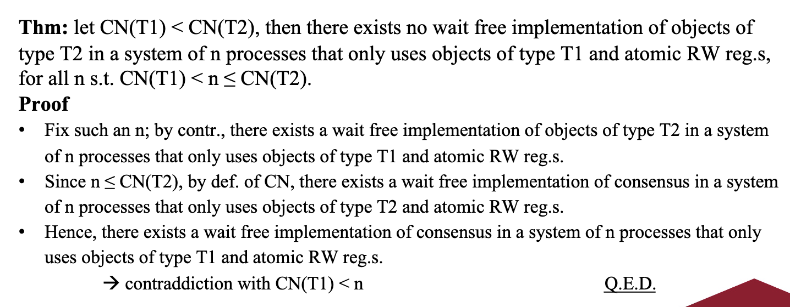
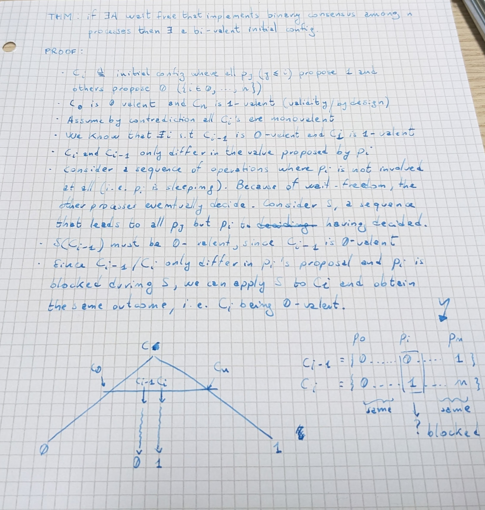
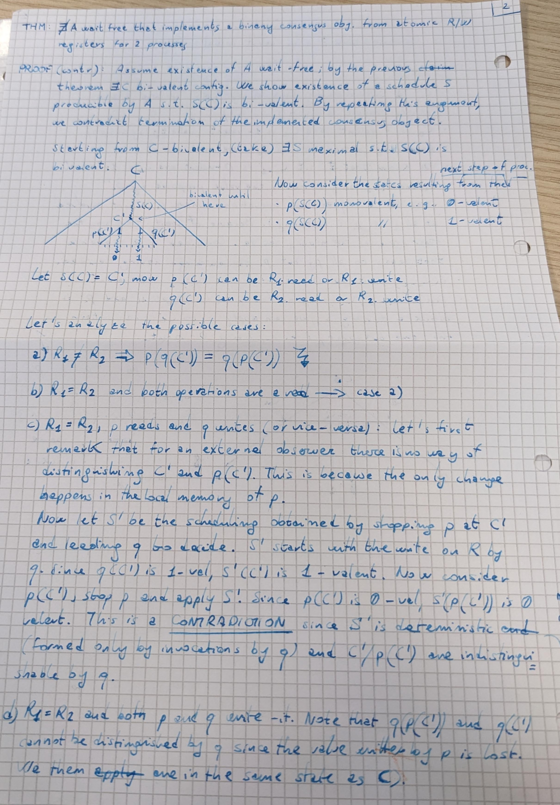
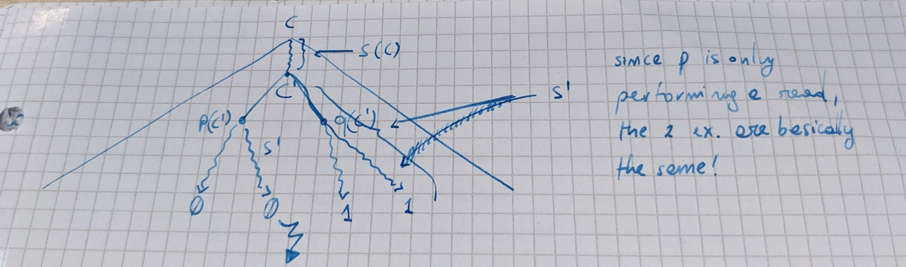
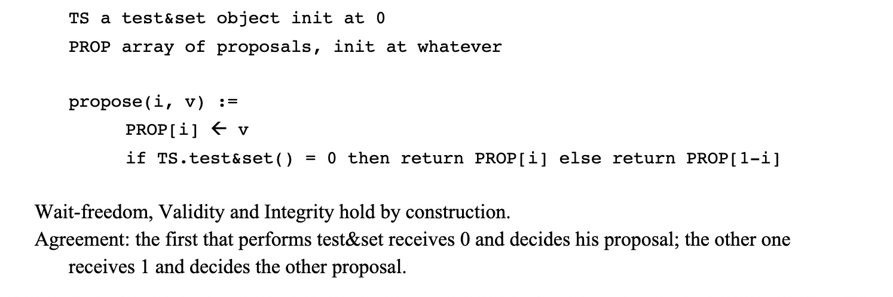
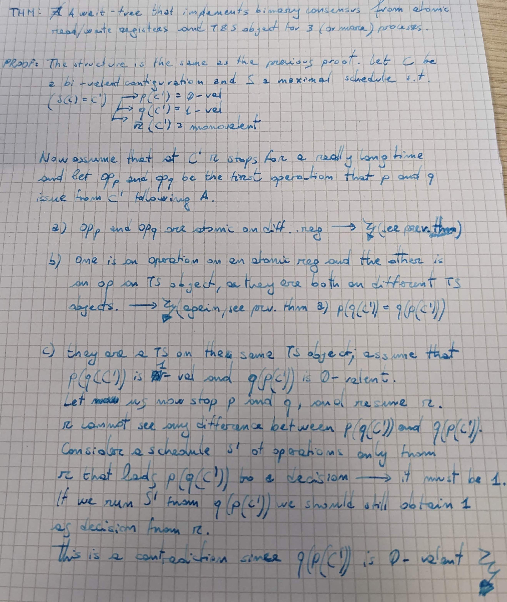
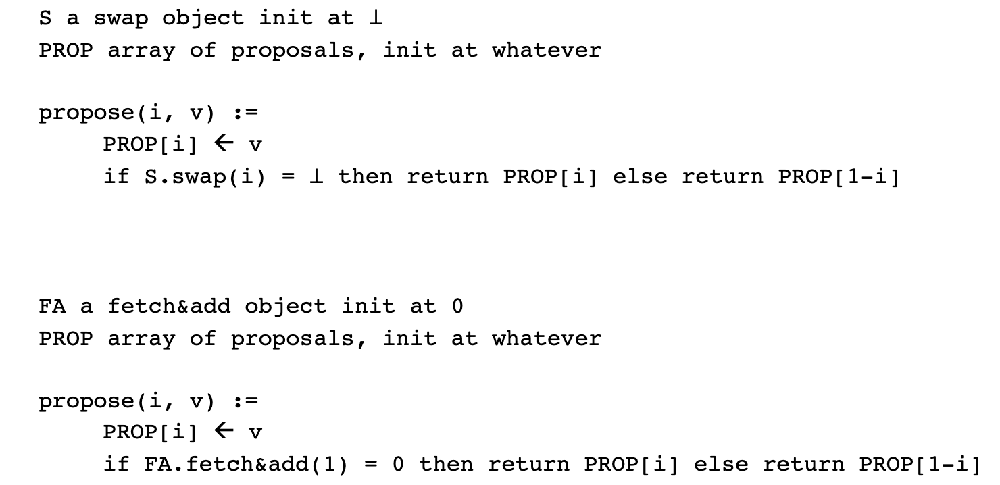
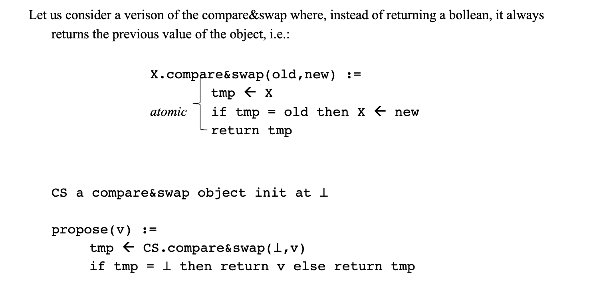

# Universal objects and consensus pt.2

Bonus ex: implement consensus with compare and swap that returns booleans
### Recall questions 

1. 

  What is the consensus number of an object type?  

    
    \
    The consensus number of an object of type $T$ is the ==greatest number $n$ such that it is possible to wait free implement a consensus object in a system of $n$ processes by only using objects of type $T$ and atomic R/W registers==.
   

2. 

  Prove the theorem on object implementation. 

    
    \
    

3. 

 What is a schedule? And a configuration? 

    
    \
    Definitions:
    - ==schedule==: ==sequence of operations== issued by a process
    - ==configuration==: global state of a system at a given time of execution, including ==local states of each $p_i$ and shared memory==

	Given a configuration $C$ and a schedule $S$, ==we denote with $S(C)$ the configuration  obtained starting from $C$ and applying $S$==
   

4. 

  What is a configuration induced by an algorithm? What are possible nomenclatures for it? 

    
    \
    Let us consider binary consensus implemented by an algorithm $A$ by using base objects and atomic R/W registers; we ==call $S_A$ a schedule induced by $A$==.

	A configuration $C$ obtained during the execution of $A$ is called:
	- ==$v$-valent== if $S_A(C)$ decides $v \ \forall \ S_A$
	- ==mono-valent== if $\exists \ v \in \{0,1\} \ | \ C$ is $v$-valent
	- ==bi-valent==, otherwise

5. 

  Prove there exist a bi-valent initial config ... 

    
    \
    

6. 

 Prove the impossibility of consensus with only read/write atomic registers. 

    
    \
	Proof:    

7. 

 Describe and prove the implementation of consensus with test and set. What is the CN? 

    
    \
	The $CN$ is 2: 

	

8. 

 Describe the implementation of consensus with fetch&add and swap. What is the CN?  

    
    \
    The $CN$ is 2: 

9. 

 Describe the implementation of consensus with compare&swap. What is the CN? 

    
    \
    The $CN$ is $\infty$ : 

