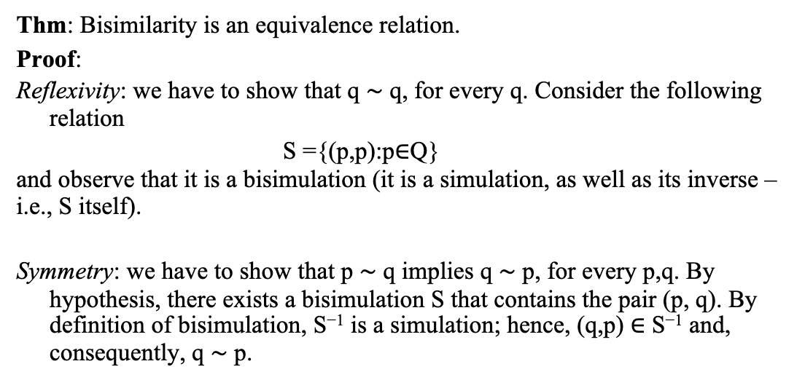
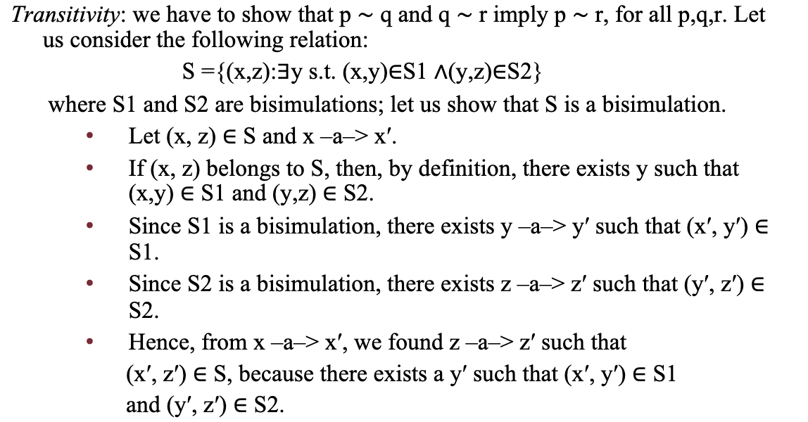
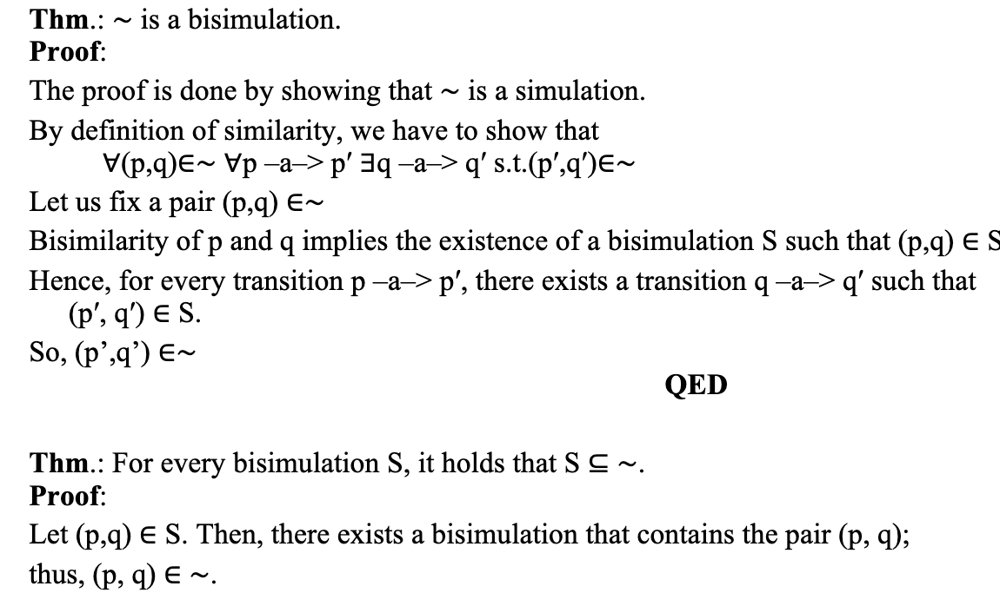
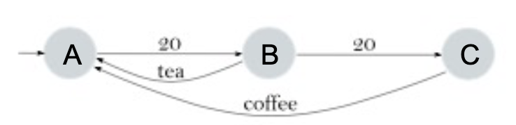
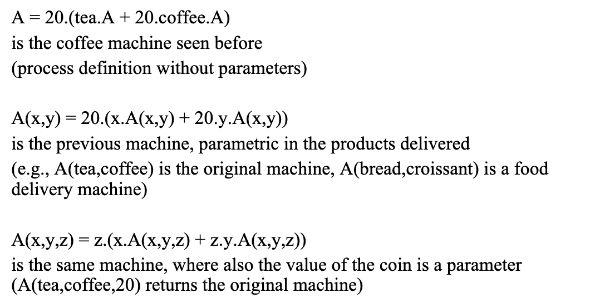
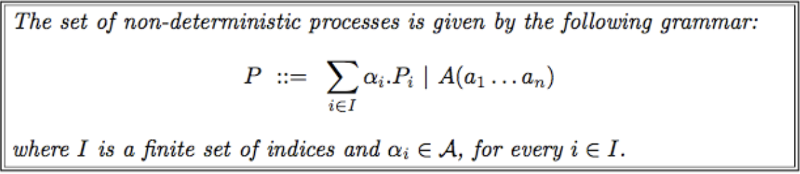
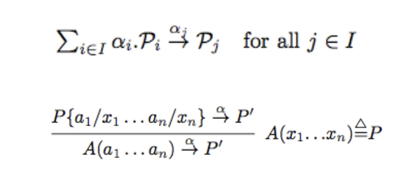

# Labeled transition systems

Exercises (highly recommended):
- bi-similarity
- from LTS to process 
- from process to LTS
### Recall questions 

1. 

 Describe the formalism of Labeled Transition Systems. What are the main difference with automata? 

    
    \
    ==Given a set of actions, written $N$, a LTS is a pair $(Q,T)$ where $Q$ is the set of states and $T$ is the transition relation $(T \subseteq  Q  \times N  \times Q)$==

	For simplicity, we write $s \to_a s'$ instead of $\langle s,a,s' \rangle \in T$ 

	The main differences between the formalisms are:
	- LTMs ==can have infinite states== while automata cannot
	- ==any state can be considered as initial==, in automata there is a fixed one
	- ==final states are not an informative notion==, while in automata they are used to detect accepted languages 
   

2. 

 What a simulation and what does it mean when we say a state is simulated by another state? And a bi-simulation? How do we define bi-simulation equivalence?   

    
    \
	Let $(Q,T)$ be an LTS. ==A binary relation $S \subseteq Q \times Q$ is a simulation $\iff \ \forall(p,q) \in S \ \forall p \to_a p' \ \exists q \to_a q' \ : \ (p',q') \in S$==

	We say that ==$p$ is simulated by $q$ if there exists a simulation $S$ such that $(p,q) \in S$.==

	We say that ==$S$ is bi-simulation if both $S, S^{-1}$ are simulations where $S^{-1} = \{(p,q) : (q,p) \in S\}$==

	Two states ==$q,p$ are bi-simulation equivalent/bi-similar if there exists a bi-simulation $S$ such that $(p,q) \in S$; we shall then write $p \sim q$==
	
   

3. 

  Prove bi-similarity is an equivalence relation. 

    
    \
    Bi-similarity is an equivalence relation:  
   

4. 

  Prove that ∼ is a bi-simulation. Then prove that for every simulation, S includes ∼ 

    
    \
    Proof that $\sim$ is a bi-simulation and that $\forall S, \ S \subseteq \sim$: 
   

5. 

  What is the main "issue" of the standard LTS notation? How can we simplify it? 

    
    \
    LTS can become increasingly difficult to read as the number of states grows. We thus provide a ==more compact syntax==, shown in the example below: 

	This machine can be represented as:
	- $A=20.B$
	- $B=tea.A + 20.C$
	- $C = coffee.A$

	And the final formula (recursive) is $A = 20.(tea.A + 20.coffee.A)$

	In the example, we use the ==dot to denote sequential composition== and the ==plus for non-deterministic choice==. To further simplify things, we assume that for every identifier (capital letters) there exists a ==unique definition of the form $A(x_1, x_2, \ldots, x_n) := P$== where names $x_1, \ldots, x_n$ are all distinct and included in the names of P.

	We also denote with ==$P\{\frac{b_1}{x_1}, \ldots, \frac{b_n}{x_n}\}$ the process obtained from $P$ after replacing names $x_i$ with names $b_i$==. Example: 

	The final notion that we'll effectively use is: 

	Note that if $I$ is empty then this is the ==terminated process==, also indicated with $\mathbb{0}$ - which we'll often omit.

6. 

  How can we "go back" to the original LTS given a process? 

    
    \
	Formulas to go back to the original LTS: 

