# Concurrent LTSs

Exercises list:
- TBA

CCS: language to model concurrent LTS

### Recall questions 

1. 

 What is lacking in the original definition of LTSs? What are possible solutions (2)? 

    
    \
    The current LTS model lacks:
    - ==simultaneous execution of processes==
    - ==inter-process interaction==

	We can fix this using:
	- ==parallel composition + interleaving semantics==
	- ==producer/consumer paradigm==

2. 

 What are events and co-events?

    
    \
	Given a set of names ==$N$ that denotes events==:
	- ==$a \in N$ denotes the consumption of event $a$==
	- ==$\bar{a} \in N$ denotes the production of event $a$==

	==$a,\bar{a}$ are two complementary actions== used by $p_i$'s to ==synch on action $a$==
   

3. 

 Is synchronization visible from the outside?

    
    \
    No, it only ==produces an event that we denote with $\tau$.==

	The set of ==possible action thus becomes $A = N \cup \bar{N} \cup \{\tau\}$==

   

4. 

 How can we restrict names to make them behave similarly to "local" variables in code? 

    
    \
    We use the ==restriction operator $P/a$ to restrict the scope of name $a$ to process $P$.==

   

5. 

 Describe and explain the new formalism and the updated set of inference rules. 

    
    \
    New formalism: 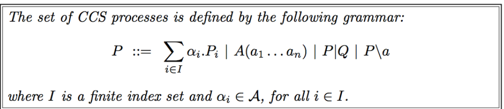

	New inference rules: 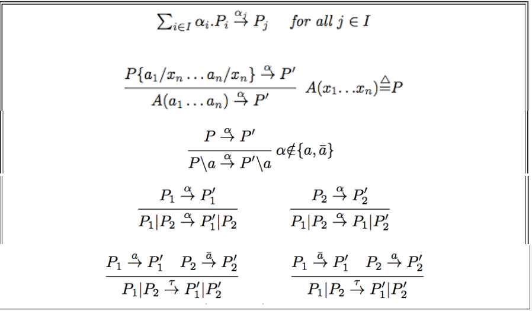

   

6. 

 Prove the image finiteness theorem. 

    
    \
	Image finitess theorem (i.e. ==inference tree height is limited==): 
	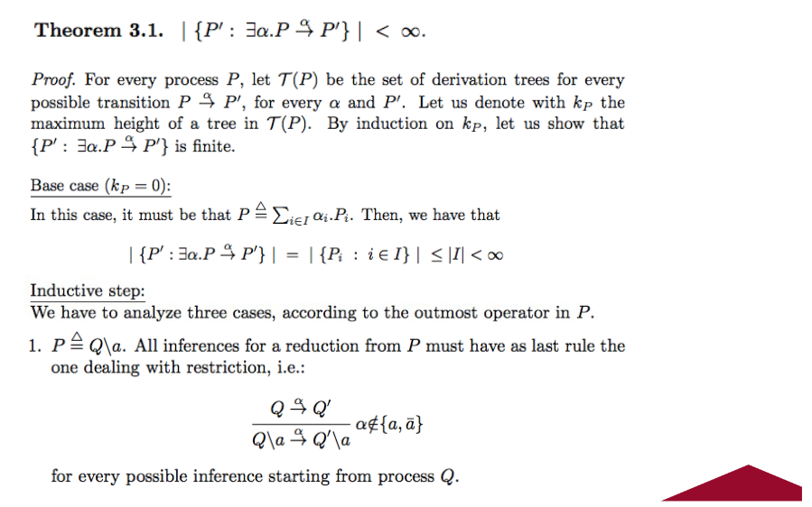 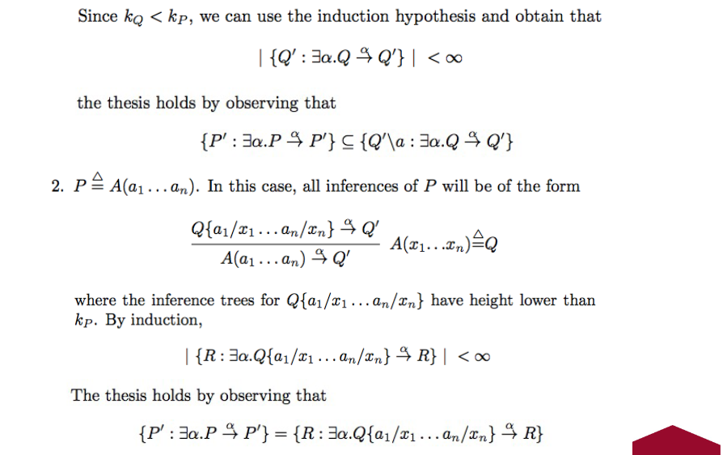 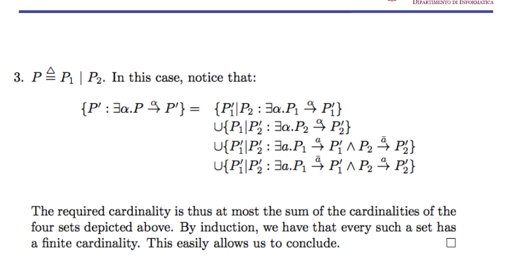
   

7. 

 What are re-namings? Prove that non-conflicting re-namings do not influence the original LTS.

    
    \
    Renamings are ==functions $\sigma \ : N \to N$== (i.e. that change names).
    We let:
    - $\sigma(\bar{a}) = \bar{\sigma(a)}$
    - $\sigma(\tau) = \tau$

	The rules are applied as follows: 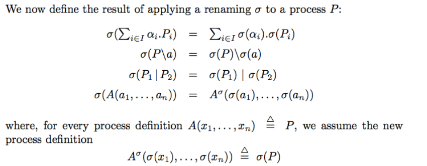

	We can then prove the following theorem: 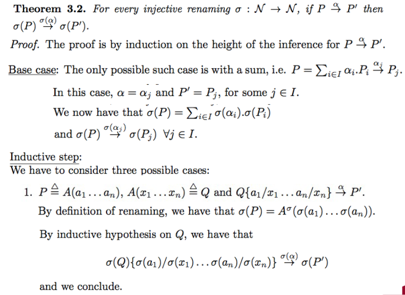 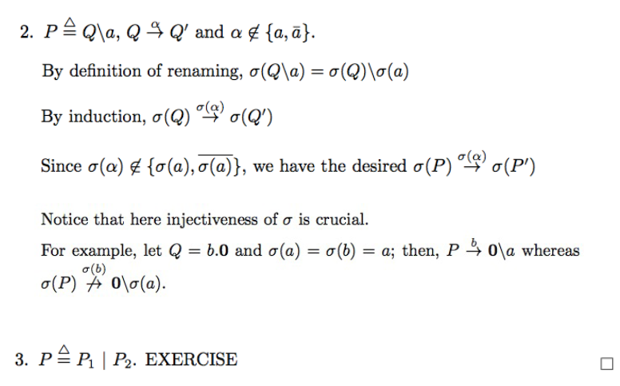
   

8. 

 Prove that restricting the only transition for a process makes it bi-similar to 0. 

    
    \
	Proof: 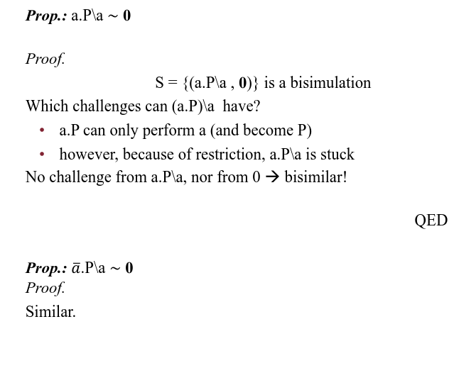
   

9. 

 Prove the idempotency of sum. 

    
    \
	Proof: 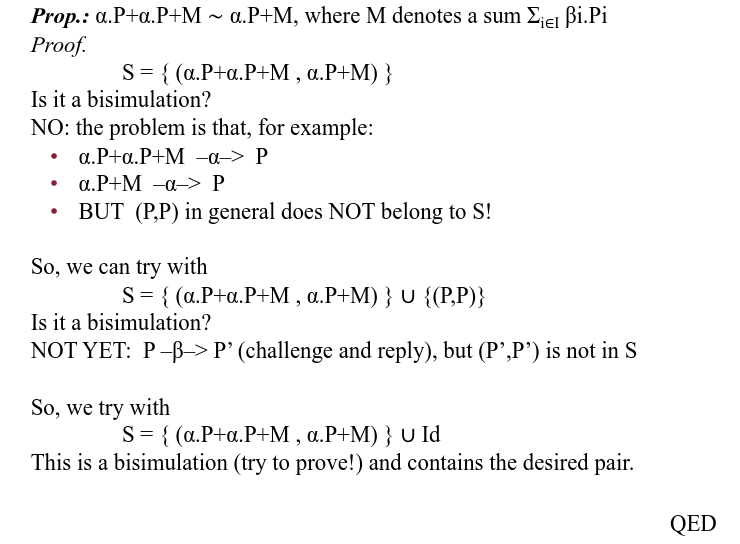
   

10. 

 Describe an implementation for semaphores using CCS. 

    
    \
    We can write down the formulation for a semaphore as shown here: 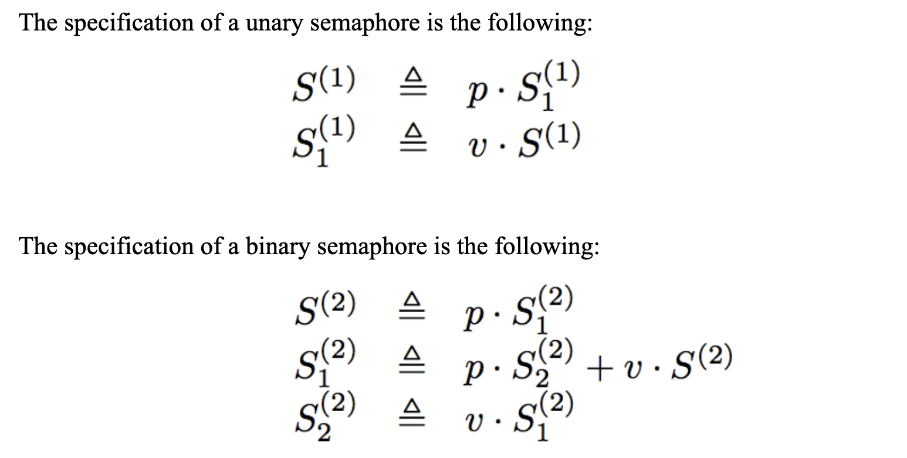

	Note that the binary semaphore can be simulated by 2 unary semaphores in parallel, i.e. $(S^{(1)} | S^{(1)})$
   

11. 

 What is congruence? Why is it important to prove that bi-similarity is a congruence? Outline the proof for the congruence of bi-similarity theorem. 

    
    \
    Congruence effectively ==allows us to use equivalent (in our case bi-similar) LTS interchangeably==.  To effectively prove this property, we ==first need to define an execution context==: 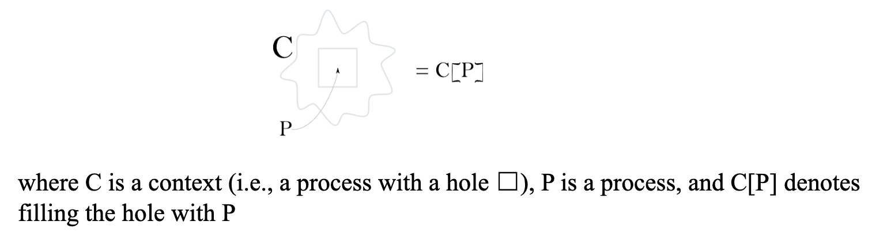

	The updated formalism for CCS including contexts is now: 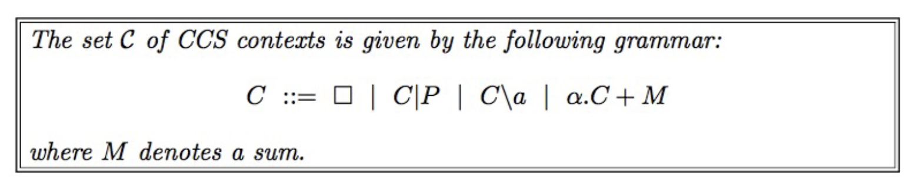

	We can now prove that: 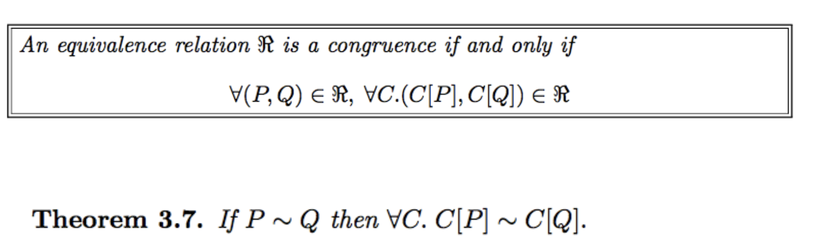

	To prove this theorem, it is easier to deconstruct it in smaller pieces:
	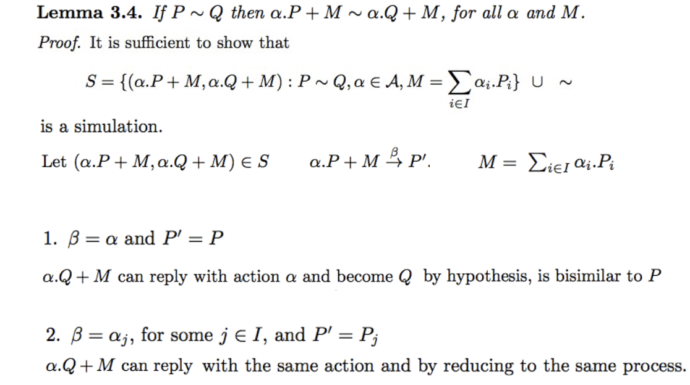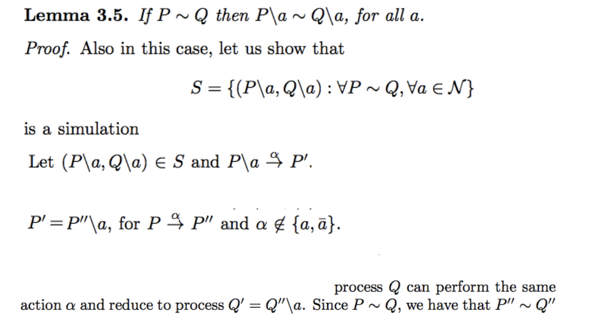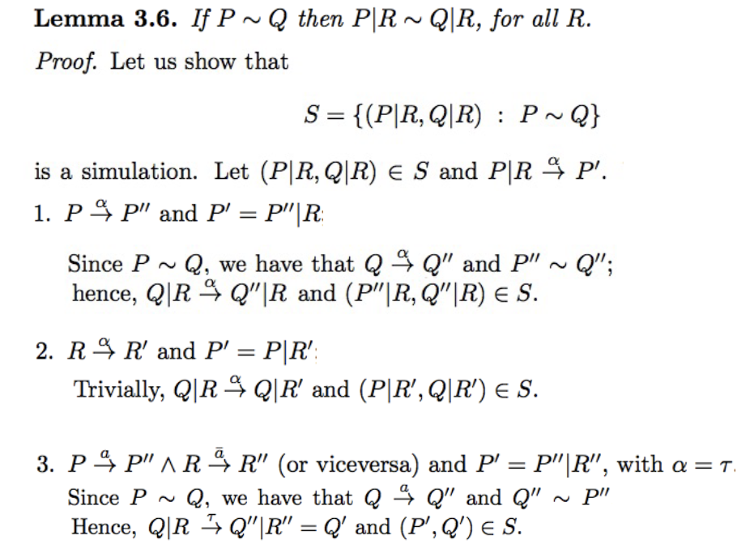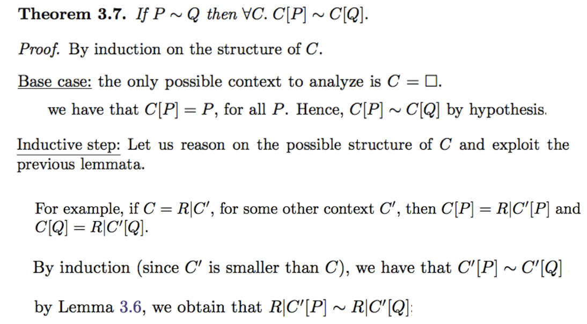

