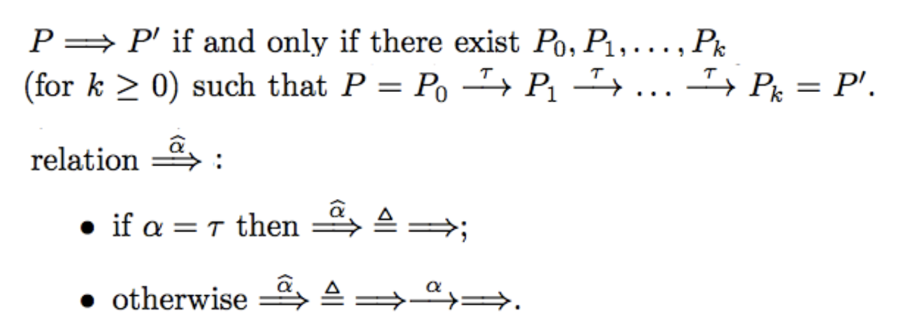
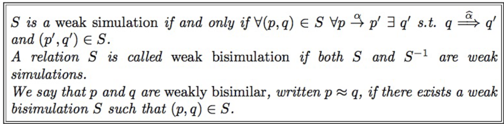
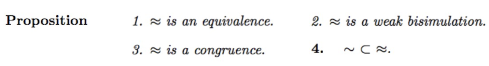

# Weak bi-similarity

Exercises list:
- TBA

### Recall questions 

1. 

  What is weak bi-similarity? Describe the new relation used by weak bi-similarity. 

    
    \
    We want a weaker form of bi-similarity that does not discriminate against internal actions invisible to an observer (i.e. $\tau$'s in synchronisation).

	We introduce a new relation $\implies$: 

	We can define the notion of ==weak bi-similarity==: 

	Weak bi-similarity has the following properties: 

1. 

  

    
    \

