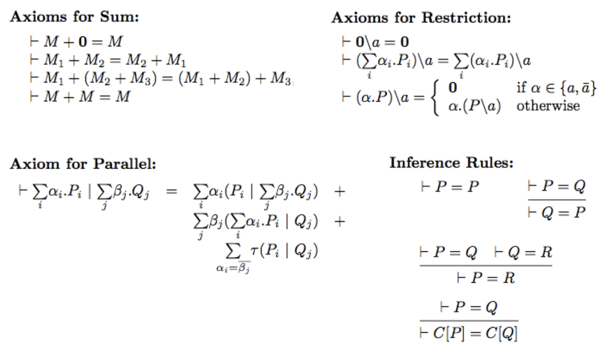

# Alternatives way of proving bi-similarity

### Recall questions 

1. 

 Which limitations are required to prove bi-similarity with inference rules? Why?  

    
    \
    We only consider ==non-recursive processes, as deciding bi-similarity for general processes is not possible==.
    

2. 

 What do we want to prove in order to be able to use these rules?  

    
    \
    To prove that our inference system works, we need to show that is satisfies both:
    - ==soundness==: ==whatever we infer is correct== (so bi-similar);
    - ==completeness==: ==whatever is bi-similar, it can be inferred.==
    

3. 

  Explain the inference rules for bi-similarity. 

    
    \
    Rules so far (+ axioms): 

4. 

 Prove soundness and completeness of our rules. 

    
    \
    Refer to the slides for the full proof.

