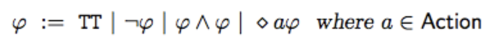
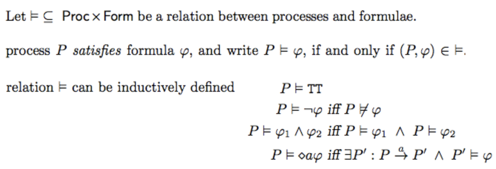
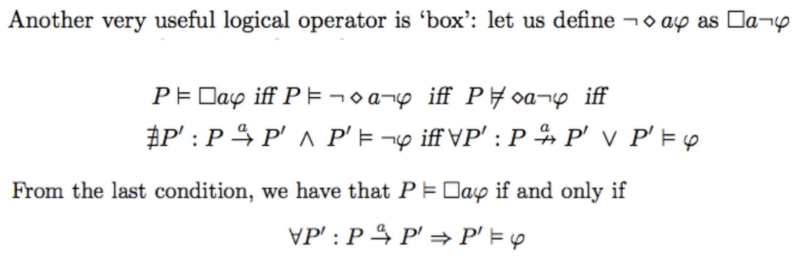
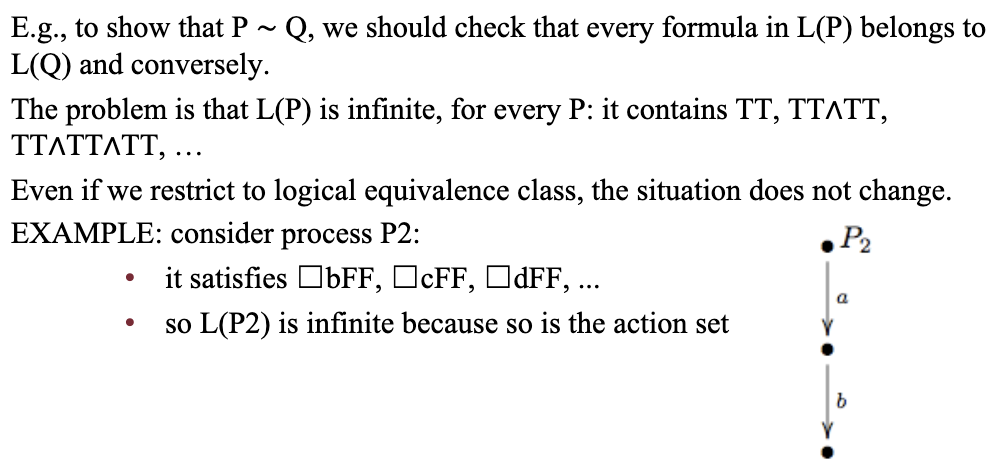
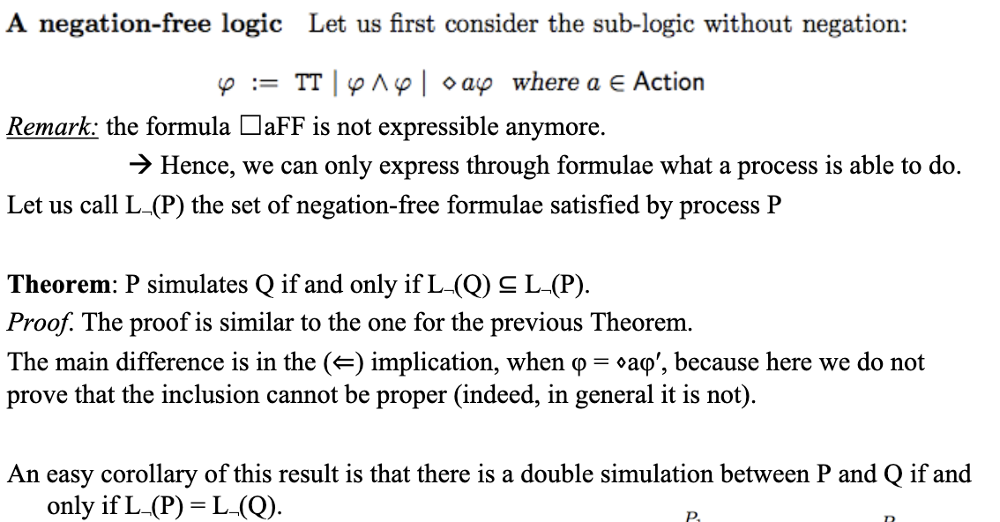
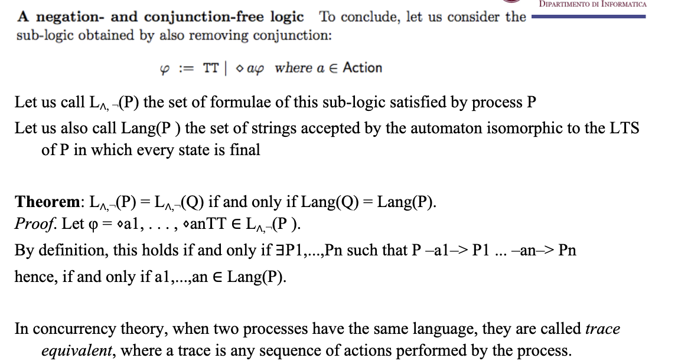
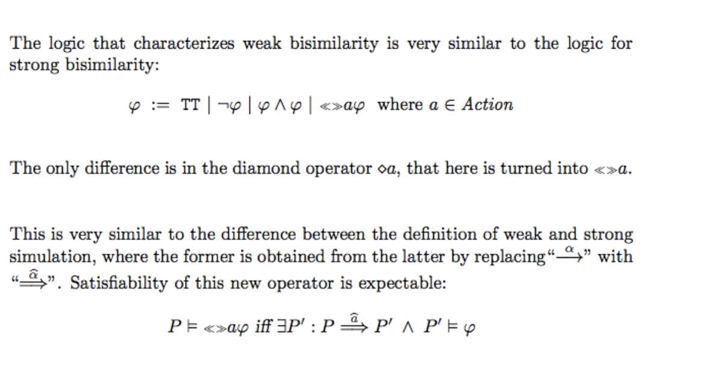

# Alternatives way of proving bi-similarity pt.2

Also see https://en.wikipedia.org/wiki/Modal_logic for an in-depth explanation of the $\square$ and $\diamond$ operators.
### Recall questions 

1. 

 Describe and explain the formulas we will use for our logic. 

    
    \
    Language components: 

	We can then define a ==relation between processes and our formulas==: 
    
    

2. 

 What other useful operator can we define? 

    
    \
    A $\square$ operator: 
    

3. 

 How can we prove bi-similarity with these new formulas? (Theorem)

    
    \
    Refer to slides.
    

4. 

 What is the issue fo this set of formulas? Make an example. 

    
    \
    This system works very ==well at proving inequalities==, but ==not as much for proving equality==: 
    

5. 

 What happens if we remove rules from our logic formulas? What is trace equivalence? 

    
    \
    We can define two new "logic". A ==negation free logic==: 

	And a ==negation and conjunction free logic==:  
    

6. 

 How can the set of rules be modified to work for weak bi-similarity? 

    
    \
	The new set of rules is mostly unchanged: 
    

