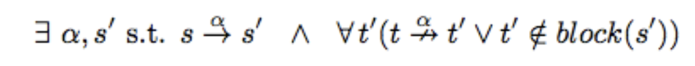

# Alternatives way of proving bi-similarity pt.3

### Recall questions 

1. 

 What is the relational coarsest partition problem? How is it related to deciding bi-similarity? 

    
    \
    RPCC is a generic problem that can be described as follows:
    - start from a given ==set partitioned in the coarsest way possible==, e.g. the entire set;
    - using a ==splitting rule==, divide the set into ==smaller blocks of equivalent elements and repeat until splitting is not possible anymore==;
    - output the final solution, two ==elements are equivalent if they are in the same block==

	As it can be seen, RPCC is a more generic problem than bi-similarity. In fact, the ==splitting rule used in RPCC== is what effectively decides which equivalence the algorithm is proving.
    

2. 

 What is the condition for splitting a block in the algorithm? 

    
    \
	Let $B$ be a generic block of a partition and $s,t$  be two states $\in B$.  
	Let us call $block(s)$ the set of states belonging to the same block as $s$.  
	According to bi-similarity, ==$s$ and $t$ must be separated (and, hence, $B$ must be split) if and only if==: 

	This condition can be ==also formulated as==: 
  

3. 

 Describe the algorithm for solving the RCPP. Use the example as an aid. 

    
    \
	The algorithm works as follows: 

	Where the splitting condition is: 

4. 

 Prove that the algorithm works. 

    
    \
    ==Termination== can be easily proved:
    - every cycle operates on a finite number of elements
    - the cardinality of $P$ is at most $|S|$ (worst case, a block for each state)
    - in this case, no block can be split further and we terminate.

	We now want to prove ==soundness==, i.e. that $s \sim t \iff \exists B \in P_f | \{s,t\} \in P_f$

	
    
  

5. 

 What is the complexity of the algorithm proposed?  

    
    \
    Let $n = |S$ and $m = |\to|$. Then, consider the number of executions in the main function's body:
    - last loop costs $O(n)$
    - main loop is executed $O(n)$ times at worst
    - the check in the if condition and updating the partition costs $O(1)$

	We need to determine how expensive is looping over every state, every transition and then checking whether we split or not: 

	==The final cost is then $O(nm)$.==
  

6. 

 Describe an efficient way to implement the algorithm.  

    
    \
    We build a symbolic representation for the blocks as follows:
    - every ==block is a list of states==
    - every ==block is associated to a binary string== 

	Then, we consider a table of triples $(\alpha, s, \sigma)$, where $\sigma$ is the binary index of a certain block: 

	Ordering this table lexicographically requires $O(m\log m)$ at the start, but ==updates do not require reordering==. The update is then done as follows: 

